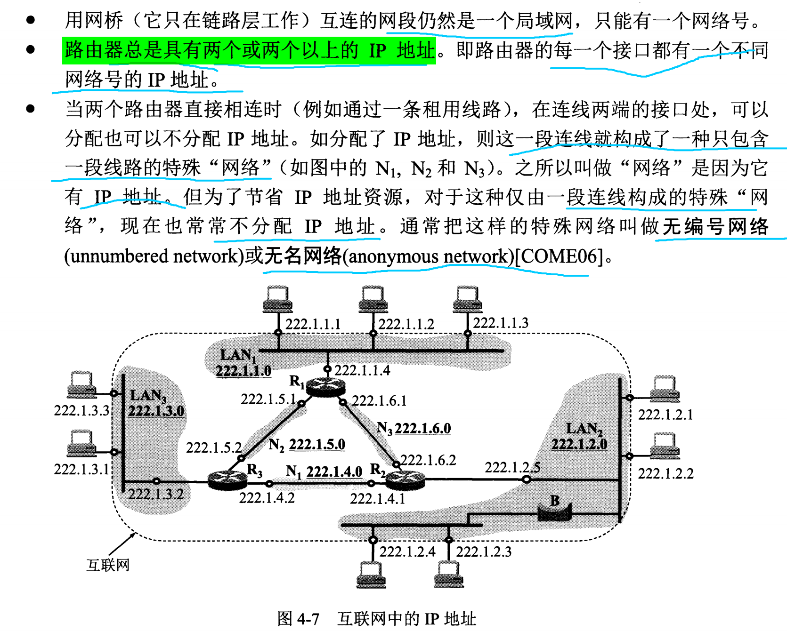

计算机网络-谢希仁-第7版 第3章 数据链路层

> [计算机网络谢希仁版（第七版）答案](https://blog.csdn.net/qq_43598138/article/details/103603514?spm=1001.2101.3001.6650.5&utm_medium=distribute.pc_relevant.none-task-blog-2%7Edefault%7EBlogCommendFromBaidu%7ERate-5-103603514-blog-121027392.pc_relevant_layerdownloadsortv1&depth_1-utm_source=distribute.pc_relevant.none-task-blog-2%7Edefault%7EBlogCommendFromBaidu%7ERate-5-103603514-blog-121027392.pc_relevant_layerdownloadsortv1&utm_relevant_index=6)
> [CRC（循环冗余校验码）简介与实现解析](https://zhuanlan.zhihu.com/p/61636624)
> [VLAN--虚拟局域网（理论详解）](https://blog.csdn.net/weixin_51486343/article/details/109434892)

# 3-01 **数据链路(即逻辑链路)与链路(即物理链路)**

1. 链路是从一个结点到相邻结点的一段**物理线路**。
2. 数据链路是在链路的基础上增加一些必要的硬件（如网路适配器）和软件（如协议的实现）。

# 3-02 **数据链路层的链路控制**

## **数据链路层的三个基本问题**
### **封装成帧**
封装成帧（framing）就是在一段数据的前后分别添加首部和尾部，从而从物理层接收到的比特流中识别帧的开始和结束。

帧的首部和尾部用于帧定界，且包括许多必要的控制信息，发送帧时从帧的首部开始发送。
数据链路层协议对帧首部和帧尾部的格式有明确的规定，也规定了帧的数据部分长度上限，即最大传输单元 **MTU** （Maximum Transfer Unit）。不同数据链路的 MTU 不同。

### **透明传输**

### **差错检测**
[CRC（循环冗余校验码）简介与实现解析](https://zhuanlan.zhihu.com/p/61636624)

数据链路层使用 CRC检验，能实现无比特差错的传输，但不是可靠传输。

## **可靠传输应根据通信质量好坏区别对待**

# 3-03 **网络适配器**
## **适配器的作用**

- 适配器在接收和发送各帧，不使用计算机的 CPU。
- MAC 地址在适配器的 ROM 中，软件地址——IP 地址在计算机的存储器中。
## **适配器工作的层**
适配器所实现的功能包含**数据链路层以及物理层两个层次的功能**。

# 3-06 **PPP协议**

## **PPP 协议**

## **PPT 协议特点**

# 3-13 **局域网**

## **局域网的主要特点**

局域网的工作层次跨越了数据链路层和物理层。

# 3-15 **以太网**
## **传统以太网**

## **以太网的两个标准**
- DIX Ethernet V2
- IEEE 802.3

# 3-29 **以太网交换机**
> [Network Devices Explained | Hub, Bridge, Router, Switch](https://www.youtube.com/watch?v=eMamgWllRFY&ab_channel=CertBros)

## **以太网交换机**

- 以太网交换机实质是多接口网桥，网桥只有两个接口，以太网交换机接口更多。
- 以太网交换机使用了专门的交换结构芯片，用硬件转发，其转发速率比普通网桥快。
- 以太网交换机有存储器，能进行帧缓存。
- 以太网交换机内有交换表，能进行自学习，交换表中每个条目是每个端口号以及对应的 MAC 地址，交换表有一定的有效时间，过期就删除。
- 以太网交换机是即插即用设备，因为其自有自学习能力，不必人工配置。
- 以太网交换机一般有多种速率接口。 
- 以太网交换机大多数对帧采用存储转发的方式，但也有些采用直通方式交换，直通交换不进行差错检测就将帧发出去。
- 以太网是全双工通信方式。

## **虚拟局域网 VLAN**
 > [VLAN--虚拟局域网（理论详解）](https://blog.csdn.net/weixin_51486343/article/details/109434892)

- 从逻辑上划分广播域
- 工作在数据链路层
- 在以太网帧中加入一个 VLAN 标志，占 4 字节，但实际可分配的主机数只有 12 位，即 4096 个主机
- 对交换机有要求
- 二层的交换机只能在一个局域网中划分广播域
- 要将不同局域网的 VLAN 连接在一起，需要三层交换机，即路由器

# MAC 层的硬件地址

 

# MAC 帧的格式

 

- 以太网 V2 的 MAC 帧格式中，首部无帧长度；物理层对数据进行曼彻斯特编码，而曼彻斯特编码的每个码元都有一次电压转换（1 是从高到低，0 是从低到高），而发送完一个以太网帧后，就不再发送其他码元，因此电压无变化，从而识别帧的结束位置；这个结束往前数 4 字节（FCS 字段长度），就能确定数据字段结束的位置。
- 以太网上传输数据以帧为单位，各帧之间有一定的间隔，接收端找到帧开始定界符后，后面连续达到的比特流就是属于同一个 MAC 帧，因此不需要字节插入来保证透明传输。
- 以太网规定一个帧最短长度，64 字节，不足则填充一些字节；总共 64 字节，减去 18 字节其他字段，则数据字段最短为 46 字节。最初定义这个是因为执行 CSMA/CD 时，帧太短可能造成无法检测到发生碰撞。
- 以太网还规定帧最小间隔 9.6us，相当于 96 比特时间；为了使杠收到数据帧的站接收缓存来得及清理，做好接收下一帧的准备。
- 数据链路层还规定了 MTU 值，即以太网帧中数据部分的最大长度，如以太网规定 MTU 为 1500 字节，即 IP 数据报的总长度的最大值。
- 以太网帧中的 FCS 帧检验序列用于 CRC 检验，但检验的只是比特差错，比特差错只是传输差错的一种，数据链路层并不能提供可靠传输。

# CSMA/CD 协议

