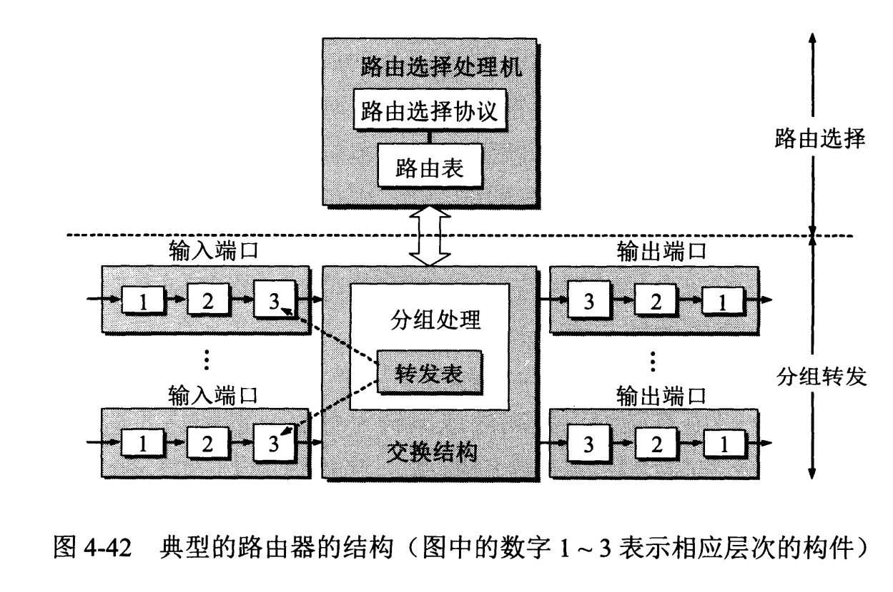
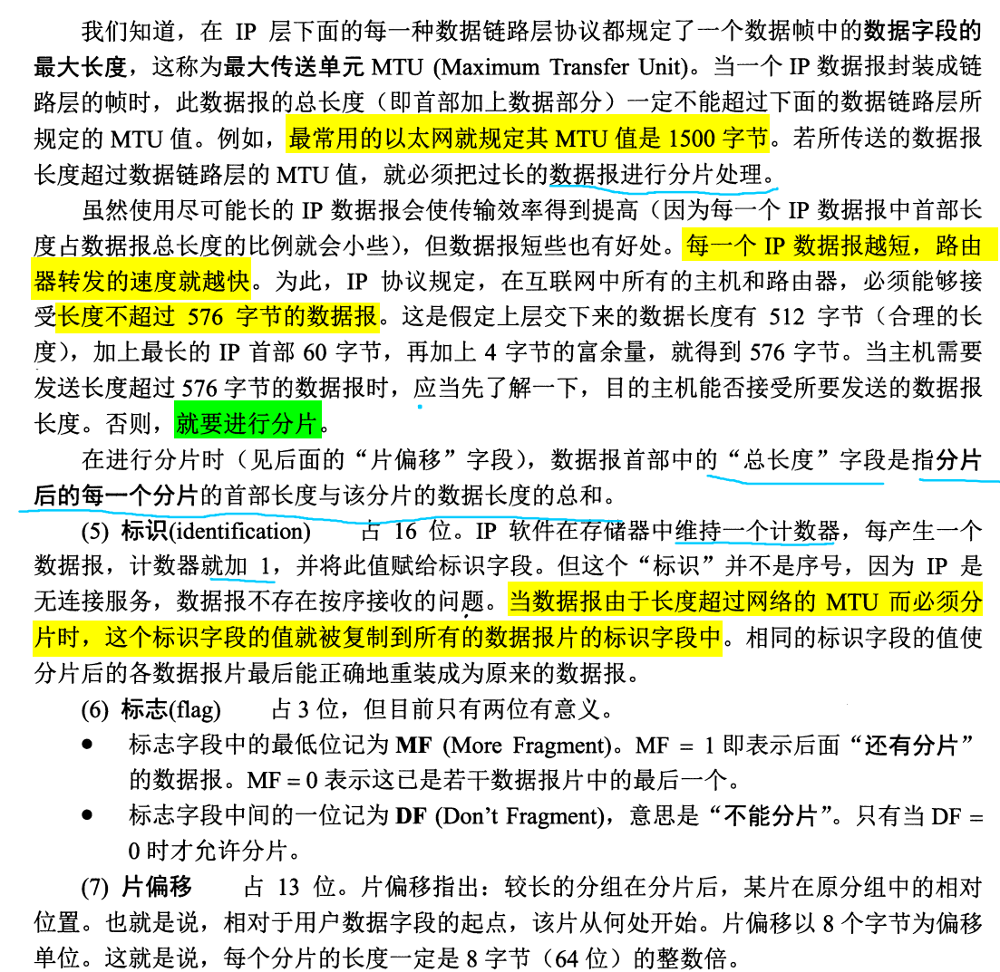
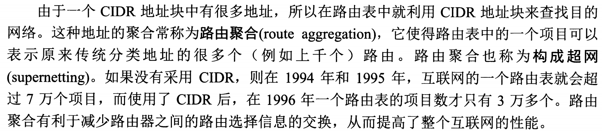
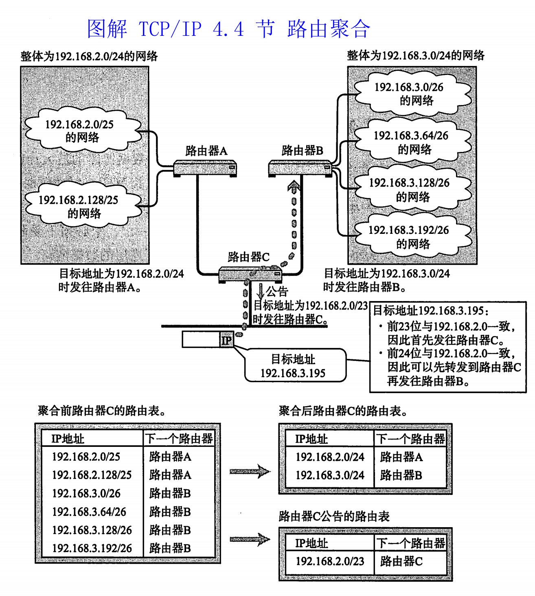
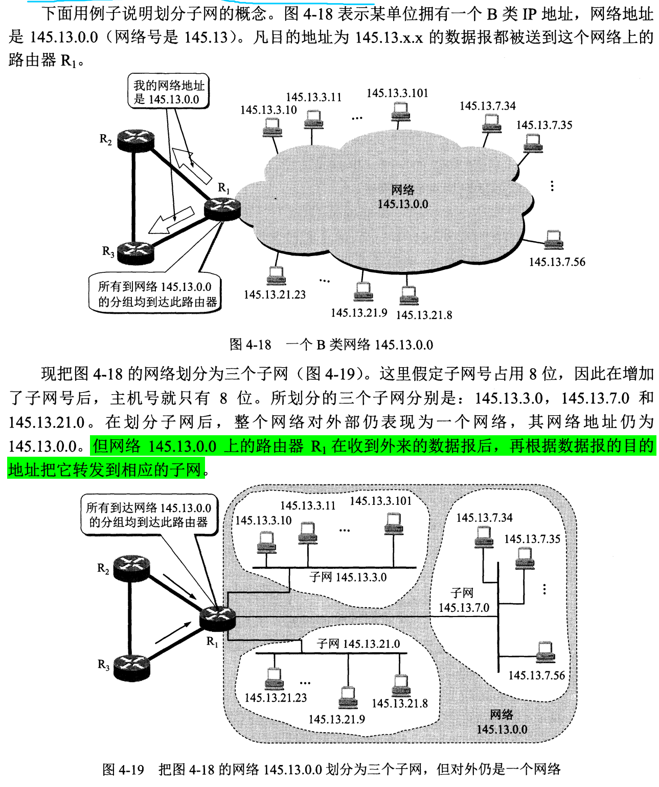
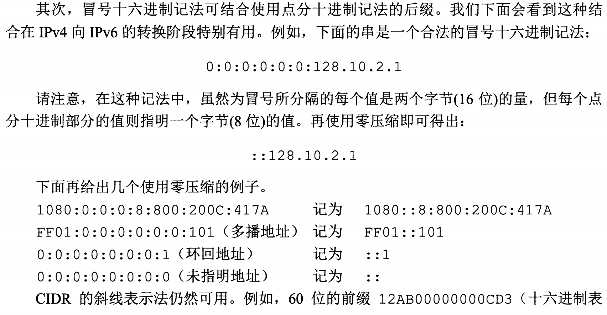
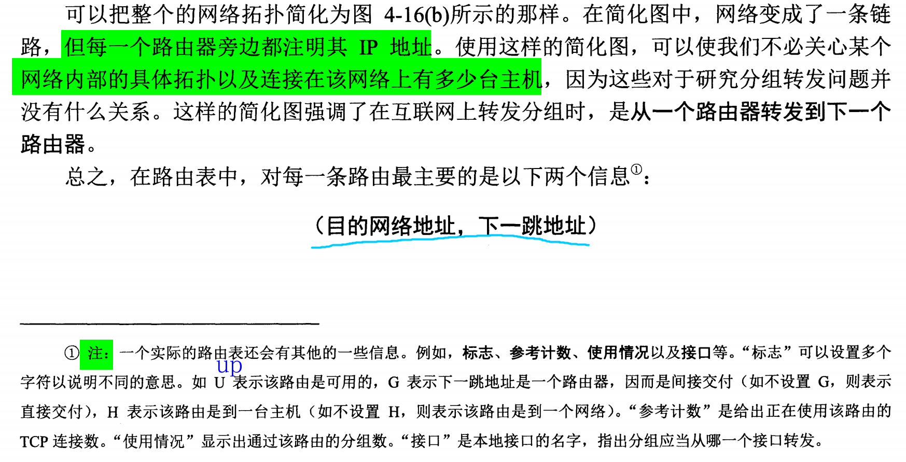
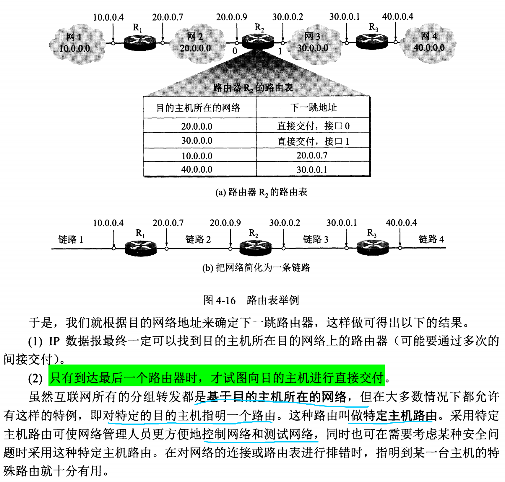
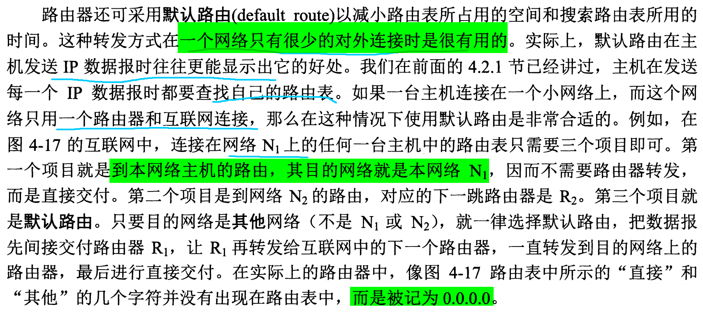
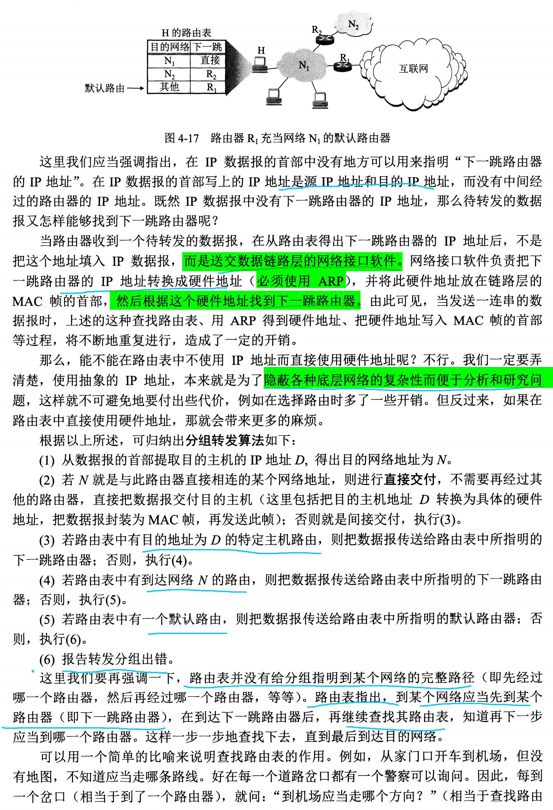

计算机网络-谢希仁-第7版 第4章 网络层

> [计算机网络原理（谢希仁第八版）第四章课后习题答案](https://blog.csdn.net/qq_51344334/article/details/120637198)
> [计算机网络谢希仁版（第七版）答案](https://blog.csdn.net/qq_43598138/article/details/103603514?spm=1001.2101.3001.6650.5&utm_medium=distribute.pc_relevant.none-task-blog-2%7Edefault%7EBlogCommendFromBaidu%7ERate-5-103603514-blog-121027392.pc_relevant_layerdownloadsortv1&depth_1-utm_source=distribute.pc_relevant.none-task-blog-2%7Edefault%7EBlogCommendFromBaidu%7ERate-5-103603514-blog-121027392.pc_relevant_layerdownloadsortv1&utm_relevant_index=6)

# 4-01 **网络层向上提供的服务**

- 网络层不提供可靠传输服务
- 网络层传输的是 IP 数据报

# 4-02 **网络互连**

# 4-03 **转发器、网桥、路由器和网关不同中间件的区别？**

- 转发器也叫中继器
- 网桥被以太网交换机取代

## 路由器
- 路由器是有多个输入端口和多个输出端口的专用计算机
- 任务是转发分组
- 将分组从某个合适的端口转发给下一跳路由器
- 路由器转发分组在网络层工作
- 路由器的结构分为两大部分：路由选择 和 分组转发

## 路由选择部分
- 也叫控制部分，核心构建是路由选择处理机
- 根据选定的**路由选择协议**构造出路由表，同时定期地和相邻路由器交换路由信息，不断更新和维护路由表

## 分组转发
- 由三部分组成：交换结构、一组输入端口 和 一组输出端口
- 端口为硬件端口
  
### 交换结构（switching fabric）
- 又称交换组织
- 根据转发表（forwarding table）对分组进行处理
- 将某个输入端口的分组从一个合适的输出端口转发出去
- 交换结构本身是一种网路，这种网络位于路由器中，路由器的网络

### 转发和路由选择的区别
> [What is the different between routing table and forwarding table?](https://networkengineering.stackexchange.com/questions/52150/what-is-the-different-between-routing-table-and-forwarding-table?newreg=86dca6b04f064dbda2aa14b8351e05bb)
> [Routing table](https://en.wikipedia.org/wiki/Routing_table)

- 转发（forwarding）
    - 转发是路由器根据**转发表**将收到的 IP 数据报从合适的端口转发出去，仅涉及到一个路由器
    - 转发表从路由表得出，包含要到达目标网络的输出端口和某些 MAC 地址信息，根据路由表得出的下一跳地址，实际选择合适的端口转发数据
    - forwarding 时间更短，通常以纳秒为单位
    - forwarding 由硬件实现
- 路由选择（routing）
    - 路由选择设计多个路由器，是路由器按照复杂的路由算法，得出整个网络的拓扑变化情况，能动态的改变选择的路由，并构造整个路由表
    - 路由表仅包含目标网络和下一跳的映射
    - 路由选择的时间比转发的时间长，通常以秒为单位
    - routing 由软件实现

# 4-05 **IP，ARP，RARP 和 ICMP**

## **IP**

## **ARP**

## **RARP**

## **ICMP**
[什么是ICMP？](https://info.support.huawei.com/info-finder/encyclopedia/zh/ICMP.html)
[What is ICMP (Internet Control Message Protocol)?](https://www.youtube.com/watch?v=xTqtm7-k25o&ab_channel=EyeonTech)
[Internet Control Message Protocol](https://en.wikipedia.org/wiki/Internet_Control_Message_Protocol)
[ICMP Explained and Packet Format](https://learnduty.com/articles/icmp-explained-and-packet-format/)

ICMP 报文是作为 IP 数据报的数据字段发送给源点。

### ICMP 应用
#### 分组网间探测 PING（Packet Internet Grouper）
- 应用层直接使用网络层
#### traceroute

# 4-05 **IP地址分类**

# 4-07 **IP 地址与硬件地址的区别**

- 在 IP 层抽象的互联网上只能看到 IP 数据报，屏蔽了下层网络硬件地址体系的不同等复杂细节。
- IP 地址是软件实现的逻辑地址，物理地址是硬件地址。
- 互联网可以由很多(异构网)[https://en.wikipedia.org/wiki/Heterogeneous_network]组成，使用 IP 协议让互联网上的主机好像在一个单个网络上通信，而不用管各网络的具体异构细节。

# 4-08 **IP地址方案与我国的电话号码体制的主要不同点**

IP 地址方案与地理位置无关，同一个区域可以有两个网络，其网络号不同。电话号码的分配是根据地理位置。

# 4-09 **子网掩码**

## **两级 IP 地址缺点**
早期的 IP 地址为两级，前面介绍由网络号和主机号组成，这种有如下缺点：
- IP 地址有时空间利用率低
有的单位目前连接的主机不多，但考虑以后的发展，申请最大的 C类地址，造成 IP 浪费，进而导致IP地址空间的资源过早被用完。
- 给每个物理网络都分配一个网络号会使路由表变得太大而使网络性能变坏
- 两级 IP 地址不够灵活
如果需要立刻开通一个新网络，需要先去申请新的网络号，不能立马使用。

## **划分子网变成三级 IP 地址**

## **子网掩码**

 

（1）子网掩码 255.255.255.0 表示前三个字节为网络号，因此使 C 类IP 地址。
（2）子网掩码为 255.255.255.248，最后一个字节为 1111 1000，主机号范围为 000 - 111，有 $2^{3}$种，再减去全 0 和 全1 情况，因此可连接 6 台主机。
（3）子网掩码相同，均为 255.255.255.0，网络号不同，A 类网络的网络号为 255.0.0.0，子网号的位数为16，则其子网数为 $2^{16}-2$；而 B 类网络的网络号为 255.255.0.0，子网号的位数为 8，因此其子网数为 $2^{8}-2$。
（4）B 类地址的子网掩码为 255.255.240.0，根据其网络号 255.255.0.0，可知其子网号的位数为 4，子网数为 $2^{4}-2$，即 14；主机号有 12 位，因此主机数目为 $2^{12}-2$，每个子网可连接 4094 台主机。
（5）A 类网络的网络号为 255.0.0.0，其子网掩码为 255.255.0.255，则其子网号位数为 32，这种虽有效但没有意义。
（6）IP 地址点分十进制为 194.47.20.129，根据每类 IP 地址的范围判断其属于 C 类地址。

（7）C 类网络使用子网掩码仍有意义，对于小网络可以进一步简化路由表。

# 4-11 **IP数据报中的首部检验和并不检验数据报中的数据的好处是**

## **IP 数据报的格式**

## **首部检验和不检验数据报中的数据**
- 好处
转发分组更快
- 坏处
数据部分出现差错不能及时发现

# 4-12 **当某个路由器发现一IP数据报的检验和有差错时，为什么采取丢弃的办法而不是要求源站重传此数据报？计算首部检验和为什么不采用CRC检验码？**

1. 首部检验和出错时，IP 数据报首部的源地址可能也变成错误的，请错误的源地址重传数据报无意义。
2. 不使用 CRC 可减少路由器检验的时间。

# 4-15 **最大传送单元 MTU**

1. MTU （Maximum Transfer Unit）
IP 层下的数据链路层规定的一个数据帧的最大长度，称为最大传送单元 MTU。
2. 整个 IP 数据报作为数据链路层种数据帧的数据部分，因此 IP 数据报首部的总长度字段与 MTU 有关。

## 设置合适的 MTU 
> [Configure MTU to maximize network performance](https://docs.tigera.io/calico/latest/networking/configuring/mtu)
> [How to determine the optimal MTU size?](https://help.keenetic.com/hc/en-us/articles/214470885-How-to-determine-the-optimal-MTU-size-)

# 4-16 **在互联网中将IP数据报分片传送的数据报在最后的目的主机进行组装。还可以有另一种做法，即数据报片通过一个网络就进行一次组装。试比较这两种方法的优劣。**

1. 在目的站组装让路由器处理更简单.
2. 并非所有的分片都经过相同的路由器,如果在中间的路由器组装可能会缺少数据报分片。
3. 也许分组后面还要经过一个网络，需要将分片划分为更小的片，这样在中间组装会组装多次。

# IP 分片
> [fragmentation](https://en.wikipedia.org/wiki/IP_fragmentation)
> [IP Fragmentation in Detail](https://packetpushers.net/ip-fragmentation-in-detail/)

- IP 分片是路由器进行分片，有最终的目的主机进行重组。

# 4-17 IP 数据报分片例题1

**一个3200 位长的TCP报文传到 IP 层，加上160 位的首部后成为数据报。下面的互联网由两个局域网通过路由器连接起来。但第二个局域网所能传送的最长数据帧中的数据部分只有1200 位。因此数据报在路由器必须进行分片。试问第二个局域网向其上层要传送多少比特的数据（这里的“数据”当然指的是局域网看见的数据）?**

帧的数据部分 1200 位是包含了首部的 160 位，因此实际数据只有1040 位，总共 3200 位原始数据，因此分成 4 片：1040 * 3 + 80，每个分片加上首部 160 位后分片为 ： 1200 + 1200 + 1200 + 240 = 3840 位。

# 4-18 ARP 协议

## **ARP 协议定义**

*******************

## **不需要发送 ARP 请求分组的情况**
- 源主机的 ARP 高速缓存中已经有该目的 IP 的硬件地址
- 源主机发送的是广播分组
- 源主机和目的主机使用点对点链路

# 4-19 ARP 例题
**主机A发送IP数据报给主机B，途中经过了5个路由器。试问在IP数据报的发送过程中总共使用了几次ARP？**

6次，主机发送一次，5个路由器分别用一次。

# 4-26 地址聚合 例题

# **无分类编址 CIDR 构造超网**

- 无分类让网络号分配更灵活，不用向之前分类那么固定
- CIDR 方法让三级 IP 变为两级 IP。
- 和划分子网的原理相似，申请一个网络号后，即分配到一个 CIDR 块，机构内部任可以自由划分一些子网。
- 用 32 位地址掩码（address mask）来表示网络前缀的位数。
- CIDR 内部划分的子网仍属于一个局域网。
- CIDR 内部划分子网后，外部网络通过该 CIDR 块查找该网络，这种称为路由聚合（route aggregation）。

## **地址聚合**

四个 IP 地址倒数第二个字节不同，该字节转换为二进制后最后两位不同，前面 6 位均为 1000 01，因此聚合后地址为 212.56.132.0/22。

# 4-43 **IGMP协议**

## **IP 多播**

## **国际组管理协议 IGMP**

# 本地地址和全球地址
## 本地地址
- 仅在一个机构内部使用，机构自行分配，不需要向互联网的管理机构申请

## 全球地址
- 向互联网的管理机构申请的全球唯一 IP 地址

# 专用地址
- 指定一些专用地址（private address）用于一个机构内部通信，而不用和互联网的主机通信
- 只能做本地地址而不能作全球地址
- 互联网中的路由器对目的地址为专用地址的数据报不转发
- 16 的二进制为 `0001 0000`，31 的二进制为 `0001 1111`

# 4-44 **VPN**

- IP 地址紧缺，一个机构能申请到的 IP 地址数小于本机构的主机数。
- 机构内部不需要所有的主机接入外部的互联网。
- 一个机构不同的部分分布范围很广，需要交换信息，不想租用电信公司的通信网来专用（价钱昂贵），因此使用公用的互联网作为本机构各专用网之间通信，这种专用网成为**虚拟专用网（Virtual Private Network）**。
- VPN 只是效果上和真正的专用网一样，但实际并未使用通信专线。

# 4-45 **网络地址转换 NAT**

- 专用网内部的主机想和外部互联网上的主机通信，但不想加密
- 用 NAT 方法，专用网连接到互联网的路由器上需要安装 NAT 软件，这种路由器叫 NAT 路由器，至少有一个全球 IP 地址。
- NAT 地址转换表将内部的主机 IP 数据报中的源地址转换为 NAT 路由器的一个 全球 IP 地址与外部通信。

# 分类的两级 IP 缺陷
- 两级 IP 地址可能造成浪费，如 A 类的网络号 8 位，B 类网络号 16 位等，可能一个机构申请 C 类地址则不够用，申请 B 类地址则太多了，造成 IP 浪费，从而 IP 过早被用完。
- 给每一个物理网络都分配网络号会造成路由表过大而使网络性能变坏。每个路由器都要能从路由表中查出应怎样到达其他网络的下一跳路由，因此互联网中的网络数越多，则路由表的条目越多，路由器的需要的存储空间越大，成本越高，查询时间也越长。
- 两级 IP 地址不灵活，有时一个机构内部需要立马开通一个网络，就需要申请一个新的 IP 地址，不能随时灵活的新增网络而不用去互联网管理机构申请新的网络号。

# 划分子网的三级 IP
- 三级 IP 就是在原来的两级 IP 基础上，主机号部分新增一个**子网号**。

- 三级 IP 的格式为：<网络号>,<子网号>,<主机号>

- 划分子网是一个机构内部的事，对外仍表现为一个网络，即属于一个局域网（互联网上的一个网络就是从互联网管理机构申请的一个网络号的所有主机的集合）。

- 划分子网是从主机号中分出若干位作为子网号（subnet-id），则主机号的数目就减少了，划分子网在 access layer。

- 互联网上的其他路由器的路由表中只有本机构申请的网络号，不知道机构内部的子网号，只有数据到达机构与外部通信的路由器后，再在机构内部将数据数据转发给目标子网（在 distribution layer 完成不同子网的转发）。

# 子网（subnet）和 虚拟局域网 VLAN 区别
> [LAN, WAN, SUBNET - EXPLAINED](https://www.youtube.com/watch?v=NyZWSvSj8ek&list=LL&index=5&ab_channel=PowerCertAnimatedVideos)
> [Subnets vs VLANs](https://www.youtube.com/watch?v=6_giEv20En0&list=LL&index=6&ab_channel=PowerCertAnimatedVideos)

- 划分子网是在网络层，通过路由器划分，不同的子网仍属于一个局域网（LAN）。
- 子网是对 IP 地址的主机号分出一些位数作为子网号
- VLAN 是在数据链路层划分，通过以太网交换机，在 MAC 地址中增加一个标志位来区分，逻辑上划分为多个广播域，但多个广播域仍然在一个局域网中。
- 子网是在物理上划分，VLAN 是在逻辑上划分，都是分割不同的广播域。
- 子网和 VLAN 划分均在访问层（access layer），但连接不同的 VALN 和子网则是在 distribution layer。
- 可能有些场景不能使用 VLAN，只能在网络层划分子网。

# IPV4 地址格式
> [Internet Protocol version 4](https://en.wikipedia.org/wiki/Internet_Protocol_version_4)
> [Classless Inter-Domain Routing](https://en.wikipedia.org/wiki/Classless_Inter-Domain_Routing)

## CIDR notation
- 如 `198.51.100.14/24` 中斜线后的数字表示网络号的位数为 24 位，即子网掩码为 `255.255.255.0`
- 点分十进制中连续的 0 省略，如 `10.0.0.0/10` 可以压缩为 `10/10`。
- 星号表示法，星号前的为网络号，如 `192.168.1.*` 为一个 CIDR 块，其地址范围为 `192.068.1.0` 到 `192.168.1.255`，但一般不用主机号为全 0 和全 1 的地址。

# Ipv6 地址格式
> [IPv4 and IPv6 address formats](https://www.ibm.com/docs/en/ts4500-tape-library?topic=functionality-ipv4-ipv6-address-formats)
> [IPv6 address](https://en.wikipedia.org/wiki/IPv6_address)
> [IPv6 Address Representation](https://www.networkacademy.io/ccna/ipv6/ipv6-address-representation)

- 总共 128 位，每个 16 位的值用十六进制表示，各值用冒号分隔，总共分为 8 段，即冒号十六进制（colon hexadecimal notation）。

- 十六进制的字母最好用小写。

- 每个值用4位写全：`2001:0db8:85a3:0000:0000:8a2e:0370:7334`

- 有些值不用写全 4 位，可以省略数字最前面的 0：`2001:db8:3333:4444:5555:6666:7777:8888` 。

- 可以使用零压缩（zero compression），即一串连续的 0 可以用一对冒号代替，但只能使用一次零压缩，如 `2001:db8:0:0:0:0:2:1` 可以压缩为 `2001:db8::1:0`。

- 冒号十六进制可以结合点分十进制，如 `2001:db8:3333:4444:CCCC:DDDD:128.0.1.2`，前面的 6 段每个值用十六进制表示，占 2 字节；最后的 4 段用 `.` 分割的每个值为十进制表示，占 1 字节。

# 路由器分组转发
- 路由表根据 IP 数据报中的目的地址，找到下一跳地址。
- 路由器不指出从源地址到最终目的地址的完整路径。
- 对于划分子网的情况，一个 LAN 中划分多个子网，对于外部互联网上的路由器来说看不到子网，外部路由表只记录该 LAN 分配的网路号，进入该 LAN 后，有 distribution layer 中的路由器再将数据分发给不同的子网，这些路由器的路由表中记录每个子网的地址和下一跳的地址映射。 

## 默认路由器（default route）
- 默认路由是为了减小路由表所占用的空间和搜索路由表占用的时间。
- 在一个网络上只有很少的对外连接时很有用。
- 当路由表中找不到目标网络时，则采用默认路由。
- 路由表中的目标地址为 0.0.0.0/0 表示默认路由。

*******************

**补充知识**

# 服务器配置多网卡
> [Is there any reason to have 2 NICs on a server?](https://serverfault.com/questions/129935/is-there-any-reason-to-have-2-nics-on-a-server)

# 多 IP 配置

> [Multiple IP Addresses: Why and How Many?](https://www.greenarrowemail.com/blog/multiple-ip-addresses-many)

- 一个网卡（NIC）可以配多个 IP。 

# 虚拟 IP（Virtual IP）
> [What are virtual IP addresses?](https://www.websense.com/content/support/library/web/v84/wcg_help/virtual_ip_overview.aspx)
> [Virtual IP for service instances](https://www.ibm.com/docs/en/pasc/1.1?topic=instances-virtual-ip-service)