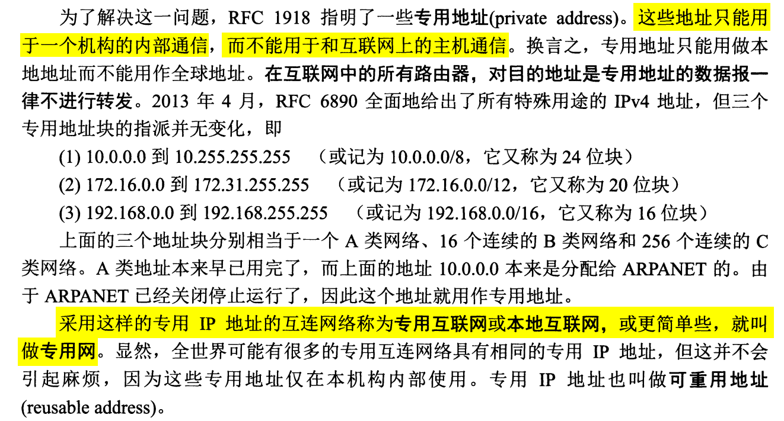

计算机网络-谢希仁-第7版 第4章 网络层

> [计算机网络原理（谢希仁第八版）第四章课后习题答案](https://blog.csdn.net/qq_51344334/article/details/120637198)
> [计算机网络谢希仁版（第七版）答案](https://blog.csdn.net/qq_43598138/article/details/103603514?spm=1001.2101.3001.6650.5&utm_medium=distribute.pc_relevant.none-task-blog-2%7Edefault%7EBlogCommendFromBaidu%7ERate-5-103603514-blog-121027392.pc_relevant_layerdownloadsortv1&depth_1-utm_source=distribute.pc_relevant.none-task-blog-2%7Edefault%7EBlogCommendFromBaidu%7ERate-5-103603514-blog-121027392.pc_relevant_layerdownloadsortv1&utm_relevant_index=6)

# 4-01 **网络层向上提供的服务**

- 网络层不提供可靠传输服务
- 网络层传输的是 IP 数据报

# 4-02 **网络互连**

# 4-03 **转发器、网桥、路由器和网关不同中间件的区别？**

- 转发器也叫中继器
- 网桥被以太网交换机取代

# 4-05 **IP，ARP，RARP 和 ICMP**

## **IP**

## **ARP**

## **RARP**

## **ICMP**
[什么是ICMP？](https://info.support.huawei.com/info-finder/encyclopedia/zh/ICMP.html)
[What is ICMP (Internet Control Message Protocol)?](https://www.youtube.com/watch?v=xTqtm7-k25o&ab_channel=EyeonTech)
[Internet Control Message Protocol](https://en.wikipedia.org/wiki/Internet_Control_Message_Protocol)
[ICMP Explained and Packet Format](https://learnduty.com/articles/icmp-explained-and-packet-format/)

ICMP 报文是作为 IP 数据报的数据字段发送给源点。

# 4-05 **IP地址分类**

# 4-07 **IP 地址与硬件地址的区别**

- 在 IP 层抽象的互联网上只能看到 IP 数据报，屏蔽了下层网络硬件地址体系的不同等复杂细节。
- IP 地址是软件实现的逻辑地址，物理地址是硬件地址。

# 4-08 **IP地址方案与我国的电话号码体制的主要不同点**

IP 地址方案与地理位置无关，同一个区域可以有两个网络，其网络号不同。电话号码的分配是根据地理位置。

# 4-09 **子网掩码**

1. **两级 IP 地址缺点**
早期的 IP 地址为两级，前面介绍由网络号和主机号组成，这种有如下缺点：
- IP 地址有时空间利用率低
有的单位目前连接的主机不多，但考虑以后的发展，申请最大的 C类地址，造成 IP 浪费，进而导致IP地址空间的资源过早被用完。
- 给每个物理网络都分配一个网络号会使路由表变得太大而使网络性能变坏
- 两级 IP 地址不够灵活
如果需要立刻开通一个新网络，需要先去申请新的网络号，不能立马使用。

2. **划分子网变成三级 IP 地址**

3. **子网掩码**

 

（1）子网掩码 255.255.255.0 表示前三个字节为网络号，因此使 C 类IP 地址。
（2）子网掩码为 255.255.255.248，最后一个字节为 1111 1000，主机号范围为 000 - 111，有 $2^{3}$种，再减去全 0 和 全1 情况，因此可连接 6 台主机。
（3）子网掩码相同，均为 255.255.255.0，网络号不同，A 类网络的网络号为 255.0.0.0，子网号的位数为16，则其子网数为 $2^{16}-2$；而 B 类网络的网络号为 255.255.0.0，子网号的位数为 8，因此其子网数为 $2^{8}-2$。
（4）B 类地址的子网掩码为 255.255.240.0，根据其网络号 255.255.0.0，可知其子网号的位数为 4，子网数为 $2^{4}-2$，即 14；主机号有 12 位，因此主机数目为 $2^{12}-2$，每个子网可连接 4094 台主机。
（5）A 类网络的网络号为 255.0.0.0，其子网掩码为 255.255.0.255，则其子网号位数为 32，这种虽有效但没有意义。
（6）IP 地址点分十进制为 194.47.20.129，根据每类 IP 地址的范围判断其属于 C 类地址。

（7）C 类网络使用子网掩码仍有意义，对于小网络可以进一步简化路由表。

# 4-11 **IP数据报中的首部检验和并不检验数据报中的数据的好处是**

## **IP 数据报的格式**

## **首部检验和不检验数据报中的数据**
- 好处
转发分组更快
- 坏处
数据部分出现差错不能及时发现

# 4-12 **当某个路由器发现一IP数据报的检验和有差错时，为什么采取丢弃的办法而不是要求源站重传此数据报？计算首部检验和为什么不采用CRC检验码？**

1. 首部检验和出错时，IP 数据报首部的源地址可能也变成错误的，请错误的源地址重传数据报无意义。
2. 不使用 CRC 可减少路由器检验的时间。

# 4-15 **最大传送单元 MTU**

1. MTU （Maximum Transfer Unit）
IP 层下的数据链路层规定的一个数据帧的最大长度，称为最大传送单元 MTU。
2. 整个 IP 数据报作为数据链路层种数据帧的数据部分，因此 IP 数据报首部的总长度字段与 MTU 有关。

# 4-16 **在互联网中将IP数据报分片传送的数据报在最后的目的主机进行组装。还可以有另一种做法，即数据报片通过一个网络就进行一次组装。试比较这两种方法的优劣。**

1. 在目的站组装让路由器处理更简单.
2. 并非所有的分片都经过相同的路由器,如果在中间的路由器组装可能会缺少数据报分片。
3. 也许分组后面还要经过一个网络，需要将分片划分为更小的片，这样在中间组装会组装多次。

# 4-17 IP 数据报分片

**一个3200 位长的TCP报文传到 IP 层，加上160 位的首部后成为数据报。下面的互联网由两个局域网通过路由器连接起来。但第二个局域网所能传送的最长数据帧中的数据部分只有1200 位。因此数据报在路由器必须进行分片。试问第二个局域网向其上层要传送多少比特的数据（这里的“数据”当然指的是局域网看见的数据）?**

帧的数据部分 1200 位是包含了首部的 160 位，因此实际数据只有1040 位，总共 3200 位原始数据，因此分成 4 片：1040 * 3 + 80，每个分片加上首部 160 位后分片为 ： 1200 + 1200 + 1200 + 240 = 3840 位。

# 4-18 ARP 协议

## **ARP 协议定义**

*******************

## **不需要发送 ARP 请求分组的情况**
- 源主机的 ARP 高速缓存中已经有该目的 IP 的硬件地址
- 源主机发送的是广播分组
- 源主机和目的主机使用点对点链路

# 4-19 ARP 例题
**主机A发送IP数据报给主机B，途中经过了5个路由器。试问在IP数据报的发送过程中总共使用了几次ARP？**

6次，主机发送一次，5个路由器分别用一次。

# 4-26 地址聚合 例题

# **无分类编址 CIDR**

## **地址聚合**

四个 IP 地址倒数第二个字节不同，该字节转换为二进制后最后两位不同，前面 6 位均为 1000 01，因此聚合后地址为 212.56.132.0/22。

# 4-43 **IGMP协议**

## **IP 多播**

## **国际组管理协议 IGMP**

# 本地地址和全球地址
## 本地地址
- 仅在一个机构内部使用，机构自行分配，不需要向互联网的管理机构申请

## 全球地址
- 向互联网的管理机构申请的全球唯一 IP 地址

# 专用地址
- 指定一些专用地址（private address）用于一个机构内部通信，而不用和互联网的主机通信
- 只能做本地地址而不能作全球地址
- 互联网中的路由器对目的地址为专用地址的数据报不转发

# 4-44 **VPN**

- IP 地址紧缺，一个机构能申请到的 IP 地址数小于本机构的主机数。
- 机构内部不需要所有的主机接入外部的互联网。
- 一个机构不同的部分分布范围很广，需要交换信息，不想租用电信公司的通信网来专用（价钱昂贵），因此使用公用的互联网作为本机构各专用网之间通信，这种专用网成为**虚拟专用网（Virtual Private Network）**。
- VPN 只是效果上和真正的专用网一样，但实际并未使用通信专线。

# 4-45 **网络地址转换 NAT**

- 专用网内部的主机想和外部互联网上的主机通信，但不想加密
- 用 NAT 方法，专用网连接到互联网的路由器上需要安装 NAT 软件，这种路由器叫 NAT 路由器，至少有一个全球 IP 地址。
- NAT 地址转换表将内部的主机 IP 数据报中的源地址转换为 NAT 路由器的一个 全球 IP 地址与外部通信。

