计算机网络-谢希仁-第7版 第5章 运输层  
  
> [计算机网络谢希仁版（第七版）答案](https://blog.csdn.net/qq_43598138/article/details/103603514?spm=1001.2101.3001.6650.5&utm_medium=distribute.pc_relevant.none-task-blog-2%7Edefault%7EBlogCommendFromBaidu%7ERate-5-103603514-blog-121027392.pc_relevant_layerdownloadsortv1&depth_1-utm_source=distribute.pc_relevant.none-task-blog-2%7Edefault%7EBlogCommendFromBaidu%7ERate-5-103603514-blog-121027392.pc_relevant_layerdownloadsortv1&utm_relevant_index=6)  
> [RFC 793 TRANSMISSION CONTROL PROTOCOL](https://datatracker.ietf.org/doc/html/rfc793#section-3.5)  
  
  
# 5-01 **运输层在协议栈中的地位和作用**  
  
1. 运输层属于面向通信的最高层，同时也是用户功能中的最底层，向上面的应用层提供通信服务。  
2. 网络层为主机之间提供逻辑通信，而运输层为应用进程之间提供端到端的逻辑通信。  
  
**运输层的作用：**  
- 运输层通过复用和分用提供进程之间的逻辑通信  
  
  
- 运输层向高层用户屏蔽网络核心的细节  
运输层向高层用户屏蔽下面网络核心的细节（如网络拓扑、所采用的路由协议等），使应用进程看见的就是好像在两个运输层实体之间有一条端到端的逻辑通信信道。  
- 差错检测  
网络层中，IP 数据报首部中的检验和字段，**只检验首部**是否出现差错而不检查数据部分。而在运输层会对首部和数据均进行差错检验。  
  
# 5-02 **网络层提供数据报或虚电路服务对上面的运输层的影响**  
对运输层无影响，但网络层向运输层提供的服务质量不同。  
  
# 5-03 **当应用程序使用面向连接的TCP和无连接的IP时，这种传输是面向连接的还是无连接的？**  
在网络层是无连接的，在运输层是面向连接的。  
  
# 5-05 **采用不可靠的UDP而不用采用可靠的TCP的场景**  
  
  
  
# 5-06 **接收方收到有差错的UDP用户数据报时的处理方式**  
丢弃该报文，并由网际控制报文协议 ICMP 发送 “端口不可达” 差错报文给发送方。  
  
# 5-08 **面向报文的 UDP 和面向字节流的 TCP**  
1. **UDP 是面向报文的**  
UDP 对应用层交下来的报文，既不合并，也不拆分，而是保留这些报文的边界，添加首部后就向下交付给 IP 层。  
  
2. **TCP 是面向字节流的**  
TCP 把应用程序交下来的数据仅仅看成是一连串的无结构的字节流。  
TCP 并不关心应用程序一次把多长的报文发送到 TCP 的缓存中，  
而是根据对方给出的窗口值和当前网络拥塞程度来决定一个报文段应包含多少个字节。  
  
  
# 运输层的复用和分用  
## 复用  
- 应用层所有的应用进程都可以通过运输层再传到 IP 层，即为复用  
  
## 分用  
- 运输层从 IP 收到的发给各个应用进程都可以通过运输层再传给 IP 层，即为分用  
  
# 5-09 **端口号**  
> [Port (computer networking)](https://en.wikipedia.org/wiki/Port_(computer_networking))  
> [TCP port 0 reserved for what purpose?](https://networkengineering.stackexchange.com/questions/11234/tcp-port-0-reserved-for-what-purpose)  
  
  
- 不是所有的应用程序都有端口，如不需要网络的应用程序，不需要端口号  
- 应用程序进行网络连接时才分配端口号  
- 端口号 0 是保留端口号，不能使用  
  
## **端口的作用**  
- 运输层是用于进程之间通信，网络层的 IP 地址仅确定主机，因此需要端口来确定主机中的具体进程。  
- 端口号只具有本地意义，只是标志本计算机应用层的各个进程在和运输层交互时的层间接口。  
- 互联网的不同计算机中，相同的端口号是没有关联的。  
- 不能直接用进程标识符来当端口号，因为不同操作系统使用不同格式的进程标志符；而要使运行不同操作系统的计算机应用程序通信，需要用统一的方法。  
  
2. **端口的三种分类**   
> [熟知端口号 well-known port number](https://www.iana.org/assignments/service-names-port-numbers/service-names-port-numbers.xhtml)  
> [List of TCP and UDP port numbers](https://en.wikipedia.org/wiki/List_of_TCP_and_UDP_port_numbers)  
  
  
 因为互联网上的计算机通信采用客户-服务器方式，因此运输层的端口号分为下面两大类：  
 - 服务器端使用的端口号  
 	- **熟知端口号 （well-knownport number）**  
 	也叫系统端口号或特权端口号，数值为 0 ~ 1023，linux 中仅 root 能使用这些端口号  
	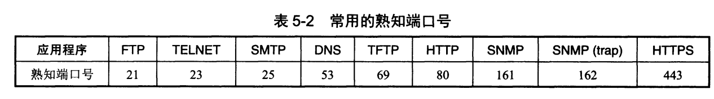  
  
 	- **登记端口号**  
 	数值为 1024 ~ 49151，在没有熟知端口号的应用程序中使用，这类端口号必须在 IANA按照规定的手续登记，防止重复。  
  
 - **客户端使用的端口号**  
数值为 49152 ~ 65535。仅在客户进程运行时才动态选择，因此又叫短暂端口号。通信结束后，使用过的客户端口号就不复存在，这个端口号就能供其他客户进程使用。  
  
  
# 5-10 **运输层中伪首部的作用**  
伪首部用于计算检验时使用，是计算检验和时临时添加在数据报前面从而得到临时数据报，伪首部既不向下传送也不向上递交，仅用于计算检验和。  
  
  
  
  
  
# 5-12 IP 分片习题1  
  
**一个应用程序用 UDP，到 IP 层把数据报在划分为 4 个数据报片发送出去，结果前两个数据报片丢失，后两个到达目的站。过了一段时间应用程序重传 UDP，而 IP 层仍然划分为 4 个数据报片来传送。结果这次前两个到达目的站而后两个丢失。试问：在目的站能否将这两次传输的4个数据报片组装成完整的数据报？假定目的站第一次收到的后两个数据报片仍然保存在目的站的缓存中。**  
  
不能，IP 数据报首部有个标识（identification）字段，当数据报需要分段时，这个标识字段的值会复制到所有数据报的标识字段中，相同的标识字段最后才会重装为原来的数据报。  
  
这里两次分段的标识字段不同，因此不能组合。  
  
# 5-13 IP 分片习题2  
**一个UDP用户数据的数据字段为 8192 字节。在数据链路层要使用以太网来传送。试问应当划分为几个IP数据报片？说明每一个IP数据报字段长度和片偏移字段的值。**  
  
**MTU：**  
  
  
根据下面关系：  
.  
  
  
数据链路层的数据部分最大长度为 1500 字节，即为该部分为 IP 数据报的总长度，因为 IP 数据报的首部固定长度固定部分为 20 字节，因此 IP 数据报的数据部分最大长度为 1480 字节。  
  
因为 UDP 数据报的数据字段为 8192 字节，加上首部 8 字节，因此 IP 数据报数据部分为 8200 字节，分片个数为：8200 / 1480，即 6 个分片，分片的组成为：1480 * 5 + 800。  
  
片偏移是以 8 字节为单位，6 个分片的片偏移分别为：0，1480/8 = 185，1480 * 2 / 8 = 370，1480 * 3 / 8 = 555，1480 * 4 / 8 = 740，1480 * 5 / 8 = 925。  
  
# **UDP 首部格式**  
  
  
# **5-14 UDP 数据报习题1**  
  
  
1. 源端口  
左边的两个字节 06 32 为源端口，转换为十进制为 1586。  
2. 目的端口  
十六进制为 00 45，十进制为69。  
3. 总长度  
UDP 用户数据报长度为 001C，即28字节，数据部分长度为总长度减去首部 8 字节，即 20 字节。  
4. 数据报发送方向  
目的端口 69 是熟知端口号，因此数据报是从客户发送给服务器。  
  
# **TCP 首部格式**  
- 区分 IP 数据报首部的**标识（identification）**和TCP 报文首部的**序号**  
- IP 数据报首部的**标识**用于识别 IP 分片，为了后面能将相同**标识**的分片重组  
- IP 分片重组的顺序根据**片偏移**  
- TCP 首部的**序号**是为了保证 TCP 传输的字节流按序到达，因为 TCP 是面向字节流的  
- TCP 连接中每个字节都按序编号，而发送多少字节跟滑动窗口大小等有关  
- 窗口值为是作为接收方让发送方设置其发送窗口的依据，即告诉发送方允许其发送的数据量  
因为接收方的数据缓存有限  
窗口值经常动态变化  
  
  
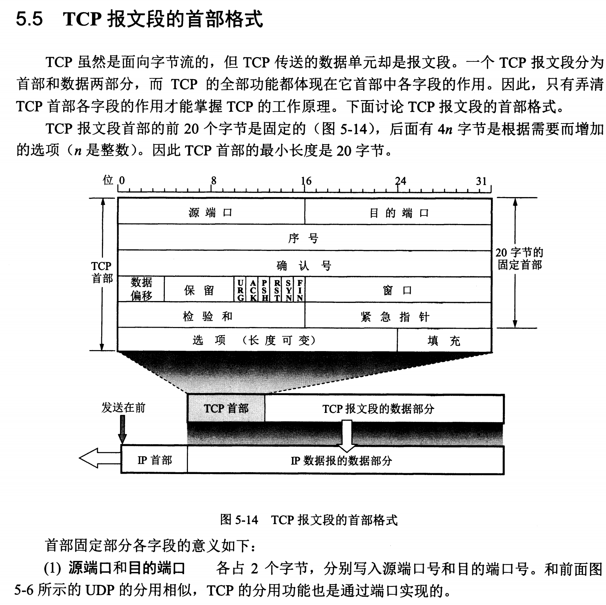  
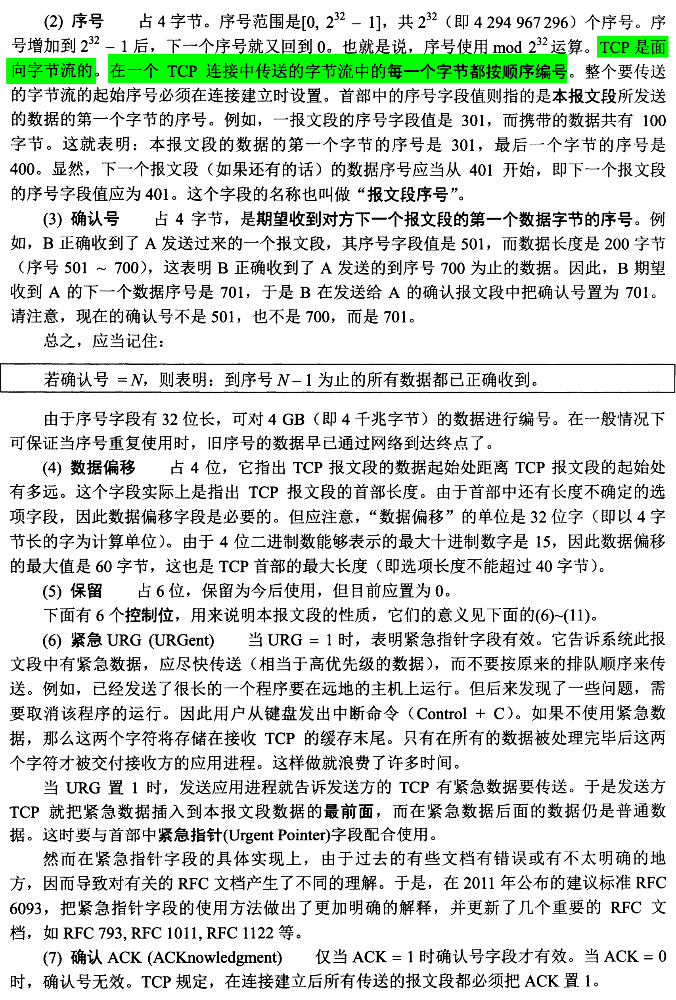  
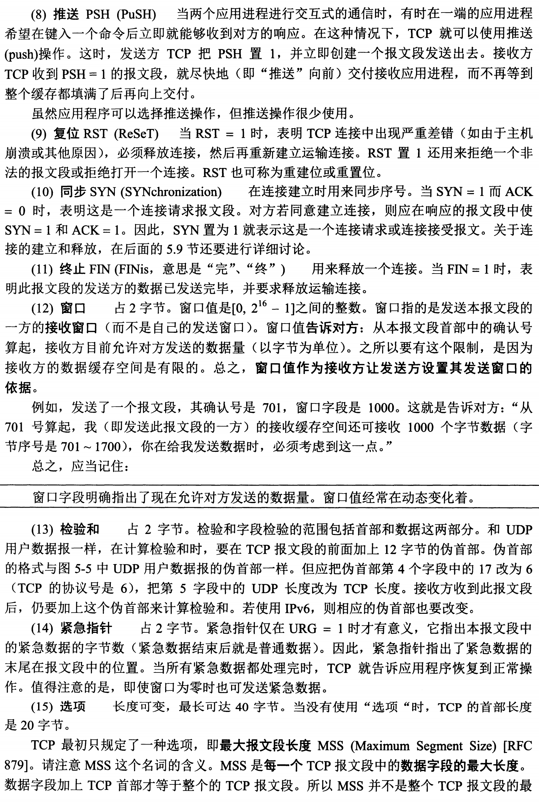  
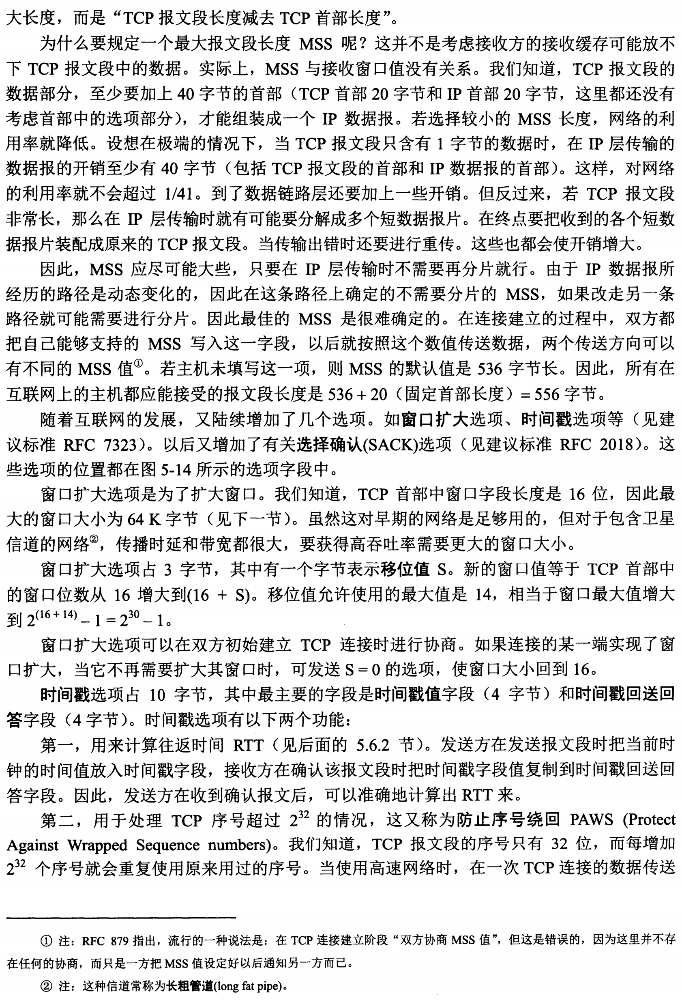  
  
  
  
*******************  
  
> [2.4.1 可靠联机的 TCP 协议](http://cn.linux.vbird.org/linux_server/0110network_basic_4.php#tcpip_transfer_tcp)  
  
- 控制位，6 bits，代表 6 个句柄，为 1 表示启用  
	- URG (Urgent)  
	为 1 表示该包为紧急包  
	- ACK (Acknowlege)  
	为 1 表示为响应封包  
	- PSH (Push function)  
	为 1 表示要求对方立即传送缓冲区内的其他封包，而不是等缓冲区满了才发送  
	- RST (Reset)  
	为 1 表示联机马上结束，如 TCP 连接中出现严重差错，必须立即释放连接，再重新建立连接  
	也可用来拒绝非法报文段或者拒绝一个连接  
	- SYN (Synchronous)  
	为 1 希望双方建立同步处理，即要求连接  
	通常表示主动要连接到对方  
	- FIN (Finish)  
	为 1 表示连接结束，发送方已完成全部数据传输，需要等接收方响应  
  
- 检验和（CheckSum）  
	- 检验首部和数据部分，IP 数据报中只检验首部  
	- 计算检验和时会在前面加上 12 字节伪首部  
	- 接收方收到报文后仍加上伪首部计算检验和，然后将结果和 CheckSum 对比，以验证包是否正确  
	- 检验和不相符的包表示已损坏，丢弃后要求对方重新发送  
  
	  
# 5-16 **停止等待协议中的编号**  
  
停止等待协议必须使用编号，见 [停止等待协议问题](https://www.cnblogs.com/xiaowei123/p/13143884.html])  
  
  
# 5-23 TCP 报文段习题1  
  
  
  
  
<br/>  
  
1. 第一个报文的序号范围为 70 ～ 99，共 30 字节。  
2. 确认号是期望收到对方下一个报文段的第一个数据字节的序号。因此这里确认号为 100。  
3. 第二个报文段的序号范围为 100 ～ 179，共 80 字节。  
4. B 只能对按序收到的数据中的最高序号给出确认，因此确认号为 70。  
  
# 5-25 **TCP首部中的端口号**  
运输层是进程与进程之间的通信，因此需要写明源端口号和目的端口号。  
ICMP 报文的数据部分包含 IP 数据报的数据字段的前 8 个字节，将 TCP 首部的前 4 字节设为源端口和目的端口可以确定出现差错的连接。  
  
**************  
  
> [2.4.1 可靠联机的 TCP 协议](http://cn.linux.vbird.org/linux_server/0110network_basic_4.php#tcpip_transfer_tcp)  
  
- 如果客户端想要访问一个服务器的 www 服务，则服务器会开启 80 端口等待客户端的连接  
- 客户端通过浏览器访问服务器的 wwww 服务，客户端浏览器的端口则是客户端主机随机分配的  
  
  
# 5-26 **TCP首部数据偏移字段表明首部长度**  
TCP 报文是面向字节流的，长度是不固定的，其首部除了固定的 20 字节外，有长度可变的选项字段，其中选项字段中包括最大报文长度 MSS（Maximum Segment Size），表示 TCP 报文段中数据字段的最大长度，使用该选项的原因如下：  
  
  
  
  
# 5-27 **TCP 报文段的数据部分最大字节数**  
  
  
IP 数据报的总长度字段为 16 位，因此 IP 数据报的最大长度为 $2^{16}-1$ = 65535 字节，TCP 报文为 IP 数据报的数据部分，IP 数据报的首部最少 20 字节，因此 TCP 数据报的总长度最大 65515 字节，TCP 数据报首部至少 20 字节，因此 TCP 数据报的数据部分最多 65495 字节。  
  
如果传送的字节长度超过序号字段可能循环使用序号，即到达最大序号后，下一个序号为 0，仍可用 TCP 传送。  
  
# 5-28 **TCP 报文段格式习题1**  
  
  
源端口为 n，目的端口为 m。  
  
# 5-29 **TCP 报文段丢失但不会重传的情况**  
  
  
还未重传就受到对更高序号的确认，则说明目的端口已收到前面的数据，因为接收方只对按序到达的最高序号给出确认。  
  
  
# 5-40 **没有拥塞而引起分组丢失的情况**  
  
  
  
1. IP数据报传输过程中需要分片，但其中一个分片未能及时到达终点，终点组装 IP 数据报超时，因此丢弃该数据报。  
2. IP 数据报以达到终点，但终点缓存没有足够空间，因此丢弃该数据报。  
3. 数据报在转发时经过一个局域网的网桥，但网桥在转发该数据报的帧时没有足够的差错空间从而丢弃。  
  
  
# TCP 以字节为单位的滑动窗口机制  
为了讨论方便，假设数据由 A 发送给 B，仅一个方向  
  
- TCP 报文段中有一个窗口值，表示接收方允许发送方发送的最大数据长度  
- 滑动窗口是以字节为单位的  
- 接收方仅对**按序**收到的最高序号给出确认，确认号是期望发送方下次发送的起始序号  
- 发送方的应用进程将字节流写入到 TCP 的发送缓存，接收方的应用进程从 TCP 的接收缓存中读取字节流  
- TCP 是全双工通信，因此通信的每一方都在发送和接收数据报文，都有自己的发送窗口和接收窗口  
  
  
假设 A 收到 B 的确认报文段，其中窗口值为 20，确认号为 31，根据这两个值，A 可以构造自己的发送窗口,  
窗口范围为 31 到 50，见下图：  
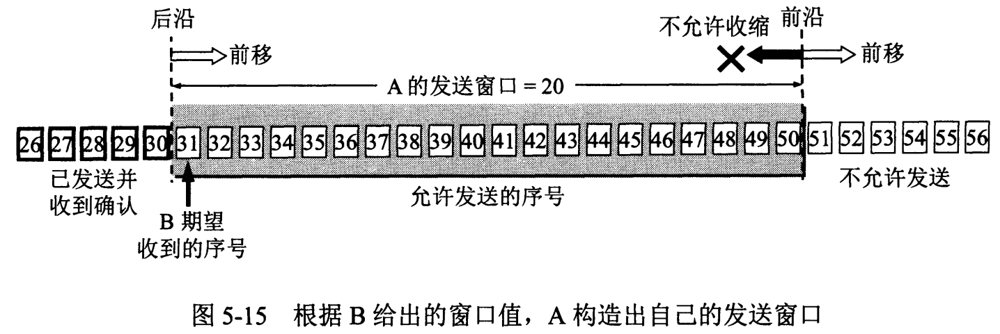  
  
发送窗口的意义是发送方可以连续的将窗口内的数据都发送出去，而不用一个字节发送完就等待确认才发送下一个字节  
因此，窗口越大，发送方就可以在对方确认前发送更多的数据，从而获得更高的传输效率  
  
发送的数据在收到确认前必须暂时保留，以便在超时重传时使用  
  
描述窗口状态的三个指针及其意义如下：  
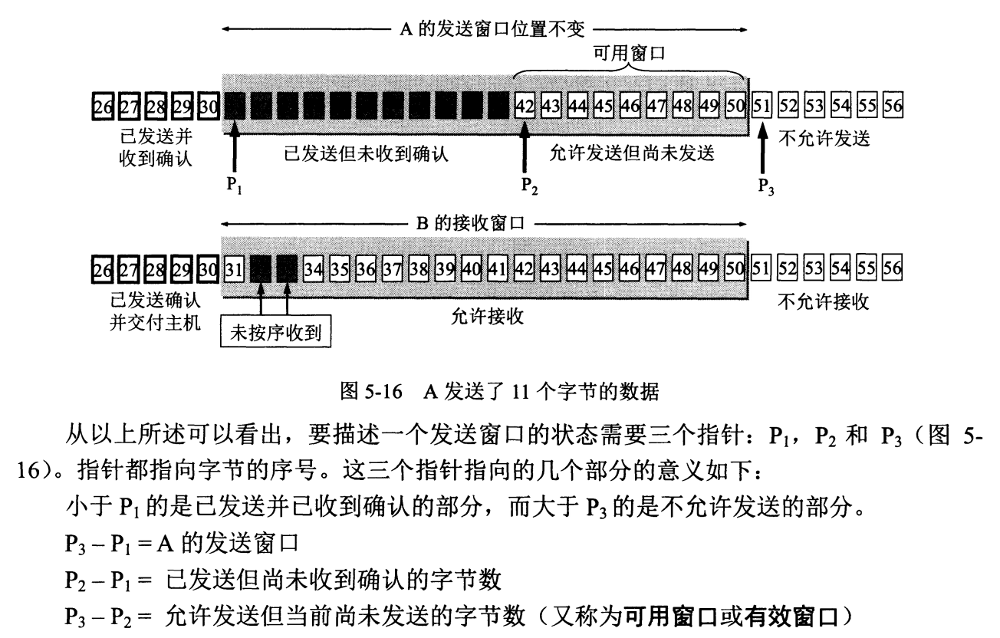  
  
  
# TCP 的选择确认 SACK  
如果收到的报文无差错，但未按序号，即中间缺少了部分序号的数据，造成接收方收到一些不连续的数据块  
TCP 的首部选项字段中可以加上允许 SACK 的选项，即可以报告不连续的字节快边界，而不用将所有未确认的重传  
但大多数实现还是重传所有未被确认的数据块  
  
  
# 5-74 **流量控制和拥塞控制的区别**  
  
  
## **流量控制**  
  
  
  
流量控制是TCP中的一种机制，用于控制发送方向接收方发送数据的速率，以确保接收方能够及时处理接收到的数据，并防止发送方发送速度过快而导致数据丢失或溢出。  
TCP使用滑动窗口机制来进行流量控制。  
  
滑动窗口机制由发送窗口和接收窗口组成。发送窗口是发送方允许发送的字节数量的上限，而接收窗口是接收方能够接收的字节数量的上限。  
接收方通过在TCP报文段中的确认号来通知发送方自己的接收窗口大小。  
发送方根据接收窗口的大小调整自己发送数据的速率，确保不超过接收方的处理能力。  
  
## **拥塞控制**  
  
  
拥塞控制是TCP中的另一种机制，用于控制数据在网络中的传输速率，以避免网络拥塞并保持网络的稳定性。  
拥塞控制通过监视网络的负载情况和网络的拥塞程度来调整数据的发送速率。  
  
TCP使用一种称为拥塞窗口的方法来实现拥塞控制。拥塞窗口是发送方发送数据的速率与网络负载情况的折中值。  
发送方根据网络的拥塞情况动态调整拥塞窗口的大小，以控制数据的发送速率。  
拥塞控制算法通常包括慢启动、拥塞避免和快速恢复等阶段，以逐步增加发送速率并对网络拥塞做出响应。  
  
## **拥塞控制与流量控制区别**  
  
  
  
1. 流量控制是为了确保接收方能够有效地接收数据并避免数据丢失或溢出，而拥塞控制是为了保持网络的稳定性和避免拥塞发生。  
2. 流量控制是在发送方和接收方之间进行的，而拥塞控制是在整个网络中进行的。  
3. 流量控制是根据接收方的处理能力来控制发送速率，而拥塞控制是根据网络的负载情况和拥塞程度来调整发送速率。  
4. 流量控制使用滑动窗口机制来控制发送速率，而拥塞控制使用拥塞窗口算法来调整发送速率。  
  
总的来说，流量控制是为了适应接收方的处理能力调整数据发送速率，而拥塞控制是为了避免网络拥塞并保持网络稳定性调整数据发送速率。它们是TCP协议中的两种重要机制，同时工作来确保传输的可靠性和效率。  
  
# TCP 三报文握手  
  
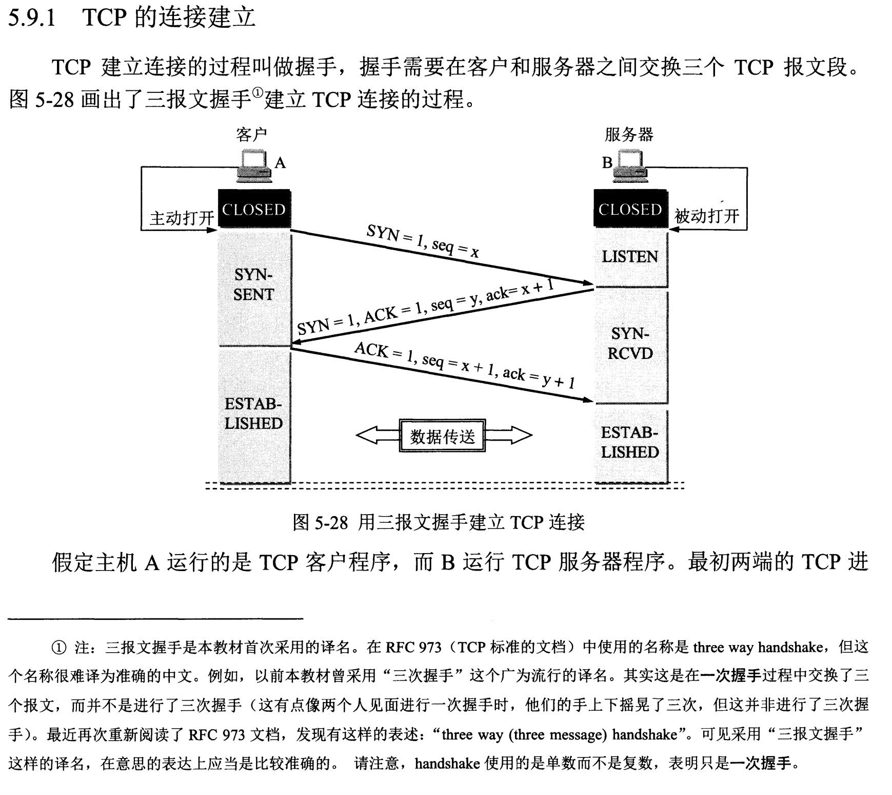  
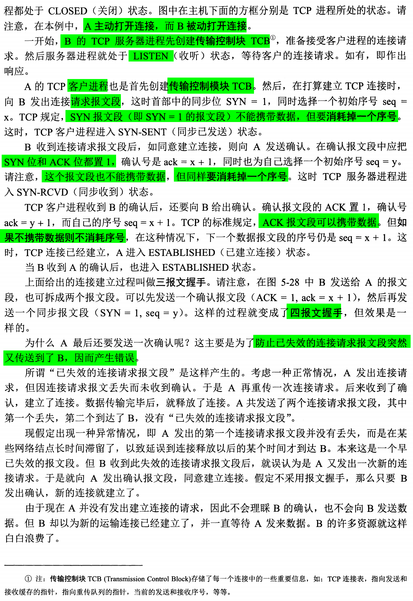  
  
  
  
> 同时参考 深入理解计算机系统第十一章  
  
A 客户端向 B 服务器建立连接：  
1. B 服务器需要创建传输控制模块 TCB，开启端口，准备接收客户端进程的连接请求，此时服务器进程处于 LISTEN 状态  
  
2. A 客户端进程也创建传输控制模块 TCB  
  
3. A 向 B 发出连接请求报文，此时首部 SYN 为 1，不能携带数据，但需要消耗一个序号，此时客户进程进入 SYN-SENT 状态  
  
4. B 收到请求报文段后，如同意建立连接，则向 A 发送确认，SYN = 1，ACK =1，返回一个确认号，选择一个初始序号，  
   该报文也不能携带数据，但需要消耗一个序号，此时 B 进程进入 SYN-RECD 状态  
     
5. A 进程收到 B 确认后，还需向 B 发送确认，确认报文段的 ACK=1，可以携带数据，如果不携带数据，则不消耗序号，  
   此时 A 进入 ESTABLISHED 状态  
  
6. B 收到 A 的确认后即进入 ESTABLISHED 状态  
  
## 四报文握手  
- 如果 B 发送给 A 确认时分开为两个报文段，即先发一个 ACK = 1 的确认报文段，再发一个 SYN = 1 的同步报文段，  
  则变成**四报文握手**  
  
## 建立连接需要三报文的原因  
  
1. A 收到 B 的确认报文后还需要向 B 发送确认  
- 防止已失效的连接请求又传到 B，从而产生错误   
如 A 发送连接请求的报文在网络中长时间滞留，因此 A 重新发送连接请求并与 B 建立连接，最后完成释放连接，  
B 在与 A 释放连接后，又收到之前 A 发送的连接请求，以为是一次新的连接而向 A 发送确认报文段，  
如果没有第三次 A 的确认报文，则连接已建立成功，而 B 会一直等待 A 发送数据，从而造成资源浪费。  
  
  
*********************  
  
> [2.4.2 TCP 的三向交握](http://cn.linux.vbird.org/linux_server/0110network_basic_4.php#tcpip_transfer_tcphand)  
  
  
# TCP 四报文挥手  
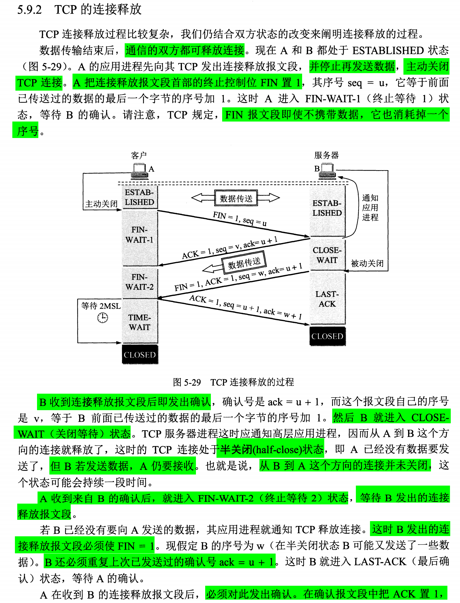  
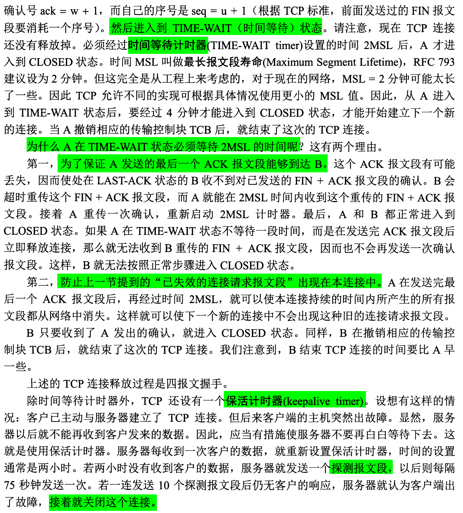  
  
  
- 通信双方都可以释放连接  
  
假设 A 进程向 B 发送连接释放报文段：  
1. A 发送连接释放报文段，FIN=1，序号 seq = u (前一次发送数据的最后一个字节序号+1)，  
   此后 A 停止发送数据，主动关闭 TCP 连接，A 进入 FIN-WAIT-1 状态;  
   A 发送的报文段可以不携带数据，但必须消耗一个序号  
  
2. B 发送确认，ACK=1，B 进入 CLOSE-WAIT 状态  
  
3. 此时 TCP 连接处于**半关闭**状态，即 A 以及完成数据传输，B 仍可以发送数据，A 仍要接收  
  
4. A 收到 B 的确认报文段后进入 FIN-WAIT-2 状态，等待 B 发送连接释放报文段  
  
5. B 可以向 A 继续发送数据，直到没有数据传输，则发出连接释放报文段，FIN=1，ACK=1，  
   以及确认号和序号，B 进入 LAST-CHECK 状态，等待 A 的确认  
  
6. A 收到连接释放报文段后，对 B 发出确认，ACK=1，附带确认号和序号，进入 TIME-WAIT 状态，  
  
7. 此时 TCP 连接并未释放，需要**时间等待计时器（TIME-WAIT timer）**设置的时间 2MSL 后，A 才进入 CLOSED 状态。  
  
  
## TIME-WAIT 阶段的作用  
> [Why does TIME_WAIT exist?](https://serverframework.com/asynchronousevents/2011/01/time-wait-and-its-design-implications-for-protocols-and-scalable-servers.html#why-does-time_wait-exist)  
  
  
> The MSL is the maximum amount of time that any segment,   
> for all intents and purposes a datagram that forms part of the TCP protocol,   
> can remain valid on the network before being discarded.  
  
  
TIME-WAIT 阶段，A 等待 2MSL（最长报文段寿命，Maximum Segment Lifetime）的时间  
  
MSL 和 IP 数据报首部的 TTL 字段有关，TTL 限制了该数据报在网络中的存活时间，超过时间即被丢弃  
  
1. The first is to prevent delayed segments from one connection being misinterpreted as being part of a subsequent connection.   
Any segments that arrive whilst a connection is in the 2MSL wait state are discarded.  
  
设置 2MSL 可以保证本连接中之前的已失效的报文段从网络中消失，以防止干扰下次新的连接  
  
2. 确保 A 发送的最后一个 ACK 确认报文段能到达 B，如果该报文丢失，B 会超时重传报文，  
A 就能在 2MSL 时间内重新发送最后的确认报文；A 重新发送确认报文后，重新开启了2MSL 计时器。  
  
  
查看 TIME-WAIT 的时间  
```bash  
[20:09:49 root@ubuntu2004 ~]# sysctl net.ipv4.tcp_fin_timeout  
net.ipv4.tcp_fin_timeout = 60  
```  
  
  
# 保活计时器（Keepalive timer）  
- 防止已建立连接后，客户端出现故障，服务端不用一直等待。  
- 服务端收到一次客户端的数据，就重置保活计时器，时间通常 2 小时。  
- 如果服务端在两小时内没有收到客户端数据，则发送一个探测报文段，  
  以后每 75 秒发送一次，若连接发送 10 个探测报文段后无响应，  
  则服务端认为客户端出现故障，关闭此连接。  
  
  
# TCP 的 11 种有限状态机  
- 为了更清楚看出 TCP 连接的各种状态之间的关系  
- ubuntu22.04 中 `man netstat` 可以查看 `state` 状态  
  
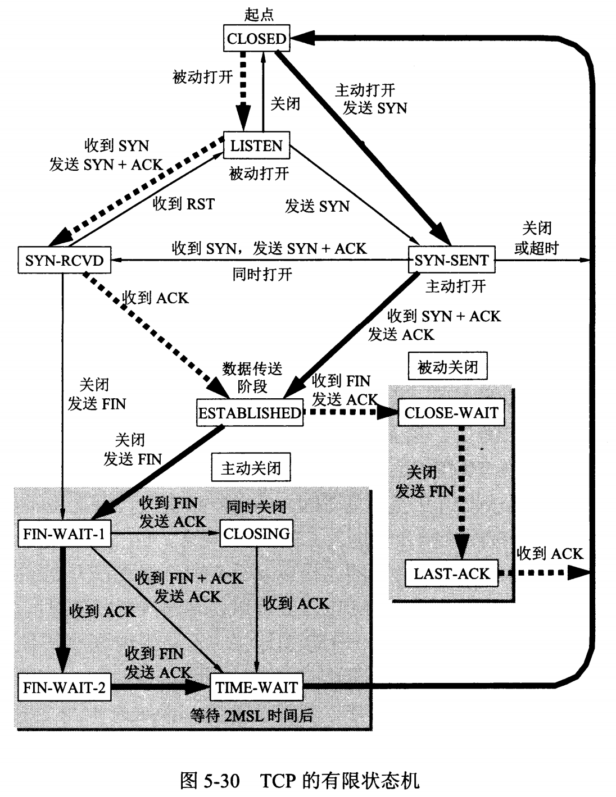  
  
- **粗实线箭头**表示对**客户进程的正常变迁**  
- **粗虚线箭头**表示对**服务进程的正常变迁**  
- **细线箭头**表示对**异常变迁**  
  
