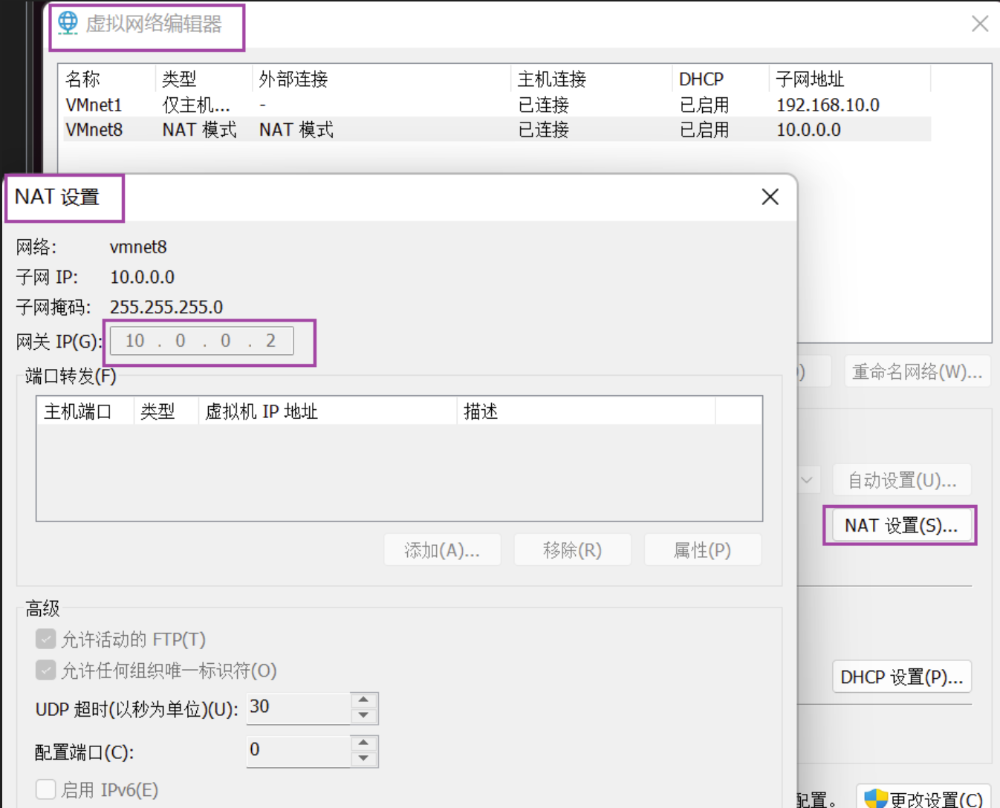

计算机网络学习笔记

# 学习资源
> 网站测速，IP 查询等网站：[站长之家](https://tool.chinaz.com/speedtest/)


## 书籍
> 小白入门计算机网络知识：计算机网络 谢希仁 第 7 版
> 看完 计算机网络 后可以补充看：图解TCP_IP
> linux 上学习网络工具，实操：鸟哥的Linux私房菜服务器架设篇
> 对计算机基础网络知识有一定了解后看，提到很多概论，拓展知识：趣谈网络协议 刘超 


## 视频
> [PowerCertAnimatedVideos](https://www.youtube.com/@PowerCertAnimatedVideos)
> [Linux DNS服务](https://www.bilibili.com/video/BV1JW4y1J7cw/?spm_id_from=333.999.0.0)


## 学习过程
1. 学习计算机网络基础知识
- 看谢希仁的**计算机网络（第 7 版）** 前 7 章，了解计算机网络基础知识
- 快速看**图解TCP_IP（第 5 版）**，作为查漏补缺

2. linux 实操学习
- 看视频学习
- 看书：鸟哥的Linux私房菜基础学习篇，学习 linux 中相关命令和工具
- 看书：鸟哥的Linux私房菜服务器架设篇，学习 linux 中网络工具使用
 
# 计算机网络基础知识
主要笔记在**计算机网络**和**图解TCP_IP**两本书的笔记中，这里做一些零碎补充

## LAN WAN SUBNET
> [LAN, WAN, SUBNET - EXPLAINED](https://www.youtube.com/watch?v=NyZWSvSj8ek&ab_channel=PowerCertAnimatedVideos)


## 计算机网络体系分层的目的
> [计算机网络为什么要分层](https://www.cnblogs.com/ricklz/p/16457713.html)
> 计算机网络 谢希仁 第7版 1.7

相互通信的计算机必须协调工作，而这种协调十分复杂，分层可以将复杂的问题转换为若干较小的局部问题

分层的好处如下：
- 各层之间独立
每一层不用关心其他层如何实现，仅需知道层间接口所提供的服务
下层对上层透明

- 灵活性好
任意一层发生发生变化，只要层间接口不变，不影响其他层

- 结构上可分割开
各层可以采用最适合自己的技术实现

- 易于实现和维护
不用调试一个十分庞大而复杂的系统，因为每层为一个相对独立的子系统

- 促进标准化工作
每层有自己明确的功能，且有精确说明


分层的缺点：
- 可能有些功能在不同层重复出现而产生额外开销


计算机网络的各层及其协议的集合就是网络的体系结构 (architecture)
计算机的体系结构就是计算机网络及其构件所应完成的功能的精确定义
体系结构是抽象的，其实现靠具体的硬件和软件

## 透明
在计算机网络中，"透明"是一个重要的概念，表示某个组件或系统对于其他组件或系统来说是不可见的，或者说对其他组件的行为没有显著的影响。

以下是几个计算机网络中"透明"概念的例子：

1. 物理层对数据链路层透明：物理层尽可能**屏蔽掉传输媒体和通信手段的差异，使物理层上层的数据链路层感觉不到这些差异**，只用考虑如何完成本层的协议和服务。

2. 传输层透明：在网络通信中，传输层的透明性是指对于应用层来说，传输层提供的传输服务是无差别的，无论底层网络使用的是哪种技术或协议。例如，TCP协议在底层可以使用以太网、Wi-Fi或者其他网络技术实现，但应用程序不需要关心底层的具体实现细节，只需使用统一的套接字接口进行数据的发送和接收。

3. 路由器透明：在计算机网络中，路由器是负责将数据包从源地址转发到目标地址的网络设备。路由器的透明性意味着它在转发数据包时不会对数据内容进行修改或解析。无论是文本、图像还是视频数据，路由器都会透明地将它们传递到下一个网络节点，而不会对数据包本身产生任何影响。

4. 隧道透明：隧道是一种将一个协议的数据封装在另一个协议的数据包中进行传输的方式。隧道协议的透明性表明，封装在隧道中的数据将在传输过程中被保持原样，不会被修改或解析。这样，隧道的两端可以是不同网络或不同协议的设备，但它们仍然可以通过隧道进行通信。

5. 加密透明：加密透明是指在网络通信中使用加密技术时，对于通信的两端来说，使用加密算法进行数据加密和解密是透明的。通信的两端可以像使用非加密通信一样发送和接收数据，中间的加密和解密过程对它们是透明的。这为安全的网络通信提供了便利，同时确保了用户数据的隐私和保密性。

这些例子展示了计算机网络中的"透明"概念，即某个组件或系统的行为对其他组件来说是不可见的。透明性帮助网络中的各个组件相互协作，并简化了网络通信和管理的复杂性。


## 五层协议
OSI 七层协议
- 物理层，数据链路层，网络层，运输层，会话层，表示层，应用层
- 理论模型

TCP/IP 四层协议
- 网络接口层，网际层，运输层，应用层
- 实际使用

五层协议划分
- 物理层，数据链路层，网络层，运输层，应用层

### 物理层
- physical layer
- 传输的数据单位为比特，考虑的是用多大电压表示 1 和 0 以及接收方如何识别发送的比特（编码方式等）
- 物理层还要考虑与传输媒介，如双绞线等接口的一些特性，但具体传输媒介的特性不属于物理层，是在物理层之下
- 物理层尽可能**屏蔽掉传输媒体和通信手段的差异，使物理层上层的数据链路层感觉不到这些差异**，只用考虑如何完成本层的协议和服务

### 数据链路层
- data link layer

数据链路层要解决的三个问题：
- 封装成帧 (framing)
帧的首部和尾部用于帧定界，且包括许多必要的控制信息，发送帧时从帧的首部开始发送。
数据链路层协议对帧首部和帧尾部的格式有明确的规定，也规定了帧的数据部分长度上限，即最大传输单元 **MTU** （Maximum Transfer Unit）。不同数据链路的 MTU 不同。

- 透明传输 
无论什么比特组合的数据，都能按照原样没有差错的通过数据链路层，即数据链路层对这些数据透明
传输的数据不会因为帧定界的方式与数据的来源不兼容而出现错误

- 差错检测
数据链路层将数据封装成帧中包含数据和控制信息，控制信息中含有差错控制，发现差错则丢弃帧
数据链路层使用 CRC 检验，能实现无比特差错的传输，但不是可靠传输，即数据链路层不会检验帧丢失，帧重复或帧失序等差错

对于通信质量良好的有线传输链路，数据链路层协议不使用确认和重传机制，即不向上层提供可靠的传输服务
对于通信质量较差的无线传输链路，数据链路层协议使用确认和重传机制，即不向上层提供可靠的传输服务

### 网络层
- network layer

将运输层产生的报文段或用户数据报封装成分组或包传送给分组交换网上的不同主机
选择合适的路由使得源主机的数据包能到达目的主机

### 运输层
- transport layer

运输层负责向两台主机中进程之间的通信提供通用的数据传输服务，通用指多个应用能使用一个运输层服务

运输层有复用和分用的功能，复用表示多个应用层进程同时使用运输层的服务，
分用表示运输层将收到的信息分别交付给应用层中的相应进程

运输层向高层用户屏蔽下面网络核心的细节（如网络拓扑、所采用的路由协议等），使应用进程看见的就是好像在两个运输层实体之间有一条端到端的逻辑通信信道。

### 应用层
- application layer

应用层通过应用进程间的交互来完成特定网络应用
应用层协议定义应用进程间通信和交互的规则

## 三层网络模型
> [Build Your Skills: The three-layer hierarchical model](https://www.techrepublic.com/article/build-your-skills-the-three-layer-hierarchical-model/)
> [3 Layer Cisco Hierarchical Model](https://ipwithease.com/3-layer-cisco-hierarchical-model/)
> [Three-Layer Hierarchical Model in Cisco](https://www.geeksforgeeks.org/three-layer-hierarchical-model-in-cisco/)
> [Network Topology Architectures (2-tier and 3-tier) | Cisco CCNA 200-301](https://www.youtube.com/watch?v=XHlr791Lid0&ab_channel=KeithBarker-TheOGofIT)
> [CCNA Training CBT - Cisco Three Layer Hierarchical Model](https://www.youtube.com/watch?v=vCneK-9nVyI&ab_channel=ITdvds)


- 接入层（access layer）
    - 连接终端到局域网中，如 VLAN 在接入层分开广播域，或者路由器划分的子网。
    - use switches or hubs

- 分发层（distribution layer）
    - 也叫汇聚层，如连接接入层不同的 VLAN，或者接入层不同的子网；如果接入层划分不同子网，分发层连接不同的子网，这些子网仍然属于一个局域网，分发层的路由器有一个路由表用来过滤数据包决定分发给哪个子网。
    - 例如防火墙，NAT 配置等在分发层。
    - use routers to connect multiple networks together

- 核心层（core layer）
    - 复杂高速数据转发，连接分发层的各个设备。


## 集线器 Hub
- 工作在物理层，仅简单地转发比特，半双工通信
- 不进行碰撞检测，因此有 CSMA/CD 协议，保证同一时刻只有一个站点发送数据

## 以太网交换机 switch
- 工作在数据链路层，全双工通信，能隔离冲突域
- 以太网交换机实质是多接口网桥，网桥只有两个接口，以太网交换机接口更多。
- 以太网交换机使用了专门的交换结构芯片，用硬件转发，其转发速率比普通网桥快。
- 以太网交换机有存储器，能进行帧缓存。
- 以太网交换机内有交换表，能进行自学习，交换表中每个条目是每个端口号以及对应的 MAC 地址，交换表有一定的有效时间，过期就删除。
- 以太网交换机是即插即用设备，因为其自有自学习能力，不必人工配置。
- 以太网交换机一般有多种速率接口。 
- 以太网交换机大多数对帧采用存储转发的方式，但也有些采用直通方式交换，直通交换不进行差错检测就将帧发出去。
- 以太网是全双工通信方式。


## 网络接口与网络适配器
### 网络接口（network interface）
> [Network interfaces](https://learn.microsoft.com/en-us/windows/win32/network-interfaces)

- 计算机与网络之间的连接点 
- 可以是物理的，也可以是虚拟的
- 允许计算机通过网络发送和接收数据

### 网络适配器（network adapter）
- 也叫网络接口卡（network interface card）
- 是一种硬件设备，提供计算机与网络之间的物理连接

## 广播域与冲突域
> [Broadcast Domains and Collision Domains - CompTIA Network+ N10-007 - 1.3](https://www.youtube.com/watch?v=SGbtLjIEVeo&ab_channel=ProfessorMesser)
> [CSMA/CD and CSMA/CA Explained](https://www.youtube.com/watch?v=iKn0GzF5-IU&t=103s&ab_channel=PowerCertAnimatedVideos)

- broadcast domain and collision domain

### collision domain
在以太网中，当两个设备同时将数据包发送到同一物理链路上时，这些数据包可能会在传输过程中发生碰撞，导致数据包损坏。
这是因为以太网使用的是半双工通信方式，设备不能同时发送和接收数据。
碰撞域的存在会限制网络的传输效率和可靠性。


- hub 连接的主机为一个 collision domain
- 同一时刻最多只允许一个站点发送数据
- 各主机的网络适配器执行 CSMA/CD 协议以避免冲突
- switch 能隔离冲突域，switch 是全双工通信，且有存储器能对数据进行缓存

### broadcast domain
广播域是指网络中的一组设备，当其中一个设备发送广播消息时，其他设备都能够接收到该消息
广播是一种发送到本地网络上的特殊数据包，其目标地址为广播地址，例如IPv4中的255.255.255.255

- 第二层以太网交换机所连接的设备属于一个广播域
- ARP 广播会在一个广播域中传输
- VLAN 可以隔离广播域
- 路由器可以隔离广播域

## 网络环路和生成树协议 STP
查看 **趣谈网络协议 2.2 节**的讲解


## VLAN 
> [VLAN Explained](https://www.youtube.com/watch?v=jC6MJTh9fRE&ab_channel=PowerCertAnimatedVideos)

- 从逻辑上划分广播域，限制接收广播风暴的计算机数量
- 工作在数据链路层
- 在以太网帧中加入一个 VLAN 标志，占 4 字节，但实际可分配的主机数只有 12 位，即 4096 个主机
- 对交换机有要求
- 二层的交换机只能在一个局域网中划分广播域

## IP 地址和 MAC 地址的区别
> [MAC Address Explained](https://www.youtube.com/watch?v=TIiQiw7fpsU&ab_channel=PowerCertAnimatedVideos)


- 在 IP 层抽象的互联网上只能看到 IP 数据报，屏蔽了下层网络硬件地址体系的不同等复杂细节。
- 互联网可以由很多[异构网](https://en.wikipedia.org/wiki/Heterogeneous_network)组成，使用 IP 协议让互联网上的主机好像在一个单个网络上通信，而不用管各网络的具体异构细节。
- IP 数据报首部的源地址和目的地址始终不变，是最终的源和目的地址
- 路由器进行路由是依据 IP 地址，IP 地址更有规律，适合路由器进行路由管理
- IP 地址是软件实现的逻辑地址，很容易变化；物理地址是硬件地址，在网络适配器的 ROM 中，一般不会变化
- 局域网的数据链路层只能看见 MAC 帧，以太网交换机的交换表是根据 MAC 地址进行转发
- MAC 帧经过不同的网络时，其帧首部的源地址和目的地址都要变化，源地址变为当前发送的地址，目的地址下一跳的地址


## 子网（subnet）和 虚拟局域网 VLAN 区别
> [LAN, WAN, SUBNET - EXPLAINED](https://www.youtube.com/watch?v=NyZWSvSj8ek&list=LL&index=5&ab_channel=PowerCertAnimatedVideos)
> [VLAN Explained](https://www.youtube.com/watch?v=jC6MJTh9fRE&t=1s&ab_channel=PowerCertAnimatedVideos)
> [Subnets vs VLANs](https://www.youtube.com/watch?v=6_giEv20En0&list=LL&index=6&ab_channel=PowerCertAnimatedVideos)


- 划分子网是在网络层，通过路由器划分，不同的子网仍属于一个局域网（LAN）。
- 子网是对 IP 地址的主机号分出一些位数作为子网号
- VLAN 是在数据链路层划分，通过以太网交换机，在 MAC 地址中增加一个标志位来区分，逻辑上划分为多个广播域，但多个广播域仍然在一个局域网中。
- 子网是在物理上划分，VLAN 是在逻辑上划分，都是分割不同的广播域。
- 子网和 VLAN 划分均在访问层（access layer），但连接不同的 VALN 和子网则是在 distribution layer。
- 可能有些场景不能使用 VLAN，只能在网络层划分子网。

## TCP 和 UDP 的区别
1. TCP 是面向连接的，UDP 面向无连接
- 面向连接指互相通信前先建立连接
- TCP 进行三次握手来建立连接，而 UDP 不建立连接
TCP 建立连接的原因：
1) 确保双方都准备好进行通信：在建立TCP连接之前，客户端和服务器需要确保双方都已经准备好进行通信。通过三次握手，客户端和服务器可以确保彼此都处于可达状态，并且可以正常地发送和接收数据。

2) 同步序列号 (Synchronize Sequence Numbers)：在三次握手过程中，服务端和客户端将交换彼此的初始序列号（ISN），以确保双方建立起相同的初始序列号。

序列号用于对TCP数据包进行排序和重组。在建立连接时同步序列号非常重要，因为它们用于标识每个TCP连接中的数据包顺序，并帮助检测和处理重复或丢失的数据包。

3) 确认连接请求和响应：通过三次握手，客户端向服务器发送一个连接请求报文段（SYN），表示客户端希望建立连接。 服务器收到请求后，会回复一个确认报文段（SYN-ACK），以确认收到连接请求，并表示服务器也准备好建立连接。最后，客户端再次回复一个确认报文段（ACK），表示已经接收到服务器的确认，并且连接已经建立。

这样来回的确认过程可以防止服务器收到多个重复的连接请求，以及客户端在发送请求后一段时间后便关闭的情况。通过三次握手，确保连接的可靠性和可用性。

2. TCP 不支持广播或多播通信，UDP 可以一对多或多对多等通信
TCP 需要建立连接，数据传送结束要释放连接，因此不支持一对多
UDP 是无连接的，因此可以进行一对多通信

3. TCP 是面向字节流的，UDP 是面向报文的
应用程序交付给 TCP 的是数据块，但 TCP 将其仅看成一连串无结构的字节流，字节流中的每个字节都被按序编号
TCP 连接的连接的两端有发送缓存和接收缓存，提供全双工通信，不关心应用程序一次将多长的报文发送到 TCP 缓存中，
TCP 是根据对方给出的窗口值和当前网络的拥塞程度决定发送多少字节

UDP 对应用层交付的报文不合并也不拆分，添加首部数据后就交给 IP 层，因此应用层最好选择合适大小的报文，
如果报文太长，到 IP 层后需要分片，会降低 IP 层的效率
报文太短也会降低 IP 层的效率

4. TCP 提供可靠交付，UDP 不保证可靠交付
TCP 是有状态的服务，会跟踪数据包发送状态，而 UDP 是无状态的，不管数据是否发送成功或者有无差错等

TCP 能提供可靠传输的原因：
- 面向连接 Connection-oriented
TCP 在通信前进行三次握手和通信结束后四次挥手保证数据的完整交换

- 确认和重传机制
接收方收到数据后会发送 acknowledgments (ACK) 给发送方以告知对方自己收到数据
如果发送方在一定时间内没有收到 ACK 确认消息，则重传数据包
该机制确保数据不丢失

- 为每个字节分配序号
TCP 在建立连接时会发送初始序号 (sequence number)，此后传输数据的包会依序编号，接收方在发送确认消息时也会指明下次发送的序号
接收方根据序号重组数据，保证数据无差错，按序到达

- 流量控制（flow control）
TCP 利用滑动窗口机制让发送方的发送速率不要太快，以便接收方来得及接收

- 拥塞控制（Congestion control）
TCP 通过监控网络拥塞程度来避免过多的数据注入到网络中，使网络中的路由器或链路不至于过载而影响通信


## TCP 流量控制和拥塞控制的区别

## **流量控制**


流量控制是TCP中的一种机制，用于控制发送方向接收方发送数据的速率，以确保接收方能够及时处理接收到的数据，并防止发送方发送速度过快而导致数据丢失或溢出。
TCP使用滑动窗口机制来进行流量控制。

滑动窗口机制由发送窗口和接收窗口组成。发送窗口是发送方允许发送的字节数量的上限，而接收窗口是接收方能够接收的字节数量的上限。
接收方通过在TCP报文段中的确认号来通知发送方自己的接收窗口大小。
发送方根据接收窗口的大小调整自己发送数据的速率，确保不超过接收方的处理能力。

## **拥塞控制**


拥塞控制是TCP中的另一种机制，用于控制数据在网络中的传输速率，以避免网络拥塞并保持网络的稳定性。
拥塞控制通过监视网络的负载情况和网络的拥塞程度来调整数据的发送速率。

TCP使用一种称为拥塞窗口的方法来实现拥塞控制。拥塞窗口是发送方发送数据的速率与网络负载情况的折中值。
发送方根据网络的拥塞情况动态调整拥塞窗口的大小，以控制数据的发送速率。
拥塞控制算法通常包括慢启动、拥塞避免和快速恢复等阶段，以逐步增加发送速率并对网络拥塞做出响应。

## **拥塞控制与流量控制区别**


1. 流量控制是为了确保接收方能够有效地接收数据并避免数据丢失或溢出，而拥塞控制是为了保持网络的稳定性和避免拥塞发生。
2. 流量控制是在发送方和接收方之间进行的，而拥塞控制是在整个网络中进行的。
3. 流量控制是根据接收方的处理能力来控制发送速率，而拥塞控制是根据网络的负载情况和拥塞程度来调整发送速率。
4. 流量控制使用滑动窗口机制来控制发送速率，而拥塞控制使用拥塞窗口算法来调整发送速率。

总的来说，流量控制是为了适应接收方的处理能力调整数据发送速率，而拥塞控制是为了避免网络拥塞并保持网络稳定性调整数据发送速率。它们是TCP协议中的两种重要机制，同时工作来确保传输的可靠性和效率。

## TCP 三报文握手
> [What is a Three-way handshake in TCP?](https://www.youtube.com/watch?v=LyDqA-dAPW4&ab_channel=Cisco)

A 客户端向 B 服务器建立连接：
1. B 服务器需要创建传输控制模块 TCB，开启端口，准备接收客户端进程的连接请求，此时服务器进程处于 LISTEN 状态

2. A 客户端进程也创建传输控制模块 TCB

3. A 向 B 发出连接请求报文，此时首部 SYN 为 1，不能携带数据，但需要消耗一个序号，此时客户进程进入 SYN-SENT 状态

4. B 收到请求报文段后，如同意建立连接，则向 A 发送确认，SYN = 1，ACK =1，返回一个确认号，选择一个初始序号，
   该报文也不能携带数据，但需要消耗一个序号，此时 B 进程进入 SYN-RECD 状态
   
5. A 进程收到 B 确认后，还需向 B 发送确认，确认报文段的 ACK=1，可以携带数据，如果不携带数据，则不消耗序号，
   此时 A 进入 ESTABLISHED 状态

6. B 收到 A 的确认后即进入 ESTABLISHED 状态

## 四报文握手
- 如果 B 发送给 A 确认时分开为两个报文段，即先发一个 ACK = 1 的确认报文段，再发一个 SYN = 1 的同步报文段，
  则变成**四报文握手**

## 建立连接需要三报文的原因

1. A 收到 B 的确认报文后还需要向 B 发送确认
- 防止已失效的连接请求又传到 B，从而产生错误 
如 A 发送连接请求的报文在网络中长时间滞留，因此 A 重新发送连接请求并与 B 建立连接，最后完成释放连接，
B 在与 A 释放连接后，又收到之前 A 发送的连接请求，以为是一次新的连接而向 A 发送确认报文段，
如果没有第三次 A 的确认报文，则连接已建立成功，而 B 会一直等待 A 发送数据，从而造成资源浪费。


*********************

> [2.4.2 TCP 的三向交握](http://cn.linux.vbird.org/linux_server/0110network_basic_4.php#tcpip_transfer_tcphand)


## TCP 四报文挥手
> [TCP-4-times-close](https://wiki.wireshark.org/TCP-4-times-close.md)

- 通信双方都可以释放连接

假设 A 进程向 B 发送连接释放报文段：
1. A 发送连接释放报文段，FIN=1，序号 seq = u (前一次发送数据的最后一个字节序号+1)，
   此后 A 停止发送数据，主动关闭 TCP 连接，A 进入 FIN-WAIT-1 状态;
   A 发送的报文段可以不携带数据，但必须消耗一个序号

2. B 发送确认，ACK=1，B 进入 CLOSE-WAIT 状态

3. 此时 TCP 连接处于**半关闭**状态，即 A 以及完成数据传输，B 仍可以发送数据，A 仍要接收

4. A 收到 B 的确认报文段后进入 FIN-WAIT-2 状态，等待 B 发送连接释放报文段

5. B 可以向 A 继续发送数据，直到没有数据传输，则发出连接释放报文段，FIN=1，ACK=1，
   以及确认号和序号，B 进入 LAST-CHECK 状态，等待 A 的确认

6. A 收到连接释放报文段后，对 B 发出确认，ACK=1，附带确认号和序号，进入 TIME-WAIT 状态，

7. 此时 TCP 连接并未释放，需要**时间等待计时器（TIME-WAIT timer）**设置的时间 2MSL 后，A 才进入 CLOSED 状态。


## TIME-WAIT 阶段的作用
> [Why does TIME_WAIT exist?](https://serverframework.com/asynchronousevents/2011/01/time-wait-and-its-design-implications-for-protocols-and-scalable-servers.html#why-does-time_wait-exist)


> The MSL is the maximum amount of time that any segment, 
> for all intents and purposes a datagram that forms part of the TCP protocol, 
> can remain valid on the network before being discarded.


TIME-WAIT 阶段，A 等待 2MSL（最长报文段寿命，Maximum Segment Lifetime）的时间

MSL 和 IP 数据报首部的 TTL 字段有关，TTL 限制了该数据报在网络中的存活时间，超过时间即被丢弃

1. The first is to prevent delayed segments from one connection being misinterpreted as being part of a subsequent connection. 
Any segments that arrive whilst a connection is in the 2MSL wait state are discarded.

设置 2MSL 可以保证本连接中之前的已失效的报文段从网络中消失，以防止干扰下次新的连接

2. 确保 A 发送的最后一个 ACK 确认报文段能到达 B，如果该报文丢失，B 会超时要求重传报文，
A 就能在 2MSL 时间内重新发送最后的确认报文；A 重新发送确认报文后，重新开启了2MSL 计时器。


查看 TIME-WAIT 的时间
```bash
[20:09:49 root@ubuntu2004 ~]# sysctl net.ipv4.tcp_fin_timeout
net.ipv4.tcp_fin_timeout = 60
```

## TCP 保活计时器（Keepalive timer）
- 防止已建立连接后，客户端出现故障，服务端不用一直等待。
- 服务端收到一次客户端的数据，就重置保活计时器，时间通常 2 小时。
- 如果服务端在两小时内没有收到客户端数据，则发送一个探测报文段，
  以后每 75 秒发送一次，若连接发送 10 个探测报文段后无响应，
  则服务端认为客户端出现故障，关闭此连接。


## TCP 的 11 种有限状态机
> [TCP State Transition Diagram](https://flylib.com/books/en/3.223.1.188/1/)

- 为了更清楚看出 TCP 连接的各种状态之间的关系
- ubuntu22.04 中 `man netstat` 可以查看 `state` 状态

## 端口号
> [Port (computer networking)](https://en.wikipedia.org/wiki/Port_(computer_networking))
> [TCP port 0 reserved for what purpose?](https://networkengineering.stackexchange.com/questions/11234/tcp-port-0-reserved-for-what-purpose)


- 不是所有的应用程序都有端口，如不需要网络的应用程序，不需要端口号
- 应用程序进行网络连接时才分配端口号
- 端口号 0 是保留端口号，不能使用


**************
> [2.4.1 可靠联机的 TCP 协议](http://cn.linux.vbird.org/linux_server/0110network_basic_4.php#tcpip_transfer_tcp)

- 如果客户端想要访问一个服务器的 www 服务，则服务器会开启 80 端口等待客户端的连接
- 客户端通过浏览器访问服务器的 wwww 服务，客户端浏览器的端口则是客户端主机随机分配的

### 熟知端口号
- 0 ~ 1023
- 熟知端口号为服务器的端口号，非客户端的端口号，客户端的端口号是随机动态分配
- 熟知端口号是服务器默认端口号，不指定时默认使用的端口号，但也可以修改，修改后访问服务器时需要指定新端口号
- 只有 root 才能开启熟知端口号，因此也叫特权端口号
- `cat /etc/services | less` 查看熟知端口号，部分内容如下：
```bash
# /etc/services:
# $Id: services,v 1.49 2017/08/18 12:43:23 ovasik Exp $
#
# Network services, Internet style
# IANA services version: last updated 2016-07-08
#
# Note that it is presently the policy of IANA to assign a single well-known
# port number for both TCP and UDP; hence, most entries here have two entries
# even if the protocol doesn't support UDP operations.
# Updated from RFC 1700, ``Assigned Numbers'' (October 1994).  Not all ports
# are included, only the more common ones.
#
# The latest IANA port assignments can be gotten from
#       http://www.iana.org/assignments/port-numbers
# The Well Known Ports are those from 0 through 1023.
# The Registered Ports are those from 1024 through 49151
# The Dynamic and/or Private Ports are those from 49152 through 65535
#
# Each line describes one service, and is of the form:
#
# service-name  port/protocol  [aliases ...]   [# comment]

tcpmux          1/tcp                           # TCP port service multiplexer
tcpmux          1/udp                           # TCP port service multiplexer
rje             5/tcp                           # Remote Job Entry
rje             5/udp                           # Remote Job Entry
echo            7/tcp
echo            7/udp
discard         9/tcp           sink null
discard         9/udp           sink null
systat          11/tcp          users
systat          11/udp          users
daytime         13/tcp
daytime         13/udp
qotd            17/tcp          quote
qotd            17/udp          quote
chargen         19/tcp          ttytst source
chargen         19/udp          ttytst source
ftp-data        20/tcp
ftp-data        20/udp
# 21 is registered to ftp, but also used by fsp
ftp             21/tcp
ftp             21/udp          fsp fspd
ssh             22/tcp                          # The Secure Shell (SSH) Protocol
ssh             22/udp                          # The Secure Shell (SSH) Protocol
telnet          23/tcp
telnet          23/udp
# 24 - private mail system
lmtp            24/tcp                          # LMTP Mail Delivery
lmtp            24/udp                          # LMTP Mail Delivery
smtp            25/tcp          mail
smtp            25/udp          mail
time            37/tcp          timserver
time            37/udp          timserver
rlp             39/tcp          resource        # resource location
rlp             39/udp          resource        # resource location
nameserver      42/tcp          name            # IEN 116
nameserver      42/udp          name            # IEN 116
nicname         43/tcp          whois
nicname         43/udp          whois
tacacs          49/tcp                          # Login Host Protocol (TACACS)
tacacs          49/udp                          # Login Host Protocol (TACACS)
re-mail-ck      50/tcp                          # Remote Mail Checking Protocol
re-mail-ck      50/udp                          # Remote Mail Checking Protocol
domain          53/tcp                          # name-domain server
domain          53/udp
whois++         63/tcp          whoispp
whois++         63/udp          whoispp
```

- 常用端口号

|协议|端口号|
|:---|:---|
|ssh|22/tcp|
|smtp|25/tcp|
|domain|53/tcp|
|domain|53/udp|
|http|80/tcp|
|https|443/tcp|

## 监听（listening）
> [7.3.1 什么是 port](http://cn.linux.vbird.org/linux_server/0210network-secure_3.php#portlimit_what)

- 监听（listening）是某个服务程序会一直常驻内存，因此该服务程序启动的 port 会一直存在

## 解耦（decoupling）
> [Coupling](https://en.wikipedia.org/wiki/Coupling_(computer_programming))
> [The Importance Of Decoupling In Software Development](https://cloudcomputingtechnologies.com/the-importance-of-decoupling-in-software-development/)


> [Decoupled](https://www.techopedia.com/definition/598/decoupled)
> &nbsp;
> In theory, this means that a change can be made to one service without the developer having to worry about how the change will impact other services — as long as the service's application programming interface (API) remains the same.

## 域名作用
- IP 转换为域名方便记忆
- 解耦，业务不用依赖具体 IP，即使 IP 地址变化，也不受影响

## 域名解析相关配置文件
### /etc/hosts
设置 hostname 和 ip 对应关系的文件
### /etc/resolv.conf
记录本地 DNS server 
### /etc/nsswitch.conf
决定先用 /etc/hosts 解析还是先用 /etc/resolv.conf 中的设置解析

```bash
[root@ubuntu2204 ~]$ cat /etc/nsswitch.conf
# /etc/nsswitch.conf
#
# Example configuration of GNU Name Service Switch functionality.
# If you have the `glibc-doc-reference' and `info' packages installed, try:
# `info libc "Name Service Switch"' for information about this file.

passwd:         files systemd
group:          files systemd
shadow:         files
gshadow:        files

hosts:          files dns
networks:       files

protocols:      db files
services:       db files
ethers:         db files
rpc:            db files

netgroup:       nis
```
上面的 files 表示 /etc/hosts 解析，dns 表示用 /etc/resolv.conf 中设置的 DNS server 解析

## **域名解析顺序**
> [What is DNS? How it works?](https://medium.com/@Betulince/what-is-dns-how-it-works-12ea45b27e75)

和 /etc/nsswitch 中的设置有关
环境：ubuntu22.04 测试，该系统中先解析 /etc/hosts

- 先查 /etc/hosts 文件
有些域名解析工具会忽略 `/etc/hosts`

- 再查本机缓存
ubuntu22.04 用 `resolvectl` 命令查看 DNS 缓存
ubuntu20.04 用 `systemd-resolve` 命令查看 DNS 缓存

- 本地无记录，找配置的 DNS 域名服务器查询

- 本地配置的 DNS server 如果查询不到，采用递归查询，代替本机向根域名服务器查询
递归（recursive query）指 dns server 以 dns client 的身份向根域名服务器查询

- 根域名服务器告诉告诉 dns server 向哪个顶级域名服务器查询，该过程为迭代查询
迭代查询（iterative query）指查询的域名服务器要么返回结果，要么告诉下步查询的域名服务器，
然后本地配置的 dns server 自己继续向其他域名服务器查询

- dns server 继续通过迭代查询方式，向顶级域名服务器查询，如果没有记录，则继续迭代方式向下级域名服务器查询

### 测试
- ubuntu22.04
1. ping www.baidu.com 正常通信
2. 查看 dns 缓存中的记录
```bash
[root@es ~]$ killall -USR1 systemd-resolved && journalctl -u systemd-resolved | grep -A 100 "CACHE:"
Sep 08 09:42:40 es systemd-resolved[799]: CACHE:
Sep 08 09:42:40 es systemd-resolved[799]:         www.baidu.com IN CNAME www.a.shifen.com
Sep 08 09:42:40 es systemd-resolved[799]:         www.a.shifen.com IN A 180.101.50.242
Sep 08 09:42:40 es systemd-resolved[799]:         www.a.shifen.com IN A 180.101.50.188
```
3. 修改 /etc/hosts 文件
添加记录
```bash
1.2.3.4 www.baidu.com
```
4. ping www.baidu.com
```bash
[root@es ~]$ ping www.baidu.com
PING www.baidu.com (1.2.3.4) 56(84) bytes of data.
```
无法 ping 通 www.baidu.com，ip 地址不对
5. host www.baidu.com 查看 ip
```bash
[root@es ~]$ host www.baidu.com
www.baidu.com has address 1.2.3.4
www.baidu.com is an alias for www.a.shifen.com.
```
第一条记录是  /etc/hosts 文件解析


## 静态文件解析 `/etc/hosts` 
> [hosts(file)](https://en.wikipedia.org/wiki/Hosts_(file))
> [How to reload /etc/hosts after editing in Linux?](https://linuxhint.com/reload-edited-etchosts-linux/)

- linux: /etc/hosts
- windows11: %windir%/system32/drivers/etc/hosts
- host 文件中列出域名与 IP 对应的关系

- hosts 文件解析域名是早期网络规模较小时使用的方案
- 管理机构提供该文件的下载地址并定期更新
- 早期使用方案，但网络规模太大后不适用，因此之后引入 DNS 服务器提供域名解析服务

- 主机中的文本文件，定义域名和 IP 地址的对应关系
- DNS 解析时最先查看的文件，找到对应 IP 则直接请求 IP 地址，如 ping 命令会找该文件，但有些域名解析工具会忽略该文件
- hosts 文件中找不到，则会向本机配置的 DNS 服务器提出域名解析请求
- 修改该文件后会立即生效，除非某些情况该文件被应用程序缓存了

## 本地 DNS 缓存
> [DNS Caching in Linux](https://www.baeldung.com/linux/configure-dns-caching)

- DNS 缓存是临时的，开机时没有缓存，如果用 `ping` 后将该记录缓存
- 解析 DNS 时先查本机缓存

- ubuntu22.04 用 `resolvectl` 命令查看 DNS 缓存
```bash
root@router ~ $ resolvectl statistics
DNSSEC supported by current servers: no

Transactions
Current Transactions: 0
  Total Transactions: 16

Cache
  Current Cache Size: 3
          Cache Hits: 1
        Cache Misses: 21

DNSSEC Verdicts
              Secure: 0
            Insecure: 0
               Bogus: 0
       Indeterminate: 0
root@router ~ $ resolvectl query www.baidu.com
www.baidu.com: 124.237.176.3                   -- link: eth2
               124.237.176.4                   -- link: eth2
               (www.a.shifen.com)

-- Information acquired via protocol DNS in 32.1ms.
-- Data is authenticated: no; Data was acquired via local or encrypted transport: no
-- Data from: network
```

- ubuntu20.04 用 `systemd-resolve` 命令查看 DNS 缓存
```bash
[11:12:33 root@ubuntu2004 ~]#systemd-resolve --statistics
DNSSEC supported by current servers: no

Transactions
Current Transactions: 0
  Total Transactions: 275

Cache
  Current Cache Size: 0
          Cache Hits: 0
        Cache Misses: 24

DNSSEC Verdicts
              Secure: 0
            Insecure: 0
               Bogus: 0
       Indeterminate: 0
```

- rocky8 用 systemd-resolve 查看
```bash
[root@nfs ~]$ systemd-resolve --statistics
DNSSEC supported by current servers: yes

Transactions
Current Transactions: 0
  Total Transactions: 2

Cache
  Current Cache Size: 0
          Cache Hits: 0
        Cache Misses: 0

DNSSEC Verdicts
              Secure: 0
            Insecure: 0
               Bogus: 0
       Indeterminate: 0
```
也可以用 `nscd`，但默认未安装
```bash
[root@nfs ~]$ whatis nscd
nscd (8)             - name service cache daemon
```

### 查看 dns 缓存内容
- ubuntu22.04
```bash
[root@es ~]$ killall -USR1 systemd-resolved && journalctl -u systemd-resolved | grep -A 100 "CACHE:"
Sep 08 09:42:40 es systemd-resolved[799]: CACHE:
Sep 08 09:42:40 es systemd-resolved[799]:         www.baidu.com IN CNAME www.a.shifen.com
Sep 08 09:42:40 es systemd-resolved[799]:         www.a.shifen.com IN A 180.101.50.242
Sep 08 09:42:40 es systemd-resolved[799]:         www.a.shifen.com IN A 180.101.50.188
Sep 08 09:42:40 es systemd-resolved[799]: [Scope protocol=dns]
Sep 08 09:42:40 es systemd-resolved[799]: [Server 10.0.0.2 type=link interface=eth0]
--
Sep 08 09:43:12 es systemd-resolved[799]: CACHE:
Sep 08 09:43:12 es systemd-resolved[799]:         www.baidu.com IN CNAME www.a.shifen.com
Sep 08 09:43:12 es systemd-resolved[799]:         www.a.shifen.com IN A 180.101.50.242
Sep 08 09:43:12 es systemd-resolved[799]:         www.a.shifen.com IN A 180.101.50.188
Sep 08 09:43:12 es systemd-resolved[799]: [Scope protocol=dns]
Sep 08 09:43:12 es systemd-resolved[799]: [Server 10.0.0.2 type=link interface=eth0]
```


## 127.0.0.53
- man systemd-resolved.service

ubuntu22.04 中查看 `/etc/resolv.conf` 时其域名服务器为 127.0.0.53

通过 `ss -ntl` 可以看到本地换回网卡（lo）监听一个 `53` 端口，用来处理本地的 dns 解析

当需要解析域名时，先在本地解析，查看 `/etc/hosts` 和本机 dns 缓存，ubuntu22.04 测试 `/etc/hosts` 文件的优先级高
如果本地无法解析，则用配置的外部 dns server 解析 
(If the record is not found in the cache, the local DNS resolver acts as a client and sends the DNS query to the configured upstream DNS server)

如本地缓存有 www.baidu.com 的解析，然后在 `/etc/hosts` 文件中将该域名解析到另一个 IP，则用 ping 命令时使用的 ip 
为 /etc/hosts 文件中的 ip
用 host 命令查看：
```bash
[root@es ~]$ host www.baidu.com
www.baidu.com has address 1.2.3.4
www.baidu.com is an alias for www.a.shifen.com.
```
第一条记录为 `/etc/hosts` 文件的解析，第二条为 dns 缓存的信息

用 nslookup 看：
```bash
[root@es ~]$ nslookup www.baidu.com
Server:         127.0.0.53
Address:        127.0.0.53#53

Name:   www.baidu.com
Address: 1.2.3.4
```

如果手动修改 `/etc/resolv.conf` 文件，将 nameserver 改为 `10.0.0.2`，不用 `10.0.0.53`，
ping www.baidu.com 仍然得不到正确的地址，因为会先找 `/etc/hosts` 文件，
再用 `host` 和 `nslookup` 命令查看
```bash
[root@es ~]$ host www.baidu.com
www.baidu.com is an alias for www.a.shifen.com.
www.a.shifen.com has address 180.101.50.188
www.a.shifen.com has address 180.101.50.242
[root@es ~]$ nslookup www.baidu.com
Server:         10.0.0.2
Address:        10.0.0.2#53

Non-authoritative answer:
www.baidu.com   canonical name = www.a.shifen.com.
Name:   www.a.shifen.com
Address: 180.101.50.242
Name:   www.a.shifen.com
Address: 180.101.50.188
```

## DNS 域名系统
> [DNS Records Explained](https://www.youtube.com/watch?v=HnUDtycXSNE&list=LL&index=1&t=625s&ab_channel=PowerCertAnimatedVideos)

- DNS 只解析域名，不负责 IP 是否可达

## 域名服务器
- 根域名服务器
所有的根域名服务器知道所有的顶级域名服务器的域名和ip

- 顶级域名服务器（TLD 服务器） 
- 权威域名服务器
负责一个区（zone）域名服务器
- 本地域名服务器（local name server）
主机上指定的 DNS server

## DNS 使用的端口和协议
- DNS 使用 53 端口
- 通常 DNS 使用 UDP 这个较快的数据传输协议查询，当没有查询到完整的信息时，会再次用 TCP 协议重新查询

因此，dns daemon 会同时启动 tcp 以及 udp 的 53 端口

## 静态和动态 DNS 域名
- 静态 DNS 域名
域名和IP绑定不变
- 动态 DNS 域名
当 IP 变更后，DNS server 会动态的变更新 IP 和域名的对应关系

## 主机配置多个 DNS 服务器
一般可以配置多个 dns server，当第一个 dns 宕机时，可以用第二个 dns server 查询

## DNS 数据库的记录：正解、反解、Zone 

### 正解
- 域名到 IP 的解析

### 反解
- IP 到域名的解析

### 区域 Zone
- 一个域的记录

- 一个 DNS 服务器管辖的范围即为区（zone）
- 一个区中设置相应的权限域名服务器（authoritative name server），用来保存该区中所有
主机的域名到 IP 地址的映射
- DNS 服务器的管辖范围不是以域为单位，而是以区为单位
- 区可能小于等于域，但不能大于域
- 一个 DNS 服务器可以管理多个区

#### 正解的 Zone 记录标识
- SOA
开始验证（Start of Authority）
- NS
名称服务器（Name Server），表示记录的数据为 DNS 服务器
- A
地址（Address），记录的数据为对应的 IP

#### 反解的 Zone 记录标识
将 IP 解析为域名需要权限，不一定能解析

- PTR
指向（PoinTeR），表示记录的数据即为反解的域名

#### 每台 DNS 都需要的正解 Zone：hint
当 DNS 无法解析时，会向根域名服务器查询，因此必须要有根域名服务器的解析记录
hint 类型即为根的正向解析记录

## DNS Primary/Secondary 架构
- 通常一台主机配置多台 DNS 服务器，防止单点
- 多台 DNS 服务器通常一台作为 Primary，其余为 Secondary

- A Primary DNS Server is a server holds the Primary Zone file which it has authority. 
- Primary Zone file is a Read-Write copy of DNS Zone file. 
- Resource Records for the Zone are created, updated and maintained, in Primary Zone file.

- A Secondary DNS Server is a server that holds the Secondary Zone file, 
  which is a Read-Only copy of the Primary Zone file. 
- It is not possible to create or update Resource Records in a Secondary Zone.
### Primary/Secondary 查询的优先权
- Primary 和 Secondary 都能提供 DNS 服务
- 域名的查询是先进先出
- 每一台 DNS 服务器的内容一致

### Primary/Secondary 数据同步化过程
- Primary 主动告知
Primary 修改数据库内容后，更新数据库序号，重启 DNS 服务，主动告知 Secondary DNS 更新内容
- Secondary 主动提出要求
Secondary 定时查看 Primary 数据库的序号，如果发现其序号比自己大，则开始更新

# 查看启动方式是 BIOS 还是 UEFI
> [Guide To Check UEFI or BIOS In Windows/Linux System](https://servonode.com/check-uefi-or-bios-in-widows-or-linux)

## 方法一：查看 /sys/firmware/efi 目录

`/sys/firmware/efi` 目录存在则为 UEFI 启动

- ubuntu20.04 UEFI 启动
```bash
[10:17:49 root@ubuntu2004 /sys/firmware]#ls
acpi  dmi  efi  memmap
[10:17:50 root@ubuntu2004 /sys/firmware]#
```

- rocky8.6 BIOS 启动
```bash
root@rocky86 ~ $ cd /sys/firmware/
root@rocky86 firmware $ ls
acpi  dmi  memmap  qemu_fw_cfg
```

## 方法二：dmesg

- ubuntu20.04 UEFI 启动
```bash
root@ubuntu2004 ~# dmesg | grep efi:
[    0.000000] efi: EFI v2.60 by HUAWEI
[    0.000000] efi:  ACPI 2.0=0x8f7fe014  SMBIOS=0x8c4ed000  SMBIOS 3.0=0x8c4eb000  ESRT=0x8c4e9c18  MEMATTR=0x88fd9018  MOKvar=0x88fd7000 
```

- rocky8.6 BIOS 启动
```bash
root@rocky86 firmware $ dmesg | grep efi
[    0.000000] clocksource: refined-jiffies: mask: 0xffffffff max_cycles: 0xffffffff, max_idle_ns: 1910969940391419 ns
[    5.408252] tsc: Refined TSC clocksource calibration: 2918.420 MHz
root@rocky86 firmware $ 
root@rocky86 firmware $ dmesg | grep efi:
```

## 方法三：适合虚拟机安装查看
- VMware ---> 虚拟机 ---> 设置 ---> 选项 ---> 高级


# 查看主机 IP 地址
- ip a
- hostname -I

# 查看本机访问公网使使用的 IP 
## 网站查询
> [Determine Your Private and Public IP Addresses from the Command Line](https://www.linuxtrainingacademy.com/determine-public-ip-address-command-line-curl/)

```bash
[root@rocky8-3 ~]$ curl http://ip.sb
122.110.90.1
```
```bash
[root@rocky8-3 ~]$ curl cip.cc
IP      : 122.110.90.1
地址    : 中国  北京
运营商  : 电信

数据二  : 北京市 | 电信

数据三  : 中国北京北京市 | 电信

URL     : http://www.cip.cc/122.110.90.1
```

## dig 命令
> [How To Find My Public IP Address From Linux CLI](https://www.cyberciti.biz/faq/how-to-find-my-public-ip-address-from-command-line-on-a-linux/)


```bash
[root@rocky8-3 ~]$ dig +short myip.opendns.com @resolver1.opendns.com
115.171.61.7
```

# 查看当前网络接口
> [What is the virbr0 interface used for](https://askubuntu.com/questions/246343/what-is-the-virbr0-interface-used-for)
> [abelardojarab/virbr0_ifconfig_explanation.md](https://gist.github.com/abelardojarab/e10ed30ab69bf9636929e17e3446bc2a)
> [libvirt](https://wiki.libvirt.org/Networking.html)

## ip a 
- `ip a` 或 `ip addr` 或 `ip addr show`
### rocky8.6
- vmware 安装 rocky8.6 虚拟机查看，配置网卡为 NAT 模式
- `ip a` 命令查看
- 可看到三个网络接口
- `lo` 为本地环回测试接口，ip 为 `127.0.0.1`
- 一块网卡 `eth0`（名字被修改过），该网卡是创建虚拟机时添加的网卡，选择的模式为 NAT 模式
- `eht0` 的 ip 为 10.0.0.158，是虚拟网络中使用的 ip，和外部通信时会被 NAT 设备转换为物理主机的 ip 
- `virbr0` 是虚拟网络接口，即 virtual bridge 0，用于 NAT
- `virbr0` 由 [libvirt](https://wiki.libvirt.org/Networking.html)库提供

```bash
root@Rocky8 ~ $ ip a
1: lo: <LOOPBACK,UP,LOWER_UP> mtu 65536 qdisc noqueue state UNKNOWN group default qlen 1000
    link/loopback 00:00:00:00:00:00 brd 00:00:00:00:00:00
    inet 127.0.0.1/8 scope host lo
       valid_lft forever preferred_lft forever
    inet6 ::1/128 scope host 
       valid_lft forever preferred_lft forever
2: eth0: <BROADCAST,MULTICAST,UP,LOWER_UP> mtu 1500 qdisc mq state UP group default qlen 1000
    link/ether 00:0c:29:88:25:14 brd ff:ff:ff:ff:ff:ff
    inet 10.0.0.158/24 brd 10.0.0.255 scope global dynamic noprefixroute eth0
       valid_lft 1729sec preferred_lft 1729sec
    inet6 fe80::20c:29ff:fe88:2514/64 scope link noprefixroute 
       valid_lft forever preferred_lft forever
3: virbr0: <NO-CARRIER,BROADCAST,MULTICAST,UP> mtu 1500 qdisc noqueue state DOWN group default qlen 1000
    link/ether 52:54:00:69:47:f2 brd ff:ff:ff:ff:ff:ff
    inet 192.168.122.1/24 brd 192.168.122.255 scope global virbr0
       valid_lft forever preferred_lft forever
root@Rocky8 ~ $ 
root@Rocky8 ~ $ cd /etc/sysconfig/network-scripts/
root@Rocky8 network-scripts $ ls
ifcfg-eth0
```


## ip link 
- `ip link` 或 `ip link show`
```bash
root@Rocky8 network-scripts $ ip link 
1: lo: <LOOPBACK,UP,LOWER_UP> mtu 65536 qdisc noqueue state UNKNOWN mode DEFAULT group default qlen 1000
    link/loopback 00:00:00:00:00:00 brd 00:00:00:00:00:00
2: eth0: <BROADCAST,MULTICAST,UP,LOWER_UP> mtu 1500 qdisc mq state UP mode DEFAULT group default qlen 1000
    link/ether 00:0c:29:88:25:14 brd ff:ff:ff:ff:ff:ff
3: virbr0: <NO-CARRIER,BROADCAST,MULTICAST,UP> mtu 1500 qdisc noqueue state DOWN mode DEFAULT group default qlen 1000
    link/ether 52:54:00:69:47:f2 brd ff:ff:ff:ff:ff:ff
```

## 查看网络接口配置文件
- 一个网络接口对应一个配置文件，在该配置文件中设置 ip，netmask 等

# 网络相关配置文件 
> [4.1.3 Linux 网络相关配置文件](http://cn.linux.vbird.org/linux_server/0130internet_connect_1.php#note_files)

# 查看网卡配置文件
> 网卡配置文件参数介绍：[nm-settings-ifcfg-rh](https://developer-old.gnome.org/NetworkManager/stable/nm-settings-ifcfg-rh.html)

## rocky8.6
> [11.2.4 About the /etc/sysconfig/network File](https://docs.oracle.com/en/operating-systems/oracle-linux/6/admin/about-etc-sysconfig.html)


- `/etc/sysconfig/network-scripts/` 目录

如用 `ip a` 查看有网卡的名为 `eth0`
```bash
[lx@Rocky8 ~]$ ip a
1: lo: <LOOPBACK,UP,LOWER_UP> mtu 65536 qdisc noqueue state UNKNOWN group default qlen 1000
    link/loopback 00:00:00:00:00:00 brd 00:00:00:00:00:00
    inet 127.0.0.1/8 scope host lo
       valid_lft forever preferred_lft forever
    inet6 ::1/128 scope host 
       valid_lft forever preferred_lft forever
2: eth0: <BROADCAST,MULTICAST,UP,LOWER_UP> mtu 1500 qdisc mq state UP group default qlen 1000
    link/ether 00:0c:29:88:25:14 brd ff:ff:ff:ff:ff:ff
    inet 10.0.0.158/24 brd 10.0.0.255 scope global dynamic noprefixroute eth0
       valid_lft 1775sec preferred_lft 1775sec
    inet6 fe80::20c:29ff:fe88:2514/64 scope link noprefixroute 
       valid_lft forever preferred_lft forever
```

则 `/etc/sysconfig/network-scripts/` 目录内有一个名为 `ifcfg-eth0` 的文件，设置网卡的信息：
```bash
[root@Rocky8 lx]# cd /etc/sysconfig/network-scripts/
[root@Rocky8 network-scripts]# ls
ifcfg-eth0-eth2

[root@Rocky8 network-scripts]# cat ifcfg-eth0
TYPE=Ethernet
PROXY_METHOD=none
BROWSER_ONLY=no
BOOTPROTO=dhcp
DEFROUTE=yes
IPV4_FAILURE_FATAL=no
IPV6INIT=yes
IPV6_AUTOCONF=yes
IPV6_DEFROUTE=yes
IPV6_FAILURE_FATAL=no
NAME=eth0
UUID=7fb201c8-1ad7-4ad5-9e94-44ac4fa4faa8
DEVICE=eth0
ONBOOT=yes
```
1. TYPE 局域网类型
- 第一行表名局域网类型为以太网
2. PROXY_METHOD
3. BROWSER_ONLY
4. BOOTPROTO 获取 ip 的方式
- dhcp 表示通过 DHCP 服务自动获取
- none 表示手动设置
5. DEFROUTE 默认路由
6. IPV4_FAILURE_FATAL
7. IPV6INIT
8. NAME 该配置的名字
- 只该网络接口配置的名字，用 `nmcli` 工具时使用的名字
- 可以和设备名相同，也可以不同
```bash
root@Rocky8 network-scripts $ nmcli connection 
NAME    UUID                                  TYPE      DEVICE 
eth0    7fb201c8-1ad7-4ad5-9e94-44ac4fa4faa8  ethernet  eth0   
virbr0  25fcd9c2-6677-453b-a64d-366e2622174e  bridge    virbr0
```
9. UUID 网络接口的 UUID
10. DEVICE 网络接口的设备名
必须和该文件名的第二部分一致，也和 `ip a` 看到的设备名一致
11.  ONBOOT 开机启动
- `yes` 表示开机启动该网络接口

************
其他未列出来的设置
1. IPADDR 手动指定 ip 地址
- 不用 DHCP 自动分配 ip 时指定
2. NETMASK 子网掩码
- 如 `255.255.255.0`
3. PREFIX 子网掩码位数
- 如 `255.255.255.0` 子网掩码可以直接写 `PREFIX=24`
4. GATEWAY 网关
- 整个主机的 default gateway
- 不能重复设置，如配置几个网络接口，但每个配置文件设置不同的默认网关
5. MTU
- 以太网默认 1500，也可自己设置
6. HARDADDR 网络接口的地址，MAC 地址
7. DOMAIN 域后缀
8. DNS1 主 DNS
9. DNS2 次 DNS
10. DNS3 第三 DNS

## ubuntu22.04
> [How to Configure Networking in Ubuntu 20.04 with NetPlan](https://www.serverlab.ca/tutorials/linux/administration-linux/how-to-configure-networking-in-ubuntu-20-04-with-netplan/)

- `/etc/netplan` 目录中以 `.yaml` 结尾的文件

```bash
root@ubuntu22 ~ $ ip link 
1: lo: <LOOPBACK,UP,LOWER_UP> mtu 65536 qdisc noqueue state UNKNOWN mode DEFAULT group default qlen 1000
    link/loopback 00:00:00:00:00:00 brd 00:00:00:00:00:00
2: ens33: <BROADCAST,MULTICAST,UP,LOWER_UP> mtu 1500 qdisc fq_codel state UP mode DEFAULT group default qlen 1000
    link/ether 00:0c:29:12:a4:95 brd ff:ff:ff:ff:ff:ff
    altname enp2s1

root@ubuntu22 ~ $ cd /etc/netplan/
root@ubuntu22 netplan $ ls
00-installer-config.yaml

root@ubuntu22 netplan $ cat 00-installer-config.yaml 
# This is the network config written by 'subiquity'
network:
  ethernets:
    ens33:
      dhcp4: true
  version: 2
```

# 查看网卡的硬件信息
## lshw -class network

```bash
root@ubuntu22 ~ $ lshw -class network
  *-network                 
       description: Ethernet interface
       product: 82545EM Gigabit Ethernet Controller (Copper)
       vendor: Intel Corporation
       physical id: 1
       bus info: pci@0000:02:01.0
       logical name: eth0
       version: 01
       serial: 00:0c:29:e7:c8:8e
       size: 1Gbit/s
       capacity: 1Gbit/s
       width: 64 bits
       clock: 66MHz
       capabilities: pm pcix bus_primary cap_list rom ethernet pgotiation
       configuration: autonegotiation=on broadcast=yes driver=elatency=0 link=yes mingnt=255 multicast=yes port=twisted pair s
       resources: irq:19 memory:fd5c0000-fd5dffff memory:fdff00
```

# 检查网卡状态
## ip
- `ip addr show` 或 `ip a` 查看全部网络接口和 ip
- `ip link show` 或 `ip link` 查看全部网络接口
- `ip link show ethX`，`ethX` 为网络接口名，查看某个具体的网络接口
- `ifconfig` 也可查看

`ip` 命令看到网卡的状态中有 `UP` 即表示网卡状态正常
```bash
root@ubuntu22 netplan $ ip link
1: lo: <LOOPBACK,UP,LOWER_UP> mtu 65536 qdisc noqueue state UNKNOWN mode DEFAULT group default qlen 1000
    link/loopback 00:00:00:00:00:00 brd 00:00:00:00:00:00
2: eth0: <BROADCAST,MULTICAST,UP,LOWER_UP> mtu 1500 qdisc fq_codel state UP mode DEFAULT group default qlen 1000
    link/ether 00:0c:29:e7:c8:8e brd ff:ff:ff:ff:ff:ff
    altname enp2s1
    altname ens33
```

## ethtool 
- `ethtool 网卡设备名` 查看网卡状态
- 最后一行 `Link detected: yes` 表示正常

```bash
root@ubuntu22 ~ $ ethtool eth0
Settings for eth0:
	Supported ports: [ TP ]
	Supported link modes:   10baseT/Half 10baseT/Full
	                        100baseT/Half 100baseT/Full
	                        1000baseT/Full
	Supported pause frame use: No
	Supports auto-negotiation: Yes
	Supported FEC modes: Not reported
	Advertised link modes:  10baseT/Half 10baseT/Full
	                        100baseT/Half 100baseT/Full
	                        1000baseT/Full
	Advertised pause frame use: No
	Advertised auto-negotiation: Yes
	Advertised FEC modes: Not reported
	Speed: 1000Mb/s
	Duplex: Full
	Auto-negotiation: on
	Port: Twisted Pair
	PHYAD: 0
	Transceiver: internal
	MDI-X: off (auto)
	Supports Wake-on: d
	Wake-on: d
        Current message level: 0x00000007 (7)
                               drv probe link
	Link detected: yes
```

## nmcli  
- 如果没有 nmcli 命令，根据提示安装 `network-manager` 工具
```bash
root@ubuntu22 netplan $ nmcli
Command 'nmcli' not found, but can be installed with:
snap install network-manager  # version 1.2.2-30, or
apt  install network-manager  # version 1.36.6-0ubuntu2
See 'snap info network-manager' for additional versions.

root@ubuntu22 netplan $ apt install -y network-manager 
```

- ubuntu22.04 如果用 `ip a` 看到网卡状态正常，用 `nmcli connection` 看不到网卡状态，
  需要在 `/etc/netplan` 目录下的 `/.yaml` 网卡配置文件中指定 `renderer` 为 `NetworkManager`
  注意配置文件中网卡的名要与 `ip a` 中显示的网卡设备名一致，即 `nmcli connection` 显示的 `DEVICE`

```bash
root@ubuntu22 ~ $ cd /etc/netplan/
root@ubuntu22 netplan $ ls
eth0.yaml

root@ubuntu22 netplan $ nmcli connection show 
NAME          UUID                                  TYPE      DEVICE 
netplan-eth0  626dd384-8b3d-3690-9511-192b2c79b3fd  ethernet  eth0   

root@ubuntu22 netplan $ cat eth0.yaml 
# This is the network config written by 'subiquity'
network:
  ethernets:
    eth0:
      dhcp4: true
  version: 2
  renderer: NetworkManager
```

### nmcli c[onnection] 

```bash
[18:47 lx@ubunut22 ~]$nmcli connection 
NAME                UUID                                  TYPE      DEVICE 
Wired connection 1  a5cf956e-08b4-391a-82fd-53837a505bea  ethernet  ens33  
```

### nmcli device

```bash
root@Rocky8 network-scripts $ nmcli device 
DEVICE  TYPE      STATE                   CONNECTION 
eth0    ethernet  connected               eth0       
virbr0  bridge    connected (externally)  virbr0     
lo      loopback  unmanaged 
```

# 更新网络配置文件
## rocky8.6
### nmcli
> [nmcli](https://networkmanager.dev/docs/api/latest/nmcli.html)
> [RHEL8.x - issue with nmcli con reload](https://access.redhat.com/discussions/6303851)

- nmcli con down NAME && nmcli reload && nmcli con up NAME
`NAME` 为网卡配置文件中的 `NAME`，也是 `nmcli con show` 中显示的第一列内容：
```bash
root@Rocky8 ~ $ nmcli connection show
NAME    UUID                                  TYPE      DEVICE
eth0    7fb201c8-1ad7-4ad5-9e94-44ac4fa4faa8  ethernet  eth0
virbr0  7c38bb24-d2c0-4a03-bc3c-939ffc9dcd92  bridge    virbr0
```

在`nmcli connection`命令中，`reload`、`reapply`和`up`是三个不同的子命令，用于管理和配置网络连接。它们的具体区别如下：
1. `reload`子命令：
   - 作用：重新加载 NetworkManager 的配置文件以更新网络连接的状态。
   - 使用场景：当对 NetworkManager 的配置文件（`/etc/NetworkManager/`目录下的文件）进行修改后，可以使用`reload`命令使修改生效并重新加载配置。
   - 示例：`nmcli connection reload`

2. `reapply`子命令：
   - 作用：在不重启网络连接的情况下，重新应用当前连接配置。
   - 使用场景：当需要更改当前连接的一些属性时，可以使用`reapply`命令重新应用这些更改，而无需断开和重新连接网络。
   - 示例：`nmcli connection reapply <connection-name>`

3. `up`子命令：
   - 作用：启用或激活指定的网络连接。
   - 使用场景：当需要手动启动一个配置好但当前处于禁用状态的网络连接时，可以使用`up`命令来激活该连接。
   - 示例：`nmcli connection up <connection-name>`

综上所述，`reload`命令用于重新加载 NetworkManager 的配置文件，`reapply`命令用于重新应用当前连接的配置，
而`up`命令用于激活指定的网络连接。这些命令在管理和配置网络连接时提供了不同的功能和用途。

## ubuntu22.04
### netplan 
> [Network configuration](https://ubuntu.com/server/docs/network-configuration)
> [Netplan static IP on Ubuntu configuration](https://linuxconfig.org/how-to-configure-static-ip-address-on-ubuntu-18-04-bionic-beaver-linux)


- `netplan apply`

### nmcli
需要按照包，管理和 rocky8.6 中一样

# 网卡命名规则
> [Linux Network Interface Naming](https://leo.leung.xyz/wiki/Linux_Network_Interface_Naming)
> [Consistent Network Device Naming](https://en.wikipedia.org/wiki/Consistent_Network_Device_Naming)
> [Network interface naming](https://library.netapp.com/ecmdocs/ECMP1155586/html/GUID-60DA02FA-B824-4B4E-862F-6862D1407453.html)
> [NetworkInterfaceNames](https://wiki.debian.org/NetworkInterfaceNames)


## 传统的网卡命名规则
- 传统的网卡命名统一叫 `ethX`，`X`为编号，如 `eth0`，`eth1` 等
- 编号根据启动时内核识别的顺序命名
- CentOS 6 之前版本采用

缺点：
- 如果机器上有多个网卡，一旦移除已存在的网卡或者新增网卡，
  则已存在的旧网卡名可能变化，可能造成安全隐患，如不便于防火墙制定规则管理


## 新网卡命名规则 Predictable Network Naming
- 根据硬件位置对网卡命名

命名规则：
1. 前缀
- en
ethernet
- wl
wireless LAN
- ww
wireless wide area network

2. 后缀  
- oN
onboard device, where N is the onboard index
- sN
hot plug, where N is the slot index
- xMAC
based on MAC address
- pN/sX
devices connected on a bus, where N is the bus number and X is the slot number


示例：
- `eno0` is the first onboard ethnet device
- `wlp2s1` is a wireless device located at a PCI bus 2, slot 1

# 修改新命名规则为旧命名规则
> [Linux: Disable assignment of new styled names for network interfaces](https://michlstechblog.info/blog/linux-disable-assignment-of-new-names-for-network-interfaces/)
 

- 编辑 `/etc/default/grub` 文件，在变量 `GRUB_CMDLINE_LINUX`的值中添加两个内核参数 `net.ifnames=0 biosdevname=0`

## ubuntu22.04

`ip a` 或者 `ip link` 查看初始网卡名为 ens33：
```bash
root@ubuntu22 init.d $ ip a
1: lo: <LOOPBACK,UP,LOWER_UP> mtu 65536 qdisc noqueue state UNKNOWN group default qlen 1000
    link/loopback 00:00:00:00:00:00 brd 00:00:00:00:00:00
    inet 127.0.0.1/8 scope host lo
       valid_lft forever preferred_lft forever
    inet6 ::1/128 scope host 
       valid_lft forever preferred_lft forever
2: ens33: <BROADCAST,MULTICAST,UP,LOWER_UP> mtu 1500 qdisc fq_codel state UP group default qlen 1000
    link/ether 00:0c:29:e7:c8:8e brd ff:ff:ff:ff:ff:ff
    altname enp2s1
    inet 10.0.0.157/24 metric 100 brd 10.0.0.255 scope global dynamic ens33
       valid_lft 921sec preferred_lft 921sec
    inet6 fe80::20c:29ff:fee7:c88e/64 scope link 
       valid_lft forever preferred_lft forever
```

1. 修改 /etc/default/grub 配置文件
```bash
root@ubuntu22 init.d $ vim /etc/default/grub

# If you change this file, run 'update-grub' afterwards to update
# /boot/grub/grub.cfg.
# For full documentation of the options in this file, see:
#   info -f grub -n 'Simple configuration'

GRUB_DEFAULT=0
GRUB_TIMEOUT_STYLE=hidden
GRUB_TIMEOUT=0
GRUB_DISTRIBUTOR=`lsb_release -i -s 2> /dev/null || echo Debian`
GRUB_CMDLINE_LINUX_DEFAULT=""
#GRUB_CMDLINE_LINUX="" #默认该变量为空

# 新增两个内核参数
GRUB_CMDLINE_LINUX="net.ifnames=0 biosdevname=0" 
```

2. 更新 /boot/grub/grub.cfg
测试系统为 BIOS 引导方式

- 方法一：执行 update-grub 命令更新 /boot/grub/grub.cfg
```bash
root@ubuntu22 init.d $ update-grub
Sourcing file `/etc/default/grub'
Sourcing file `/etc/default/grub.d/init-select.cfg'
Generating grub configuration file ...
Found linux image: /boot/vmlinuz-5.15.0-69-generic
Found initrd image: /boot/initrd.img-5.15.0-69-generic
Found linux image: /boot/vmlinuz-5.15.0-67-generic
Found initrd image: /boot/initrd.img-5.15.0-67-generic
Warning: os-prober will not be executed to detect other bootable partitions.
Systems on them will not be added to the GRUB boot configuration.
Check GRUB_DISABLE_OS_PROBER documentation entry.
done
```

- 方法二： 执行命令 `grub-mkconfig -o /boot/grub/grub.cfg` 
结果和上面方法相同

3. 修改网卡配置文件
- 需要在 `/etc/netplan` 目录下的 `.yaml` 网卡配置文件中的网卡名改为新的网卡名
- 可以将网卡配置名字改为新网卡名，如 `eth0.yaml`
- 让网卡配置文件生效 `netplan apply`

4. reboot
此时用 `ip a` 或 `ip link` 可看到网卡名已修改，变为 `eth0`
```bash
root@ubuntu22 ~ $ ip link 
1: lo: <LOOPBACK,UP,LOWER_UP> mtu 65536 qdisc noqueue state UNKNOWN mode DEFAULT group default qlen 1000
    link/loopback 00:00:00:00:00:00 brd 00:00:00:00:00:00
2: eth0: <BROADCAST,MULTICAST,UP,LOWER_UP> mtu 1500 qdisc fq_codel state UP mode DEFAULT group default qlen 1000
    link/ether 00:0c:29:e7:c8:8e brd ff:ff:ff:ff:ff:ff
    altname enp2s1
    altname ens33
```


## rocky 8.6
1. 修改 /etc/default/grub 配置文件
同 ubuntu 22.04 

2. 更新 grub.cfg 配置文件
- BIOS 引导
```bash
grub2-mkconfig -o /boot/grub2/grub.cfg
```
- UEFI 引导
```bash
grub2-mkconfig -o /boot/efi/EFI/redhat/grub.cfg
```

3. 修改网卡配置文件中的网卡配置文件名和配置文件中的 DEVICE 名
- 配置文件在 `/etc/sysconfig/network-scripts/` 目录中
- 每个网卡的配置，包括 IP 地址等有一个单独的配置文件
- 配置文件的命名格式固定，前缀为 `ifcfg-`，后缀为网卡的设备名，即该配置文件中 `DEVICE` 变量的值
将配置文件名的后缀改为旧命名方式的新网卡名，并修改该配置文件中的 `DEVICE` 为新网卡名

4. 重启

# 虚拟机中添加一块新网卡
环境：虚拟机（VMware）

1. 添加网卡
VMware ---> 虚拟机 ---> 设置，在虚拟机设置界面添加网卡，选择一种网络连接模式

2. 配置新网卡
`ip a` 可以看到新网卡名，但没 ip 等信息，需要在配置文件中配置

- ubuntu22.04
   - 进入 `/etc/netplan` 目录下，可以看到有一个初始网卡配置的 `.yaml` 配置文件
   - 可以在原来的配置文件中添加新的网卡配置，或者重新建立一个 `.yaml` 配置文件
   - `netplan apply` 让网卡配置文件生效 

- rocky8
	- 进入 `/etc/sysconfig/network-scripts/` 目录，可看到有 `ifcfg-` 开头的文件名 
	- 在该目录下新建网卡配置文件，如 `ifcfg-eth1`，网卡名为 `eth1`
   - 让新网卡配置文件生效
      - `nmcli connection reload`
      - `nmmcli connection up NAME`
      `NAME` 为网卡配置文件中定义的 `NAME`
      - `nmcli connection` 查看生效的网卡，绿色为正常状态

3. 查看新网卡 ip
- `ip a`


# 修改网卡 ip

## ubuntu22.04
> [Netplan network configuration tutorial for beginners](https://linuxconfig.org/netplan-network-configuration-tutorial-for-beginners)

如修改 ip 为 `10.0.0.201`

1. 修改 `/etc/netplan` 目录下的 `.yaml` 网卡配置文件中的 `addresses`
```bash
    # This file describes the network interfaces available on your system
  1 # For more information, see netplan(5).
  2 network:
  3   version: 2
  4  #renderer: networkd
  5   renderer: NetworkManager
  6   ethernets:
  7     eth0:
  8       match:
  9         name: eth0
 10       addresses:
 11       - 10.0.0.201/24
 12      #gateway4: 10.0.0.2
 13       routes:
 14       - to: default
 15         via: 10.0.0.2
```

2. netplan apply 使其生效
```bash
[root@ubuntu22-c1 ~]$ ip a
1: lo: <LOOPBACK,UP,LOWER_UP> mtu 65536 qdisc noqueue state UNKNOWN group default qlen 1000
    link/loopback 00:00:00:00:00:00 brd 00:00:00:00:00:00
    inet 127.0.0.1/8 scope host lo
       valid_lft forever preferred_lft forever
    inet6 ::1/128 scope host
       valid_lft forever preferred_lft forever
2: eth0: <BROADCAST,MULTICAST,UP,LOWER_UP> mtu 1500 qdisc fq_codel state UP group default qlen 1000
    link/ether 00:0c:29:98:e3:96 brd ff:ff:ff:ff:ff:ff
    altname enp2s1
    altname ens33
    inet 10.0.0.201/24 brd 10.0.0.255 scope global noprefixroute eth0
       valid_lft forever preferred_lft forever
    inet6 fe80::20c:29ff:fe98:e396/64 scope link
       valid_lft forever preferred_lft forever
```
## rocky8.6
> [Understanding the Network interface configuration file /etc/sysconfig/network-scripts/ifcfg-eth#](https://www.thegeekdiary.com/understanding-the-network-interface-configuration-file-etc-sysconfig-network-scripts-ifcfg-eth/)
> [11.2. Interface Configuration Files](https://access.redhat.com/documentation/en-us/red_hat_enterprise_linux/6/html/deployment_guide/s1-networkscripts-interfaces)
> [Understanding the Network interface configuration file /etc/sysconfig/network-scripts/ifcfg-eth#](https://www.thegeekdiary.com/understanding-the-network-interface-configuration-file-etc-sysconfig-network-scripts-ifcfg-eth/)
> [Chapter 13. Network Scripts](https://mirror.apps.cam.ac.uk/pub/doc/redhat/redhat7.3/rhl-rg-en-7.3/ch-networkscripts.html)
> 查看网络配置参数：[nm-settings-ifcfg-rh](https://developer-old.gnome.org/NetworkManager/stable/nm-settings-ifcfg-rh.html)


### 查看默认网络参数
- `ip a` 查看 IP 地址，子网掩码，广播地址等
```bash
[root@rocky8-1 network-scripts]$ ip addr show eth0
2: eth0: <BROADCAST,MULTICAST,UP,LOWER_UP> mtu 1500 qdisc mq state UP group default qlen 1000
    link/ether 00:0c:29:54:b6:1a brd ff:ff:ff:ff:ff:ff
    altname enp3s0
    altname ens160
    inet 10.0.0.162/24 brd 10.0.0.255 scope global dynamic noprefixroute eth0
       valid_lft 1467sec preferred_lft 1467sec
    inet6 fe80::20c:29ff:fe54:b61a/64 scope link noprefixroute 
       valid_lft forever preferred_lft forever
```

1. 上面 IPv4 地址为 `10.0.0.162`
2. PREFIX 为 24，即子网掩码为 `255.255.255.0`

- `route -n` 查看默认路由
```bash
[root@rocky8-1 network-scripts]$ route -n
Kernel IP routing table
Destination     Gateway         Genmask         Flags Metric Ref    Use Iface
0.0.0.0         10.0.0.2        0.0.0.0         UG    100    0        0 eth0
10.0.0.0        0.0.0.0         255.255.255.0   U     100    0        0 eth0
192.168.122.0   0.0.0.0         255.255.255.0   U     0      0        0 virbr0
```
上面可看到默认路由为 `10.0.0.2`


### 修改配置文件的参数
- 配置文件在 `/etc/sysconfig/network-scripts/` 目录中
- 每个网卡的配置，包括 IP 地址等有一个单独的配置文件
- 配置文件的命名格式固定，前缀为 `ifcfg-`，后缀为网卡的设备名，即该配置文件中 `DEVICE` 变量的值

```bash
[root@rocky8-1 ~]$ cd /etc/sysconfig/network-scripts/
[root@rocky8-1 network-scripts]$ ls
ifcfg-ens160
[root@rocky8-1 network-scripts]$ mv ifcfg-ens160 ifcfg-eth0
[root@rocky8-1 network-scripts]$ vim ifcfg-eth0
```

- 如网卡配置文件 `ifcfg-eth0`：
```bash
TYPE=Ethernet
PROXY_METHOD=none
BROWSER_ONLY=no
BOOTPROTO=none
DEFROUTE=yes
IPADDR=10.0.0.82
PREFIX=24
GATEWAY=10.0.0.2
IPV4_FAILURE_FATAL=no
IPV6INIT=yes
IPV6_AUTOCONF=yes
IPV6_DEFROUTE=yes
IPV6_FAILURE_FATAL=no
NAME=eth0
UUID=26fbfd70-8518-4b0d-a0bc-69669c59622a
DEVICE=eth0
ONBOOT=yes
```
- `DEVICE` 为网卡的设备名 
- `NAME` 为这个网卡整个配置的名字，用 `nmcli` 操作该网卡时使用的名字，`man nmcli` 查看帮助
- `NAME` 可以和 `DEVICE` 不同
- `DEVICE` 的名字必须和网卡配置文件名字的后缀相同
- BOOTPROTO
    - 地址配置协议，默认 dhcp
    - 自定义 ip 需要修改为 none 或 static
- IPADDR
    - 指明 IP 地址，默认没有，由 DHCP 自动分配
    - 如果配置多个 IP，则第二个 IP 用 `IPADDR2`
- PREFIX 
    - 指定子网掩码位数，和 `NETMASK` 作用相同
    - 如 24 则子网掩码为 `255.255.255.0`
- GATEWAY
    - 默认网关
    - 可用 `route -n` 查看，`Destination` 为 `0.0.0.0` 对应的 `Gateway` 即为默认网关
- IPV4_FAILURE_FATAL
    - no
    This interface is not disabled if configuration fails
    - yes
    This interface is disabled if IPv4 or IPv6 configuration failes

### 让新网卡配置文件生效
修改网卡配置文件后保存，并不能让配置立刻生效

- `nmcli connection down NAME`
`NAME` 为网卡配置文件中定义的 `NAME`
- `nmcli connection reload`
- `nmmcli connection up NAME`

```bash
[root@rocky8-1 network-scripts]$ nmcli connection down eth0
Connection 'eth0' successfully deactivated (D-Bus active path: /org/freedesktop/NetworkManager/ActiveConnection/2)


[root@rocky8-1 network-scripts]$ nmcli connection 
NAME    UUID                                  TYPE      DEVICE 
virbr0  9eac4062-fdc2-4208-9aba-f053addb47bc  bridge    virbr0 
eth0    26fbfd70-8518-4b0d-a0bc-69669c59622a  ethernet  --     


[root@rocky8-1 network-scripts]$ nmcli connection reload 

[root@rocky8-1 network-scripts]$ nmcli connection up eth0
Connection successfully activated (D-Bus active path: /org/freedesktop/NetworkManager/ActiveConnection/3)
```

检查新的 IP 是否生效
```bash
[root@rocky8-1 network-scripts]$ nmcli connection 
NAME    UUID                                  TYPE      DEVICE 
eth0    26fbfd70-8518-4b0d-a0bc-69669c59622a  ethernet  eth0   
virbr0  9eac4062-fdc2-4208-9aba-f053addb47bc  bridge    virbr0 

[root@rocky8-1 network-scripts]$ ip addr show eth0
2: eth0: <BROADCAST,MULTICAST,UP,LOWER_UP> mtu 1500 qdisc mq state UP group default qlen 1000
    link/ether 00:0c:29:54:b6:1a brd ff:ff:ff:ff:ff:ff
    altname enp3s0
    altname ens160
    inet 10.0.0.82/24 brd 10.0.0.255 scope global noprefixroute eth0
       valid_lft forever preferred_lft forever
    inet6 fe80::20c:29ff:fe54:b61a/64 scope link noprefixroute 
       valid_lft forever preferred_lft forever
```

# IP Alias 一个网卡绑定多个 IP
> [IP aliasing](https://en.wikipedia.org/wiki/IP_aliasing)
> [8.1.2 一个网卡绑多个 IP： IP Alias 的测试用途](http://cn.linux.vbird.org/linux_server/0230router_1.php#routing_ip_alias)

- 一个物理网卡模拟多个虚拟网络接口，给虚拟网络接口设置 IP 

## ip address add 临时添加 IP 
- 添加完立即生效，可以用 `ip a` 查看
- 用其他主机远程连接新的 IP 成功

```bash
[root@rocky8-2 ~]$ ip addr add 10.0.0.85/24 dev eth0 label eth0:1

[root@rocky8-2 ~]$ ip addr show eth0
2: eth0: <BROADCAST,MULTICAST,UP,LOWER_UP> mtu 1500 qdisc mq state UP group default qlen 1000
    link/ether 00:0c:29:5c:56:b0 brd ff:ff:ff:ff:ff:ff
    altname enp3s0
    altname ens160
    inet 10.0.0.82/24 brd 10.0.0.255 scope global noprefixroute eth0
       valid_lft forever preferred_lft forever
    inet 10.0.0.85/24 scope global secondary eth0:1
       valid_lft forever preferred_lft forever
    inet6 fe80::20c:29ff:fe5c:56b0/64 scope link noprefixroute
       valid_lft forever preferred_lft forever
```

- 删除该虚拟网络接口
```bash
[root@rocky8-2 ~]$ ip addr del 10.0.0.85/24 dev eth0
[root@rocky8-2 ~]$ ip addr show eth0
2: eth0: <BROADCAST,MULTICAST,UP,LOWER_UP> mtu 1500 qdisc mq state UP group default qlen 1000
    link/ether 00:0c:29:5c:56:b0 brd ff:ff:ff:ff:ff:ff
    altname enp3s0
    altname ens160
    inet 10.0.0.82/24 brd 10.0.0.255 scope global noprefixroute eth0
       valid_lft forever preferred_lft forever
    inet6 fe80::20c:29ff:fe5c:56b0/64 scope link noprefixroute
       valid_lft forever preferred_lft forever
```

## 配置文件永久添加
> ubuntu 网卡配置文件参数介绍：[netplan.5.html](https://manpages.ubuntu.com/manpages/bionic/man5/netplan.5.html)
> rocky8 网卡配置文件参数介绍：[nm-settings-ifcfg-rh](https://developer-old.gnome.org/NetworkManager/stable/nm-settings-ifcfg-rh.html)

- 环境：rocky8.6
- 如网卡为 `eth0`，则该网卡的第一个虚拟接口为 `eth0:0`
- 新建虚拟网络接口文件管理配置
```bash
[root@rocky8-2 network-scripts]$ cp ifcfg-eth0 ifcfg-eth0:1
[root@rocky8-2 network-scripts]$ ls
ifcfg-eth0  ifcfg-eth0:0
```

- 编辑新的网络接口文件
修改 DEVICE 为新的名字 `eth0:0`，注意该格式
```bash
TYPE=Ethernet
PROXY_METHOD=none
BROWSER_ONLY=no
BOOTPROTO=none
DEFROUTE=yes
DEVICE=eth0:1
IPADDR=10.0.0.85
PREFIX=24
IPV4_FAILURE_FATAL=no
IPV6INIT=yes
IPV6_AUTOCONF=yes
IPV6_DEFROUTE=yes
IPV6_FAILURE_FATAL=no
ONBOOT=yes
```

- 使该网卡配置文件生效
`nmcli` 看到的只有 `eth0` 这个网卡，`eth0:0` 是 `eth0` 物理网卡上的虚拟接口
```bash
[root@rocky8-2 ~]$ nmcli connection reload 
[root@rocky8-2 ~]$ nmcli connection up eth0
Connection successfully activated (D-Bus active path: /org/freedesktop/NetworkManager/ActiveConnection/3)
[root@rocky8-2 ~]$ nmcli connection 
NAME    UUID                                  TYPE      DEVICE 
eth0    abba618f-e345-4e76-92c9-c577966ccf92  ethernet  eth0   
virbr0  46da25ee-5743-4e6a-a3a3-8a9ebda94088  bridge    virbr0 
[root@rocky8-2 ~]$ ip addr show eth0
2: eth0: <BROADCAST,MULTICAST,UP,LOWER_UP> mtu 1500 qdisc mq state UP group default qlen 1000
    link/ether 00:0c:29:5c:56:b0 brd ff:ff:ff:ff:ff:ff
    altname enp3s0
    altname ens160
    inet 10.0.0.82/24 brd 10.0.0.255 scope global noprefixroute eth0
       valid_lft forever preferred_lft forever
    inet 10.0.0.85/24 brd 10.0.0.255 scope global secondary noprefixroute eth0:1
       valid_lft forever preferred_lft forever
    inet6 fe80::20c:29ff:fe5c:56b0/64 scope link noprefixroute 
       valid_lft forever preferred_lft forever
```

- 使虚拟网络接口开机启动
将启动虚拟网络接口启动的命令写到 `etc/rc.d/rc.local` 文件中，给该文件增加可执行权限，
然后用 `systemctl daemon-reload` 重新加载 serveice 
```bash
ip link set eth0:0 up
```

注意：
1. 虚拟网络接口生效的前提是物理网卡启动生效
2. 要删除虚拟网络接口可以直接删除 ifcfg 配置文件
3. 还可以不新建配置文件，直接在一个文件中增加 IP
```bash
DEVICE=eth0
NAME=eth0
BOOTPROTO=none
IPADDR=10.0.0.83
PREFIX=24
IPADDR1=10.0.0.85 
PREFIX1=24
GATEWAY=10.0.0.2
UUID=5fb06bd0-0bb0-7ffb-45f1-d6edd65f3e03
ONBOOT=yes
DNS1=10.0.0.2
```
```bash
[root@rocky8-3 network-scripts]$ nmcli connection down eth0
Connection 'eth0' successfully deactivated (D-Bus active path: /org/freedesktop/NetworkManager/ActiveConnection/5)
[root@rocky8-3 network-scripts]$ nmcli connection reload 
[root@rocky8-3 network-scripts]$ nmcli connection up eth0
Connection successfully activated (D-Bus active path: /org/freedesktop/NetworkManager/ActiveConnection/6)
[root@rocky8-3 network-scripts]$ nmcli connection 
NAME    UUID                                  TYPE      DEVICE 
eth0    5fb06bd0-0bb0-7ffb-45f1-d6edd65f3e03  ethernet  eth0   
virbr0  7170f53d-6dee-4920-b3e0-1866f5705bcd  bridge    virbr0 
[root@rocky8-3 network-scripts]$ ip addr show eth0
2: eth0: <BROADCAST,MULTICAST,UP,LOWER_UP> mtu 1500 qdisc mq state UP group default qlen 1000
    link/ether 00:0c:29:98:2a:21 brd ff:ff:ff:ff:ff:ff
    inet 10.0.0.83/24 brd 10.0.0.255 scope global noprefixroute eth0
       valid_lft forever preferred_lft forever
    inet 10.0.0.85/24 brd 10.0.0.255 scope global secondary noprefixroute eth0
       valid_lft forever preferred_lft forever
```

# 查看默认网关 
## 虚拟机中查看
如果用虚拟机安装系统，在装系统时会有一个网卡，如选择的网卡模式为 NAT，在 **虚拟机 --> 设置** 可以查看选择的网卡模式：

在 **编辑 --> 虚拟网络编辑器 --> NAT设置** 可以查看或修改默认网关的 IP 地址，如果不能修改，则点击 **虚拟网络编辑器** 右下角的更改设置：


## 命令查看
### ip r[oute]
- `ip r` 或 `ip route`

### route -n
- `route -n` 
- 下面命令查询可见默认网关为 `10.0.0.2`，主机 IP 为 `10.0.0.157`

```bash
root@ubuntu22 netplan $ ip r
default via 10.0.0.2 dev eth0 proto dhcp src 10.0.0.157 metric 100 
10.0.0.0/24 dev eth0 proto kernel scope link src 10.0.0.157 metric 100 
10.0.0.2 dev eth0 proto dhcp scope link src 10.0.0.157 metric 100 
root@ubuntu22 netplan $ 
root@ubuntu22 netplan $ route -n
Kernel IP routing table
Destination     Gateway         Genmask         Flags Metric Ref    Use Iface
0.0.0.0         10.0.0.2        0.0.0.0         UG    100    0        0 eth0
10.0.0.0        0.0.0.0         255.255.255.0   U     100    0        0 eth0
10.0.0.2        0.0.0.0         255.255.255.255 UH    100    0        0 eth0
```

# 多网卡绑定 
将多个网卡绑定同一个 ip 对外提供服务，实现高可用或者负载均衡

## bonding
> [What is Network Bonding? Types of Network Bonding](https://www.interserver.net/tips/kb/network-bonding-types-network-bonding/)
> [What are the Network Bonding Modes In CentOS / RHEL](https://www.thegeekdiary.com/what-are-the-network-bonding-modes-in-centos-rhel/)


### bonding 的 7 种模式: 
- mode=0 balance-rr
This mode is based on round-robin policy
This mode offers fault tolerance and load balancing feature
当有个网卡出故障，会切换到正常的网卡上

可能的问题：
一个连接或会话的数据如果从不同的接口发出，中途经过不同的链路，在客户端可能出现数据包无序达到，
无序到达的数据包可能会被重新发送，降低性能

该模式在大压力的网络传输下，性能不理想

- mode=1 active-backup
主备模式，一个时间只有一个网卡工作，其他网卡在当前网卡出故障后才能成为激活状态
有 fault tolerance，无负载均衡

- mode=2 balance-xor
This mode sets an XOR (exclusive or) mode that is the source MAC address is XOR’d with destination MAC address for providing load balancing and fault tolerance. 
Each destination MAC address the same secondary is selected.

- mode=3 broadcast
数据会向所有绑定的网卡广播，提供 fault tolerance，仅用于特殊场景，如金融行业，对可靠性要求高

- mode=4 802.3ad
This mode is known as a Dynamic Link Aggregation mode that has it created aggregation groups having same speed.
It requires a switch that supports IEEE 802.3ad dynamic link. 
The secondary selection for outgoing traffic is done based on a transmit hashing method. 
This may be changed from the XOR method via the xmit_hash_policy option.

- mode=5 balance-tlb
This mode is called Adaptive transmit load balancing. 
向外的流量依据绑定的每个网卡当前的负载情况来分发
向内接收的流量会被绑定的每个网卡接收到

- mode=6 balance-alb
This mode is called adaptive load balancing.

This mode includes transmit load balancing (tlb) and receive load balancing (rlb) for IPv4 traffic 
and does not require any special switch support. Receive load balancing is achieved by ARP negotiation.


### bonding 的实现
#### 修改配置文件实现
1. 新增网卡
在 vmware 种增加网卡绑定，注意绑定的绑卡用一种网络模式，例如用仅主机网卡或桥接模式

2. 创建 bond 配置文件
- rocky8.6
- 假设创建的 bond 网卡名为 bond0，则网卡配置文件名为 ifcg-bond0
自己设置 ip 地址，如 192.168.10.80
```bash
TYPE=bond
DEVICE=bond0
NAME=bond0
BOOTPROTO=none
IPADDR=192.168.10.80
# backup 每 100 ms 探测一下 active 网卡是否正常
BONDING_OPTS="mode=1 miimon=100 fail_over_mac=1"
```

3. 创建网卡配置文件
rocky8.6 中为每个要绑定的网卡创建一个配置文件
加上下面额外参数：
```bash
primary=bond0
secondary=yes
```

4. 让网卡配置文件生效
- nmcli con reload; nmcli con up NAME1; nmcli con up NAME2; ...

5. 查看绑定状态
```bash
cat /proc/net/bonding/bond0
```

#### nmcli 命令实现
> [Chapter 3. Configuring network bonding](https://access.redhat.com/documentation/en-us/red_hat_enterprise_linux/8/html/configuring_and_managing_networking/configuring-network-bonding_configuring-and-managing-networking)


### NIC teaming
> [NIC Teaming](https://www.youtube.com/watch?v=8qRMwpgLJek&ab_channel=itfreetraining)
> [Chapter 4. Configuring network teaming](https://access.redhat.com/documentation/en-us/red_hat_enterprise_linux/8/html/configuring_and_managing_networking/configuring-network-teaming_configuring-and-managing-networking)

- 比旧的 bonding 技术有更好的性能和扩展性
- 由内核驱动和 teamd 守护进程实现

# 路由器配置
## 查看内核是否开启数据包转发
- `/proc/sys/net/ipv4/ip_forward` 值为 1 表示开启
```bash
[root@rocky8-2 ipv4]$ pwd
/proc/sys/net/ipv4
[root@rocky8-2 ipv4]$ cat ip_forward
1
```

- 修改 ip_forward 的值
> [Linux IP forwarding – How to Disable/Enable using net.ipv4.ip_forward](https://linuxconfig.org/how-to-turn-on-off-ip-forwarding-in-linux)

- 利用 `sysctl` 命令
- 直接修改 `/proc/sys/net/ipv4/ip_forward` 的值在重启后失效
- 应该修改 `/etc/sysctl.conf` 文件 `net.ipv4.if_forward = 1`
- sysctl -p 使设置生效

## 静态路由配置
> [8.2.3 静态路由之路由器](http://cn.linux.vbird.org/linux_server/0230router_2.php#route_static)


## 动态路由配置
> [8.3 动态路由器架设：quagga (zebra + ripd)](http://cn.linux.vbird.org/linux_server/0230router_3.php)


# 检查域名解析
## host
- 默认使用的 DNS 服务器为 /etc/resolv.conf 文件中定义的服务器
- 可以用 `server` 选项指定其他的域名服务器

```bash
[root@rocky8-3 ~]$ whatis host
host (1)             - DNS lookup utility
[root@rocky8-3 ~]$
[root@rocky8-3 ~]$ host --help
host: illegal option -- -
Usage: host [-aCdilrTvVw] [-c class] [-N ndots] [-t type] [-W time]
            [-R number] [-m flag] hostname [server]
       -a is equivalent to -v -t ANY
       -c specifies query class for non-IN data
       -C compares SOA records on authoritative nameservers
       -d is equivalent to -v
       -i IP6.INT reverse lookups
       -l lists all hosts in a domain, using AXFR
       -m set memory debugging flag (trace|record|usage)
       -N changes the number of dots allowed before root lookup is done
       -p specifies the port on the server to query
       -r disables recursive processing
       -R specifies number of retries for UDP packets
       -s a SERVFAIL response should stop query
       -t specifies the query type
       -T enables TCP/IP mode
       -U enables UDP mode
       -v enables verbose output
       -V print version number and exit
       -w specifies to wait forever for a reply
       -W specifies how long to wait for a reply
       -4 use IPv4 query transport only
       -6 use IPv6 query transport only
```

```bash
[root@centos7 ~]# host www.github.com
www.github.com is an alias for github.com.
github.com has address 20.205.243.166
github.com mail is handled by 1 aspmx.l.google.com.
github.com mail is handled by 5 alt1.aspmx.l.google.com.
github.com mail is handled by 5 alt2.aspmx.l.google.com.
github.com mail is handled by 10 alt3.aspmx.l.google.com.
github.com mail is handled by 10 alt4.aspmx.l.google.com.
```

```bash
[root@centos7 ~]# host www.github.com 183.60.82.98
Using domain server:
Name: 183.60.82.98
Address: 183.60.82.98#53
Aliases:

www.github.com is an alias for github.com.
github.com has address 20.205.243.166
github.com mail is handled by 1 aspmx.l.google.com.
github.com mail is handled by 5 alt1.aspmx.l.google.com.
github.com mail is handled by 5 alt2.aspmx.l.google.com.
github.com mail is handled by 10 alt3.aspmx.l.google.com.
github.com mail is handled by 10 alt4.aspmx.l.google.com.
```

## nslookup
- 默认使用的 DNS 服务器为 /etc/resolv.conf 文件中定义的服务器

```bash
[root@rocky8-3 ~]$ nslookup www.github.com
Server:         10.0.0.2
Address:        10.0.0.2#53

Non-authoritative answer:
www.github.com  canonical name = github.com.
Name:   github.com
Address: 20.205.243.166
```

## dig
- +trace 
从 `.` 开始追踪
- -t type
指明查询的数据类型，如 SOA,NS,MX 等
- -x
查询反解信息

```bash
[root@ubuntu2204 ~]$ dig www.baidu.com

; <<>> DiG 9.18.12-0ubuntu0.22.04.2-Ubuntu <<>> www.baidu.com # 第一行，头部信息，最后字段为查询参数
;; global options: +cmd # 表示显示软件头部信息
;; Got answer:
# 操作为 QUERY,即查询；状态为：无错误; 查询 id
;; ->>HEADER<<- opcode: QUERY, status: NOERROR, id: 48991 
# 标志位，qr为 query，表示查询；rd 为 recursive desired，表示客户端希望递归查询
# ra 为 recursive available，表示dns服务器支持递归查询
# QUERY: 1 表示查询数位 1； ANSWER: 3 表示有3个查询结果
# AUTHORITY: 0 表示权威域名服务器记录数量为 0
# ADDITIONAL: 1 表示额外记录数量为 1
;; flags: qr rd ra; QUERY: 1, ANSWER: 3, AUTHORITY: 0, ADDITIONAL: 1

;; OPT PSEUDOSECTION:
; EDNS: version: 0, flags:; udp: 65494

# 提出问题的部分
;; QUESTION SECTION:  
# 第一列：要查询的域名，第二列：TTL，记录的缓存时间；第三列：查询的信息类型，IN 表示 IP 协议，Internet
# 第四列：要查询的记录类型：A 表示 ip；第五列：查询的结果
;www.baidu.com.                 IN      A

# 回答部分
;; ANSWER SECTION:
www.baidu.com.          5       IN      CNAME   www.a.shifen.com.
www.a.shifen.com.       5       IN      A       180.101.50.242
www.a.shifen.com.       5       IN      A       180.101.50.188

;; Query time: 12 msec
;; SERVER: 127.0.0.53#53(127.0.0.53) (UDP)
;; WHEN: Fri Sep 08 21:35:27 CST 2023
;; MSG SIZE  rcvd: 101
```


## whois 查询域名注册信息

## cname 查询别名
# 查看 DNS 服务器地址
## rocky8.6
- `/etc/resolv.conf`

```bash
[root@Rocky8 network-scripts]# cat /etc/resolv.conf 
# Generated by NetworkManager
search localdomain 6
nameserver 10.0.0.2
```

## ubuntu 22.04
- `/etc/resolv.conf`

```bash
[20:42 lx@ubunut22 ~]$cat /etc/resolv.conf 
# This is /run/systemd/resolve/stub-resolv.conf managed by man:systemd-resolved(8).
# Do not edit.
#
# This file might be symlinked as /etc/resolv.conf. If you're looking at
# /etc/resolv.conf and seeing this text, you have followed the symlink.
#
# This is a dynamic resolv.conf file for connecting local clients to the
# internal DNS stub resolver of systemd-resolved. This file lists all
# configured search domains.
#
# Run "resolvectl status" to see details about the uplink DNS servers
# currently in use.
#
# Third party programs should typically not access this file directly, but only
# through the symlink at /etc/resolv.conf. To manage man:resolv.conf(5) in a
# different way, replace this symlink by a static file or a different symlink.
#
# See man:systemd-resolved.service(8) for details about the supported modes of
# operation for /etc/resolv.conf.

nameserver 127.0.0.53
options edns0 trust-ad
search .
```
根据提示运行 `resolvectl status` 查看

# 添加域名解析服务器地址
## Rocky8.6
- 修改 `/etc/sysconfig/network-scripts/ifcfg-eth0` 配置文件，其中 `eth0` 为网卡名
- 添加 `DNS1=10.0.0.2`，`DNS2=服务器地址` 
- 让配置生效
	- `nmcli connection reload`
	- `nmcli connection up eth1`，其中 `eth1` 不是网卡名，而是配置文件中写的 `NAME`
- `cat /etc/resolv.conf` 查看
- 判断域名解析是否生效
	- host
	- nslookup

## Ubuntu22.04
- 修改 `/etc/netplan` 目录下的 `.yaml` 网卡配置文件，添加 `nameservers`
```bash
network:
  version: 2
 #renderer: networkd
  renderer: NetworkManager
  ethernets:
    eth0:
      match:
        name: eth0
      addresses:
      - 10.0.0.201/24
      routes:
      - to: default
        via: 10.0.0.2
      nameservers:
         addresses: [10.0.0.2]
```

- netplan apply 使其生效
- 判断域名解析是否生效
	- host
	- nslookup


# route 查看和操作路由表
- 最好用 ip 命令代替
- 命令中设置的参数等都是临时生效

```bash
[root@rocky8-2 init.d]$ route --help
Usage: route [-nNvee] [-FC] [<AF>]           List kernel routing tables
       route [-v] [-FC] {add|del|flush} ...  Modify routing table for AF.

       route {-h|--help} [<AF>]              Detailed usage syntax for specified AF.
       route {-V|--version}                  Display version/author and exit.

        -v, --verbose            be verbose
        -n, --numeric            don't resolve names
        -e, --extend             display other/more information
        -F, --fib                display Forwarding Information Base (default)
        -C, --cache              display routing cache instead of FIB

  <AF>=Use -4, -6, '-A <af>' or '--<af>'; default: inet
  List of possible address families (which support routing):
    inet (DARPA Internet) inet6 (IPv6) ax25 (AMPR AX.25)
    netrom (AMPR NET/ROM) ipx (Novell IPX) ddp (Appletalk DDP)
    x25 (CCITT X.25)
```

## route -n 查看路由状态
- `-n` 表示不解析名字，直接用 ip 或端口号

```bash
[root@rocky8-2 init.d]$ route -n
Kernel IP routing table
Destination     Gateway         Genmask         Flags Metric Ref    Use Iface
0.0.0.0         10.0.0.2        0.0.0.0         UG    100    0        0 eth0
10.0.0.0        0.0.0.0         255.255.255.0   U     100    0        0 eth0
192.168.122.0   0.0.0.0         255.255.255.0   U     0      0        0 virbr0
[root@rocky8-2 init.d]$
[root@rocky8-2 init.d]$ route
Kernel IP routing table
Destination     Gateway         Genmask         Flags Metric Ref    Use Iface
default         _gateway        0.0.0.0         UG    100    0        0 eth0
10.0.0.0        0.0.0.0         255.255.255.0   U     100    0        0 eth0
192.168.122.0   0.0.0.0         255.255.255.0   U     0      0        0 virbr0
```

- Flags 说明
```bash
Flags  Possible flags include
              U (route is up)
              H (target is a host)
              G (use gateway)
              R (reinstate route for dynamic routing)
              D (dynamically installed by daemon or redirect)
              M (modified from routing daemon or redirect)
              A (installed by addrconf)
              C (cache entry)
              !  (reject route)
```

## route add 增加路由

## route del 删除路由

## zeroconf route
> [CentOS / RHEL: Remove Routes 169.254.0.0 / 255.255.0.0 From the System](https://www.cyberciti.biz/faq/fedora-centos-rhel-linux-disable-zeroconf-route-169-254-0-0/)


- 在 centos7 上查看路由表时，可以看到一个地址为 `169.254.0.0` 的路由记录
```bash
[root@centos7 ~]$ route -n
Kernel IP routing table
Destination     Gateway         Genmask         Flags Metric Ref    Use Iface
0.0.0.0         10.0.8.1        0.0.0.0         UG    0      0        0 eth0
10.0.8.0        0.0.0.0         255.255.252.0   U     0      0        0 eth0
169.254.0.0     0.0.0.0         255.255.0.0     U     1002   0        0 eth0
```

- 禁用 zeroconf
编辑 `/etc/sysconfig/network` 文件，添加 `NOZEROCONF=yes`
重启网络服务 `systemctl restart NetworkManager.service`，但仍不生效，重启后生效


# ip 网络参数综合操作
```bash
[root@rocky8-2 init.d]$ whatis ip
ip (7)               - Linux IPv4 protocol implementation
ip (8)               - show / manipulate routing, network devices, interfaces and tunnels
```

## 命令格式
```bash
[root@rocky8-2 init.d]$ ip --help
Usage: ip [ OPTIONS ] OBJECT { COMMAND | help }
       ip [ -force ] -batch filename
where  OBJECT := { address | addrlabel | amt | fou | help | ila | ioam | l2tp |
                   link | macsec | maddress | monitor | mptcp | mroute | mrule |
                   neighbor | neighbour | netconf | netns | nexthop | ntable |
                   ntbl | route | rule | sr | tap | tcpmetrics |
                   token | tunnel | tuntap | vrf | xfrm }
       OPTIONS := { -V[ersion] | -s[tatistics] | -d[etails] | -r[esolve] |
                    -h[uman-readable] | -iec | -j[son] | -p[retty] |
                    -f[amily] { inet | inet6 | mpls | bridge | link } |
                    -4 | -6 | -M | -B | -0 |
                    -l[oops] { maximum-addr-flush-attempts } | -br[ief] |
                    -o[neline] | -t[imestamp] | -ts[hort] | -b[atch] [filename] |
                    -rc[vbuf] [size] | -n[etns] name | -N[umeric] | -a[ll] |
                    -c[olor]}
```
- `OPTIONS` 可选，选项
- `OBJECT`，表示命令对象
  - `link` 对象针对物理链路层的操作，如 MTU，MAC等
  - `address` IP 层的操作
  - `route` 路由相关设置
- `COMMAND` 命令 可选

命令中设置的参数等都是临时生效

## link 链路层接口设备相关
`ip link help | less` 查看相关命令帮助
### ip -s link show 查看全部网络接口信息
- `-s` 选项可以显示详细的统计信息
```bash
[root@rocky8-2 ~]$ ip -s link show
1: lo: <LOOPBACK,UP,LOWER_UP> mtu 65536 qdisc noqueue state UNKNOWN mode DEFAULT group default qlen 1000
    link/loopback 00:00:00:00:00:00 brd 00:00:00:00:00:00
    RX:  bytes packets errors dropped  missed   mcast
          5012      32      0       0       0       0
    TX:  bytes packets errors dropped carrier collsns
          5012      32      0       0       0       0
2: eth0: <BROADCAST,MULTICAST,UP,LOWER_UP> mtu 1500 qdisc mq state UP mode DEFAULT group default qlen 1000
    link/ether 00:0c:29:5c:56:b0 brd ff:ff:ff:ff:ff:ff
    RX:  bytes packets errors dropped  missed   mcast
        297522    2663      0       0       0     166
    TX:  bytes packets errors dropped carrier collsns
        239833    1969      0       0       0       0
    altname enp3s0
    altname ens160
3: virbr0: <NO-CARRIER,BROADCAST,MULTICAST,UP> mtu 1500 qdisc noqueue state DOWN mode DEFAULT group default qlen 1000
    link/ether 52:54:00:cb:9e:93 brd ff:ff:ff:ff:ff:ff
    RX:  bytes packets errors dropped  missed   mcast
             0       0      0       0       0       0
    TX:  bytes packets errors dropped carrier collsns
             0       0      0       0       0       0
```
```bash
[root@rocky8-2 ~]$ ip link show
1: lo: <LOOPBACK,UP,LOWER_UP> mtu 65536 qdisc noqueue state UNKNOWN mode DEFAULT group default qlen 1000
    link/loopback 00:00:00:00:00:00 brd 00:00:00:00:00:00
2: eth0: <BROADCAST,MULTICAST,UP,LOWER_UP> mtu 1500 qdisc mq state UP mode DEFAULT group default qlen 1000
    link/ether 00:0c:29:5c:56:b0 brd ff:ff:ff:ff:ff:ff
    altname enp3s0
    altname ens160
3: virbr0: <NO-CARRIER,BROADCAST,MULTICAST,UP> mtu 1500 qdisc noqueue state DOWN mode DEFAULT group default qlen 1000
    link/ether 52:54:00:cb:9e:93 brd ff:ff:ff:ff:ff:ff
```

- `lo` 为 `loopback` 环回测试网络接口
- `eth0` 为网卡名称
- `RX` 为网络由启动到目前为止接收的数据包信息
- `TX` 为网络由启动到目前为止发送的数据包信息


### ip link set DEVNAME up 启动网络接口
- 临时生效
- DEVNAME 为网络接口设备名，如 eth0

### ip link set DEVNAME down 禁用网络接口
- 临时生效
- DEVNAME 为网络接口设备名，如 eth0
- 如果远程做改操作，则网络接口无法重启，因为网络会断开

### ip link set DEVNAME mtu NUM 设置 MTU 值
- 临时生效
- DEVNAME 为网络接口设备名，如 eth0
- NUM 为 MTU 数值，如 1000

### ip link set DEVNAME name 修改网卡名
- 临时生效
- DEVNAME 为网络接口设备名，如 eth0
- 设置前先关闭网络接口
- 需要 root 权限

1. 初始网卡名为 ens33，网卡 IP 为 10.0.0.151
```bash
[lx@ubunut22:~]$ ip a
1: lo: <LOOPBACK,UP,LOWER_UP> mtu 65536 qdisc noqueue state UNKNOWN group default qlen 1000
    link/loopback 00:00:00:00:00:00 brd 00:00:00:00:00:00
    inet 127.0.0.1/8 scope host lo
       valid_lft forever preferred_lft forever
    inet6 ::1/128 scope host 
       valid_lft forever preferred_lft forever
2: ens33: <BROADCAST,MULTICAST,UP,LOWER_UP> mtu 1500 qdisc fq_codel state UP group default qlen 1000
    link/ether 00:0c:29:c7:51:cb brd ff:ff:ff:ff:ff:ff
    altname enp2s1
    inet 10.0.0.151/24 brd 10.0.0.255 scope global dynamic noprefixroute ens33
       valid_lft 1099sec preferred_lft 1099sec
    inet6 fe80::e2c5:7e1b:9fc5:8ba3/64 scope link noprefixroute 
       valid_lft forever preferred_lft forever
```
2. 禁用网卡
- 需要 root 权限
- 禁用后 `ip link` 查看网卡状态没有 `UP`
```bash
[lx@ubunut22:~]$ ip link set ens33 down
RTNETLINK answers: Operation not permitted
[lx@ubunut22:~]$ su -
[root@ubunut22:~]$ ip link set ens33 down
[root@ubunut22:~]$ ip link 
1: lo: <LOOPBACK,UP,LOWER_UP> mtu 65536 qdisc noqueue state UNKNOWN mode DEFAULT group default qlen 1000
    link/loopback 00:00:00:00:00:00 brd 00:00:00:00:00:00
2: ens33: <BROADCAST,MULTICAST> mtu 1500 qdisc fq_codel state DOWN mode DEFAULT group default qlen 1000
    link/ether 00:0c:29:c7:51:cb brd ff:ff:ff:ff:ff:ff
    altname enp2s1
[root@ubunut22:~]$ ip a
1: lo: <LOOPBACK,UP,LOWER_UP> mtu 65536 qdisc noqueue state UNKNOWN group default qlen 1000
    link/loopback 00:00:00:00:00:00 brd 00:00:00:00:00:00
    inet 127.0.0.1/8 scope host lo
       valid_lft forever preferred_lft forever
    inet6 ::1/128 scope host 
       valid_lft forever preferred_lft forever
2: ens33: <BROADCAST,MULTICAST> mtu 1500 qdisc fq_codel state DOWN group default qlen 1000
    link/ether 00:0c:29:c7:51:cb brd ff:ff:ff:ff:ff:ff
    altname enp2s1
```
3. 修改网卡名为 `eth0`
- 修改完后改网卡无 IP 地址
```bash
[root@ubunut22:~]$ ip link set ens33 name eth0
[root@ubunut22:~]$ 
[root@ubunut22:~]$ ip link
1: lo: <LOOPBACK,UP,LOWER_UP> mtu 65536 qdisc noqueue state UNKNOWN mode DEFAULT group default qlen 1000
    link/loopback 00:00:00:00:00:00 brd 00:00:00:00:00:00
2: eth0: <BROADCAST,MULTICAST> mtu 1500 qdisc fq_codel state DOWN mode DEFAULT group default qlen 1000
    link/ether 00:0c:29:c7:51:cb brd ff:ff:ff:ff:ff:ff
    altname enp2s1
    altname ens33
[root@ubunut22:~]$ ip a
1: lo: <LOOPBACK,UP,LOWER_UP> mtu 65536 qdisc noqueue state UNKNOWN group default qlen 1000
    link/loopback 00:00:00:00:00:00 brd 00:00:00:00:00:00
    inet 127.0.0.1/8 scope host lo
       valid_lft forever preferred_lft forever
    inet6 ::1/128 scope host 
       valid_lft forever preferred_lft forever
2: eth0: <BROADCAST,MULTICAST> mtu 1500 qdisc fq_codel state DOWN group default qlen 1000
    link/ether 00:0c:29:c7:51:cb brd ff:ff:ff:ff:ff:ff
    altname enp2s1
    altname ens33
```
4. 启动网卡
```bash
[root@ubunut22:~]$ ip link set eth0 up
[root@ubunut22:~]$ ip a
1: lo: <LOOPBACK,UP,LOWER_UP> mtu 65536 qdisc noqueue state UNKNOWN group default qlen 1000
    link/loopback 00:00:00:00:00:00 brd 00:00:00:00:00:00
    inet 127.0.0.1/8 scope host lo
       valid_lft forever preferred_lft forever
    inet6 ::1/128 scope host 
       valid_lft forever preferred_lft forever
2: eth0: <BROADCAST,MULTICAST,UP,LOWER_UP> mtu 1500 qdisc fq_codel state UP group default qlen 1000
    link/ether 00:0c:29:c7:51:cb brd ff:ff:ff:ff:ff:ff
    altname enp2s1
    altname ens33
```
5. 为新网卡名设置 IP 地址
- 原来的网卡的 IP 地址为 `10.0.0.151`
- 新的 IP 地址设置为 `10.0.0.21/24`，和原来的 IP 同网段
- ping 同网段的其他虚拟机可以通信，ping 外部网络失败
```bash
[root@ubunut22:~]$ ip address add 10.0.0.21/24 dev eth0
[root@ubunut22:~]$ ip addr show eth0
2: eth0: <BROADCAST,MULTICAST,UP,LOWER_UP> mtu 1500 qdisc fq_codel state UP group default qlen 1000
    link/ether 00:0c:29:c7:51:cb brd ff:ff:ff:ff:ff:ff
    altname enp2s1
    altname ens33
    inet 10.0.0.21/24 scope global eth0
       valid_lft forever preferred_lft forever
[root@ubunut22:~]$ 
[root@ubunut22:~]$ ping 10.0.0.82
PING 10.0.0.82 (10.0.0.82) 56(84) bytes of data.
64 bytes from 10.0.0.82: icmp_seq=1 ttl=64 time=0.901 ms
64 bytes from 10.0.0.82: icmp_seq=2 ttl=64 time=0.460 ms
64 bytes from 10.0.0.82: icmp_seq=3 ttl=64 time=0.810 ms
^C
--- 10.0.0.82 ping statistics ---
3 packets transmitted, 3 received, 0% packet loss, time 2013ms
rtt min/avg/max/mdev = 0.460/0.723/0.901/0.190 ms
[root@ubunut22:~]$ ping www.baidu.com
ping: www.baidu.com: Temporary failure in name resolution
```
6. 增加默认网关
- 无法与外部网络通信，查询路由表发现无默认网关
```bash
[root@ubunut22:~]$ route -n
Kernel IP routing table
Destination     Gateway         Genmask         Flags Metric Ref    Use Iface
10.0.0.0        0.0.0.0         255.255.255.0   U     0      0        0 eth0
[root@ubunut22:~]$ 
```

- 增加默认网关后可以通过 IP 与外部网络通信，但域名无法解析
1) 增加默认网关
```bash
[root@ubunut22:~]$ ip route add default via 10.0.0.2 dev eth0
[root@ubunut22:~]$ ip route show
default via 10.0.0.2 dev eth0 
10.0.0.0/24 dev eth0 proto kernel scope link src 10.0.0.21 
[root@ubunut22:~]$ 
[root@ubunut22:~]$ ip a show eth0
2: eth0: <BROADCAST,MULTICAST,UP,LOWER_UP> mtu 1500 qdisc fq_codel state UP group default qlen 1000
    link/ether 00:0c:29:c7:51:cb brd ff:ff:ff:ff:ff:ff
    altname enp2s1
    altname ens33
    inet 10.0.0.21/24 scope global eth0
       valid_lft forever preferred_lft forever
[root@ubunut22:~]$ 
[root@ubunut22:~]$ route -n
Kernel IP routing table
Destination     Gateway         Genmask         Flags Metric Ref    Use Iface
0.0.0.0         10.0.0.2        0.0.0.0         UG    0      0        0 eth0
10.0.0.0        0.0.0.0         255.255.255.0   U     0      0        0 eth0
```

2) 通过外部网络 IP 地址测试网络是否连通
先在其他主机查询 IP 地址
```bash
[17:04:15 root@ubuntu2004 ~]#host www.baidu.com
www.baidu.com is an alias for www.a.shifen.com.
www.a.shifen.com has address 220.181.38.149
www.a.shifen.com has address 220.181.38.150
Host www.a.shifen.com not found: 3(NXDOMAIN)
Host www.a.shifen.com not found: 3(NXDOMAIN)
```

本机上测试，IP 可以通信，域名无法解析
```bash
[root@ubunut22:~]$ ping 220.181.38.150
PING 220.181.38.150 (220.181.38.150) 56(84) bytes of data.
64 bytes from 220.181.38.150: icmp_seq=1 ttl=128 time=4.61 ms
64 bytes from 220.181.38.150: icmp_seq=2 ttl=128 time=4.95 ms
64 bytes from 220.181.38.150: icmp_seq=3 ttl=128 time=5.41 ms
^C
--- 220.181.38.150 ping statistics ---
3 packets transmitted, 3 received, 0% packet loss, time 2003ms
rtt min/avg/max/mdev = 4.614/4.992/5.412/0.327 ms
```

```bash
[root@ubunut22:~]$ ping www.baidu.com
ping: www.baidu.com: Temporary failure in name resolution
[root@ubunut22:~]$ 
[root@ubunut22:~]$ host www.baidu.com
Host www.baidu.com not found: 2(SERVFAIL)
```

7. dhclient 修复域名解析问题
- 查看域名解析配置文件
```bash
[root@ubunut22:~]$ cat /etc/resolv.conf 
# This is /run/systemd/resolve/stub-resolv.conf managed by man:systemd-resolved(8).
# Do not edit.
#
# This file might be symlinked as /etc/resolv.conf. If you're looking at
# /etc/resolv.conf and seeing this text, you have followed the symlink.
#
# This is a dynamic resolv.conf file for connecting local clients to the
# internal DNS stub resolver of systemd-resolved. This file lists all
# configured search domains.
#
# Run "resolvectl status" to see details about the uplink DNS servers
# currently in use.
#
# Third party programs should typically not access this file directly, but only
# through the symlink at /etc/resolv.conf. To manage man:resolv.conf(5) in a
# different way, replace this symlink by a static file or a different symlink.
#
# See man:systemd-resolved.service(8) for details about the supported modes of
# operation for /etc/resolv.conf.

nameserver 127.0.0.53
options edns0 trust-ad
search .
```
- 查看域名解析服务状态
```bash
[root@ubunut22:~]$ resolvectl status 
Global
       Protocols: -LLMNR -mDNS -DNSOverTLS DNSSEC=no/unsupported
resolv.conf mode: stub

Link 2 (eth0)
Current Scopes: none
     Protocols: -DefaultRoute +LLMNR -mDNS -DNSOverTLS DNSSEC=no/unsupported
```
没有域名解析服务器，需要配置域名解析服务器

```bash
[root@ubunut22:~]$ systemctl status systemd-resolved.service 
● systemd-resolved.service - Network Name Resolution
     Loaded: loaded (/lib/systemd/system/systemd-resolved.service; enabled; vendor preset: enabled)
     Active: active (running) since Sat 2023-04-29 17:00:02 CST; 16min ago
       Docs: man:systemd-resolved.service(8)
             man:org.freedesktop.resolve1(5)
             https://www.freedesktop.org/wiki/Software/systemd/writing-network-configuration-managers
             https://www.freedesktop.org/wiki/Software/systemd/writing-resolver-clients
   Main PID: 249176 (systemd-resolve)
     Status: "Processing requests..."
      Tasks: 1 (limit: 4573)
     Memory: 5.6M
        CPU: 96ms
     CGroup: /system.slice/systemd-resolved.service
             └─249176 /lib/systemd/systemd-resolved

4月 29 17:00:01 ubunut22 systemd[1]: Starting Network Name Resolution...
4月 29 17:00:02 ubunut22 systemd-resolved[249176]: Positive Trust Anchors:
4月 29 17:00:02 ubunut22 systemd-resolved[249176]: . IN DS 20326 8 2 e06d44b80b8f1d39a95c0b0d7c65d0845>
4月 29 17:00:02 ubunut22 systemd-resolved[249176]: Negative trust anchors: home.arpa 10.in-addr.arpa 1>
4月 29 17:00:02 ubunut22 systemd-resolved[249176]: Using system hostname 'ubunut22'.
4月 29 17:00:02 ubunut22 systemd[1]: Started Network Name Resolution.
```


- 手动修改 `/etc/resolv.conf` 文件配置 dns server
从上面可以看见没有 dns server，因此手动修改配置文件中的 `nameserver` 的地址
如改为网关地址 `10.0.0.2`，重新测试，可以 ping 通外网

## address 网络层 IP 相关设置
- `ip link help | less` 查看相关命令帮助
- `man 8 ip-address` 查看详细帮助

```bash
[root@ubunut22:~]$ ip address help
Usage: ip address {add|change|replace} IFADDR dev IFNAME [ LIFETIME ]
                                                      [ CONFFLAG-LIST ]
       ip address del IFADDR dev IFNAME [mngtmpaddr]
       ip address {save|flush} [ dev IFNAME ] [ scope SCOPE-ID ]
                            [ to PREFIX ] [ FLAG-LIST ] [ label LABEL ] [up]
       ip address [ show [ dev IFNAME ] [ scope SCOPE-ID ] [ primary DEVICE ]
                         [ type TYPE ] [ to PREFIX ] [ FLAG-LIST ]
                         [ label LABEL ] [up] [ vrf NAME ] ]
       ip address {showdump|restore}
IFADDR := PREFIX | ADDR peer PREFIX
          [ broadcast ADDR ] [ anycast ADDR ]
          [ label IFNAME ] [ scope SCOPE-ID ] [ metric METRIC ]
SCOPE-ID := [ host | link | global | NUMBER ]
FLAG-LIST := [ FLAG-LIST ] FLAG
FLAG  := [ permanent | dynamic | secondary | primary |
           [-]tentative | [-]deprecated | [-]dadfailed | temporary |
           CONFFLAG-LIST ]
CONFFLAG-LIST := [ CONFFLAG-LIST ] CONFFLAG
CONFFLAG  := [ home | nodad | mngtmpaddr | noprefixroute | autojoin ]
LIFETIME := [ valid_lft LFT ] [ preferred_lft LFT ]
LFT := forever | SECONDS
TYPE := { bareudp | bond | bond_secondary | bridge | bridge_secondary |
          dummy | erspan | geneve | gre | gretap | ifb |
          ip6erspan | ip6gre | ip6gretap | ip6tnl |
          ipip | ipoib | ipvlan | ipvtap |
          macsec | macvlan | macvtap |
          netdevsim | nlmon | rmnet | sit | team | team_secondary |
          vcan | veth | vlan | vrf | vti | vxcan | vxlan | wwan |
          xfrm }
```

### ip address show 显示全部网络接口的 IP 参数
```bash
[root@rocky8-2 ~]$ ip address show
1: lo: <LOOPBACK,UP,LOWER_UP> mtu 65536 qdisc noqueue state UNKNOWN group default qlen 1000
    link/loopback 00:00:00:00:00:00 brd 00:00:00:00:00:00
    inet 127.0.0.1/8 scope host lo
       valid_lft forever preferred_lft forever
    inet6 ::1/128 scope host
       valid_lft forever preferred_lft forever
2: eth0: <BROADCAST,MULTICAST,UP,LOWER_UP> mtu 1500 qdisc mq state UP group default qlen 1000
    link/ether 00:0c:29:5c:56:b0 brd ff:ff:ff:ff:ff:ff
    altname enp3s0
    altname ens160
    inet 10.0.0.82/24 brd 10.0.0.255 scope global noprefixroute eth0
       valid_lft forever preferred_lft forever
    inet6 fe80::20c:29ff:fe5c:56b0/64 scope link noprefixroute
       valid_lft forever preferred_lft forever
3: virbr0: <NO-CARRIER,BROADCAST,MULTICAST,UP> mtu 1500 qdisc noqueue state DOWN group default qlen 1000
    link/ether 52:54:00:cb:9e:93 brd ff:ff:ff:ff:ff:ff
    inet 192.168.122.1/24 brd 192.168.122.255 scope global virbr0
       valid_lft forever preferred_lft forever
```

### ip address add 为一个网卡添加新的网络接口
- 一个网卡添加新的网络接口，该网络接口设置新的 IP 地址
- 注意添加多个 IP 最好加上 `label` 

```bash
[root@rocky8-3 ~]# ip address show eth0
2: eth0: <BROADCAST,MULTICAST,UP,LOWER_UP> mtu 1500 qdisc mq state UP group default qlen 1000
    link/ether 00:0c:29:98:2a:21 brd ff:ff:ff:ff:ff:ff
    inet 10.0.0.83/24 brd 10.0.0.255 scope global noprefixroute eth0
       valid_lft forever preferred_lft forever
    inet6 fe80::20c:29ff:fe98:2a21/64 scope link
       valid_lft forever preferred_lft forever
```

```bash
[root@rocky8-3 ~]# ip address add 10.0.0.84/24 dev eth0 label eth0:1
[root@rocky8-3 ~]#
[root@rocky8-3 ~]# ip address show eth0
2: eth0: <BROADCAST,MULTICAST,UP,LOWER_UP> mtu 1500 qdisc mq state UP group default qlen 1000
    link/ether 00:0c:29:98:2a:21 brd ff:ff:ff:ff:ff:ff
    inet 10.0.0.83/24 brd 10.0.0.255 scope global noprefixroute eth0
       valid_lft forever preferred_lft forever
    inet 10.0.0.84/24 scope global secondary eth0:1
       valid_lft forever preferred_lft forever
    inet6 fe80::20c:29ff:fe98:2a21/64 scope link
       valid_lft forever preferred_lft forever
```

### ip address del 删除网络接口
```bash
[root@rocky8-3 ~]# ip address show eth0
2: eth0: <BROADCAST,MULTICAST,UP,LOWER_UP> mtu 1500 qdisc mq state UP group default qlen 1000
    link/ether 00:0c:29:98:2a:21 brd ff:ff:ff:ff:ff:ff
    inet 10.0.0.83/24 brd 10.0.0.255 scope global noprefixroute eth0
       valid_lft forever preferred_lft forever
    inet 10.0.0.84/24 scope global secondary eth0:1
       valid_lft forever preferred_lft forever
    inet6 fe80::20c:29ff:fe98:2a21/64 scope link
       valid_lft forever preferred_lft forever
```
```bash
[root@rocky8-3 ~]# ip address del 10.0.0.84/24 dev eth0
```
```bash
[root@rocky8-3 ~]# ip address show eth0
2: eth0: <BROADCAST,MULTICAST,UP,LOWER_UP> mtu 1500 qdisc mq state UP group default qlen 1000
    link/ether 00:0c:29:98:2a:21 brd ff:ff:ff:ff:ff:ff
    inet 10.0.0.83/24 brd 10.0.0.255 scope global noprefixroute eth0
       valid_lft forever preferred_lft forever
    inet6 fe80::20c:29ff:fe98:2a21/64 scope link
       valid_lft forever preferred_lft forever
```

### ip address flush 清除网卡上全部 IP
- `man ip-address` 查看帮助

```bash
ip address flush dev eth4 scope global
    Removes all global IPv4 and IPv6 addresses from device eth4. 
    Without 'scope global' it would remove all addresses including IPv6 link-local ones.
```

## ip route 路由相关设置
- `man 8 ip-route` 查看帮助文档
- `ip route help` 查看简单帮助

### ip route show 查看当前路由信息
- proto 指路由的路由协议，`kernel` 表示由内核判断自动设置
- scope 指路由的范围 
  - `SCOPE := [ host | link | global | NUMBER ]`
  - scope `link` for direct unicast and broadcast routes
  - scope 为 `link` 表示与本设备有关的直接连接

```bash
[root@rocky8-3 ~]# ip route show
default via 10.0.0.2 dev eth0 proto static metric 100
10.0.0.0/24 dev eth0 proto kernel scope link src 10.0.0.83 metric 100
192.168.122.0/24 dev virbr0 proto kernel scope link src 192.168.122.1 linkdown
[root@rocky8-3 ~]#
[root@rocky8-3 ~]# route -n
Kernel IP routing table
Destination     Gateway         Genmask         Flags Metric Ref    Use Iface
0.0.0.0         10.0.0.2        0.0.0.0         UG    100    0        0 eth0
10.0.0.0        0.0.0.0         255.255.255.0   U     100    0        0 eth0
192.168.122.0   0.0.0.0         255.255.255.0   U     0      0        0 virbr0
```

### ip route add 添加路由
> [How To Add Route on Linux](https://devconnected.com/how-to-add-route-on-linux/)

- ip route add <network_ip>/<cidr> via <gateway_ip> dev <network_card_name>
#### 添加默认路由
- ip route add default via GW dev IFACE
```bash
ip route add default via 10.0.0.2 dev eth0
```
### ip route del 删除路由
- ip route del TARGET

# 网络配置工具 nmcli
> [nmcli Command Examples in Linux (Cheat Sheet)](https://www.thegeekdiary.com/nmcli-command-examples-in-linux/)

- nmcli 可以用命令添加或修改 ip 等，然后自动生成配置文件


# 无线网络操作命令
## iwlist
```bash
[18:44:29 root@ubuntu2004 ~]#iwlist
Usage: iwlist [interface] scanning [essid NNN] [last]
              [interface] frequency
              [interface] channel
              [interface] bitrate
              [interface] rate
              [interface] encryption
              [interface] keys
              [interface] power
              [interface] txpower
              [interface] retry
              [interface] ap
              [interface] accesspoints
              [interface] peers
              [interface] event
              [interface] auth
              [interface] wpakeys
              [interface] genie
              [interface] modulation
[18:44:32 root@ubuntu2004 ~]#
```

## iwconfig
```bash
[18:44:32 root@ubuntu2004 ~]#iwconfig
lo        no wireless extensions.

wlp1s0    IEEE 802.11  ESSID:"LAPTOP-VB238NKA 9364"
          Mode:Managed  Frequency:5.805 GHz  Access Point: 7E:B5:66:5F:41:AA
          Bit Rate=866.7 Mb/s   Tx-Power=22 dBm
          Retry short limit:7   RTS thr:off   Fragment thr:off
          Encryption key:off
          Power Management:on
          Link Quality=70/70  Signal level=-38 dBm
          Rx invalid nwid:0  Rx invalid crypt:0  Rx invalid frag:0
          Tx excessive retries:1  Invalid misc:35   Missed beacon:0
```

# DHCP 客户端命令
## dhclient 
用 `dhclient eth0` 可以不用修改配置文件而让网卡以 DHCP 协议尝试获取 ip


# 网络排错与查看命令
## ping 测试两台主机的两点沟通
- 发送 ICMP 数据包探测两个主机能否通信
```bash
[root@rocky8-2 ~]$ whatis ping
ping (8)             - send ICMP ECHO_REQUEST to network hosts
```
### ping -c NUM 指定执行 ping 的次数
- count，指定执行次数，不指一直发送，需要 ctrl-c 终止
- 最前面的 `64 bytes` 表示发送的 ICMP 数据包的大小为 64字节，默认值
```bash
[root@rocky8-2 ~]$ ping -c 5 www.baidu.com
PING www.a.shifen.com (220.181.38.150) 56(84) bytes of data.
64 bytes from 220.181.38.150 (220.181.38.150): icmp_seq=1 ttl=128 time=4.52 ms
64 bytes from 220.181.38.150 (220.181.38.150): icmp_seq=2 ttl=128 time=4.44 ms
64 bytes from 220.181.38.150 (220.181.38.150): icmp_seq=3 ttl=128 time=4.57 ms
64 bytes from 220.181.38.150 (220.181.38.150): icmp_seq=4 ttl=128 time=3.92 ms
64 bytes from 220.181.38.150 (220.181.38.150): icmp_seq=5 ttl=128 time=4.02 ms

--- www.a.shifen.com ping statistics ---
5 packets transmitted, 5 received, 0% packet loss, time 4006ms
rtt min/avg/max/mdev = 3.923/4.293/4.565/0.267 ms
```

### ping -t 指定 TTL 数值
- 如果检测主机与本主机不在一个网络，则默认 255
- 检测主机与本主机在一个网络，则默认 64

```bash
[root@rocky8-2 ~]$ ping -c5 10.0.0.83
PING 10.0.0.83 (10.0.0.83) 56(84) bytes of data.
64 bytes from 10.0.0.83: icmp_seq=1 ttl=64 time=0.498 ms
64 bytes from 10.0.0.83: icmp_seq=2 ttl=64 time=0.317 ms
64 bytes from 10.0.0.83: icmp_seq=3 ttl=64 time=0.415 ms
64 bytes from 10.0.0.83: icmp_seq=4 ttl=64 time=0.748 ms
64 bytes from 10.0.0.83: icmp_seq=5 ttl=64 time=0.467 ms

--- 10.0.0.83 ping statistics ---
5 packets transmitted, 5 received, 0% packet loss, time 4085ms
rtt min/avg/max/mdev = 0.317/0.489/0.748/0.143 ms
```

### ping -s 发送 ICMP 数据包的大小
- 默认 56 bytes，还要加上 8 字节的 ICMP 头部，总共 64 字节
- 注意 ICMP 数据包是在 IP 数据包中，还要加上 IP 数据包的包头，至少 20 字节

```bash
-s packetsize
  Specifies the number of data bytes to be sent. 
  The default is 56, which translates into 64 ICMP data bytes 
  when combined with the 8 bytes of ICMP header data.
```

### ping -M 检测网络 MTU 数值的大小
- do 传送 `DF（Don't Fragment）` 标识，禁止分片
- dont 不传送 `DF` 标识，允许分片
- 默认以太网 MTU 为 1500
- 注意 ICMP 数据包是在 IP 数据包中，还要加上 IP 数据包的包头，至少 20 字节
  ICMP 数据包的包头还有 8 字节
  实际指定 ICMP 数据包的数据部分大小最大为 1500-20-8=1472
- 本地网卡的 MTU 也影响检测，以太网接口默认设置 1500

```bash
[root@rocky8-2 ~]$ ping -c 2 -s 1470 -M do www.baidu.com
PING www.baidu.com (220.181.38.149) 1470(1498) bytes of data.

--- www.baidu.com ping statistics ---
2 packets transmitted, 0 received, 100% packet loss, time 1060ms

[root@rocky8-2 ~]$ ping -c 2 -s 1300 -M do www.baidu.com
PING www.a.shifen.com (220.181.38.150) 1300(1328) bytes of data.
1308 bytes from 220.181.38.150 (220.181.38.150): icmp_seq=1 ttl=128 time=6.14 ms
1308 bytes from 220.181.38.150 (220.181.38.150): icmp_seq=2 ttl=128 time=6.75 ms

--- www.a.shifen.com ping statistics ---
2 packets transmitted, 2 received, 0% packet loss, time 1001ms
rtt min/avg/max/mdev = 6.137/6.445/6.753/0.308 ms
```

```bash
 -M pmtudisc_opt
           Select Path MTU Discovery strategy.  
           pmtudisc_option may be either do (prohibit fragmentation, even local one), 
           want (do PMTU discovery, fragment locally when packet size is large), 
           or dont (do not set DF flag).
```

### ping -W 等待相应的秒数
- Time to wait for a response, in seconds.

## mtr 网络诊断工具
```bash
[root@rocky8-3 ~]$ whatis mtr
mtr (8)              - a network diagnostic tool
```

## traceroute 检测两主机在网络中的各节点
- rocky8 默认未安装，需要手动安装 

### -n 不进行域名解析，用 IP

### -U 使用 UDP 的特定端口
```bash
Use UDP to particular destination port for tracerouting (instead of increasing the port per each probe). 
Default port is 53 (dns).
```

### -I 使用 ICMP 的方式检测

### -T 时使用 TCP 检测
```bash
Use TCP SYN for probes
```

### -w 指定等待响应的最大时间
- 默认 5 秒

### -p 指定检测的端口号
```bash
For UDP tracing, specifies the destination port base traceroute will use 
(the destination port number will be incremented by each probe).

For ICMP tracing, specifies the initial ICMP sequence value (incremented by each probe too).
For TCP and others specifies just the (constant) destination port to connect.
```

### -i 指定发送数据包的接口
```bash
Specifies the interface through which traceroute should send packets. 
By default, the interface is selected according to the routing table.
```

### -g 指定路由

# 检查本机网络的连接
- 如果网络服务已启动但无法连接，可以检查网络接口的监听端口是否已启动

## netstat
> [NETSTAT Command Explained](https://www.youtube.com/watch?v=8UZFpCQeXnM&ab_channel=PowerCertAnimatedVideos)

- 比较通用，windows 中也可以使用
- linux 中可以用 ss 代替，ss 信息更详细，更快

### -r 列出路由表信息
- 和 route 相同
- 加上 `-n` 参数，相当于 `route -n`，不进行域名解析

```bash
[root@rocky8-2 ~]$ netstat -r
Kernel IP routing table
Destination     Gateway         Genmask         Flags   MSS Window  irtt Iface
default         _gateway        0.0.0.0         UG        0 0          0 eth0
10.0.0.0        0.0.0.0         255.255.255.0   U         0 0          0 eth0
192.168.122.0   0.0.0.0         255.255.255.0   U         0 0          0 virbr0
[root@rocky8-2 ~]$
[root@rocky8-2 ~]$ netstat -rn
Kernel IP routing table
Destination     Gateway         Genmask         Flags   MSS Window  irtt Iface
0.0.0.0         10.0.0.2        0.0.0.0         UG        0 0          0 eth0
10.0.0.0        0.0.0.0         255.255.255.0   U         0 0          0 eth0
192.168.122.0   0.0.0.0         255.255.255.0   U         0 0          0 virbr0
```

### -c 设置几秒后自动更新
- 设置几秒后刷新，即持续检测
```bash
 -c, --continuous
       This will cause netstat to print the selected information every second continuously.
```

## ss
> [A Comparison Between ss vs netstat Commands](https://tecadmin.net/comparison-between-ss-vs-netstat-commands/)

- 代替 netstat，比 netstat 更快
```bash
[root@rocky8-2 ~]$ time netstat -antp

...

real    0m0.031s
user    0m0.006s
sys     0m0.024s


[root@rocky8-2 ~]$ time ss -antp

...

real    0m0.026s
user    0m0.010s
sys     0m0.016s
```


### -n 不解析服务名称，用 IP 和 端口号代替
- `--numeric`

### -r 解析主机名
- `--resolve`

### -a 显示所有数据
- Display both listening and non-listening (for TCP this means established connections) sockets.

### -l 列出已在监听的连接
- `--listening`

### -t 列出 TCP 数据包的连接
- `--tcp`

### -u 列出 UDP 数据包的连接
- `--udp`

### -p 列出对应的进程
- `--process`

### -m 显示连接内存的使用情况
```bash
-m, --memory
  Show socket memory usage. The output format is:
```

### -f 指定过滤类型
- 如只看 IPv4 地址用 `ss -f inet`

```bash
-f FAMILY, --family=FAMILY
  Display sockets of type FAMILY.  Currently the following families are supported:
  unix, inet, inet6, link, netlink, vsock, xdp.
```

```bash
[root@rocky8-2 ~]$ ss -ntlp -f inet| tr -s '[[:blank:]]' '\t'
State   Recv-Q  Send-Q  Local   Address:Port    Peer    Address:PortProcess
LISTEN  0       32      192.168.122.1:53        0.0.0.0:*       users:(("dnsmasq",pid=1934,fd=6))
LISTEN  0       128     0.0.0.0:22      0.0.0.0:*       users:(("sshd",pid=1016,fd=3))
LISTEN  0       5       127.0.0.1:631   0.0.0.0:*       users:(("cupsd",pid=1260,fd=7))
LISTEN  0       128     127.0.0.1:6011  0.0.0.0:*       users:(("sshd",pid=9800,fd=13))
LISTEN  0       128     0.0.0.0:111     0.0.0.0:*       users:(("rpcbind",pid=918,fd=4),("systemd",pid=1,fd=35))
```

### -A 指定过滤类型
```bash
-A QUERY, --query=QUERY, --socket=QUERY
  List of socket tables to dump, separated by commas. 
  The following identifiers are understood: all, inet, tcp,  udp,  raw,  
  unix,  packet,  netlink,  unix_dgram, unix_stream, unix_seqpacket, packet_raw, 
  packet_dgram, dccp, sctp, vsock_stream, vsock_dgram, 
  xdp Any item in the list may optionally be prefixed by an exclama‐tion mark 
  (!)  to exclude that socket table from being dumped.
```

### state 按照 tcp 状态筛选
tcp 的状态如下：
```bash
All standard TCP states: established, syn-sent, syn-recv, fin-wait-1, fin-wait-2, time-wait, closed,
         close-wait, last-ack, listening and closing.

all - for all the states

connected - all the states except for listening and closed

synchronized - all the connected states except for syn-sent

bucket - states, which are maintained as minisockets, i.e.  time-wait and syn-recv

big - opposite to bucket
``` 

```bash
[root@ubuntu22-c0 ~]$ ss -tnp state established
```

或者用 grep 过滤，ss -a 显示全部
```bash
[root@ubuntu22-c0 ~]$ ss -atnp | grep -i estab
```

# 端口查看工具
## netstat 查看本机自己的端口

## ss 查看本机自己的端口
- netstat 的增强版

## nmap 检测网络其他主机
# 数据包捕获工具
## tcpdump 文字接口数据包捕获
> [10 Useful tcpdump examples on Linux](https://www.howtouselinux.com/post/10-useful-tcpdump-command-examples)

### -D 显示全部可以捕获数据包的网络接口
```bash
[root@rocky8-3 ~]$ tcpdump -D
1.eth0 [Up, Running]
2.lo [Up, Running, Loopback]
3.any (Pseudo-device that captures on all interfaces) [Up, Running]
4.virbr0 [Up]
5.bluetooth-monitor (Bluetooth Linux Monitor) [none]
6.nflog (Linux netfilter log (NFLOG) interface) [none]
7.nfqueue (Linux netfilter queue (NFQUEUE) interface) [none]
8.bluetooth0 (Bluetooth adapter number 0) [none]
9.usbmon0 (Raw USB traffic, all USB buses) [none]
10.usbmon1 (Raw USB traffic, bus number 1)
11.usbmon2 (Raw USB traffi- c, bus number 2)
```

### -c 指定捕获数据包的数量
- 不指定则持续监听

### -nn 以端口及IP显示而非主机名和服务名
- Don't convert protocol and port numbers etc. to names either.


## wireshark 图形接口数据包捕获

## nc 任意启动 TCP/UDP 数据包端口连接
> [nc Command (Netcat) with Examples](https://phoenixnap.com/kb/nc-command)


# 网络连接不上原因排查
> [6.1 无法联机原因分析](http://cn.linux.vbird.org/linux_server/0150detect_network_1.php)
> [6.2 处理流程](http://cn.linux.vbird.org/linux_server/0150detect_network_2.php)


# bind 搭建 DNS 服务器
- 需要上层 DNS 授权才能成为合法 DNS 服务器
- 每个正反解区域文件都需要一个数据库文件
文件名在配置文件中设置

## 安装 bind
### ubuntu22.04
> [How To Configure BIND as a Private Network DNS Server on Ubuntu 22.04](https://www.digitalocean.com/community/tutorials/how-to-configure-bind-as-a-private-network-dns-server-on-ubuntu-22-04)
> [How to Install and Configure a Private BIND DNS Server on Ubuntu 22.04?](https://www.cherryservers.com/blog/how-to-install-and-configure-a-private-bind-dns-server-on-ubuntu-22-04)


```bash
[root@ubuntu22-c0 ~]$ apt update && apt install -y bind9 bind9-utils bind9-doc
```
```bash
[root@ubuntu22-c0 ~]$ apt list bind* --installed
Listing... Done
bind9-dnsutils/jammy-updates,jammy-security,now 1:9.18.12-0ubuntu0.22.04.2 amd64 [installed]
bind9-doc/jammy-updates,jammy-security,now 1:9.18.12-0ubuntu0.22.04.2 all [installed]
bind9-host/jammy-updates,jammy-security,now 1:9.18.12-0ubuntu0.22.04.2 amd64 [installed]
bind9-libs/jammy-updates,jammy-security,now 1:9.18.12-0ubuntu0.22.04.2 amd64 [installed,automatic]
bind9-utils/jammy-updates,jammy-security,now 1:9.18.12-0ubuntu0.22.04.2 amd64 [installed]
bind9/jammy-updates,jammy-security,now 1:9.18.12-0ubuntu0.22.04.2 amd64 [installed]
```

- bind9 为服务端程序包
- bind9-utils 为客户端使用的工具包
- bind9-doc 为 bind9 文档


### rocky8.6
> [Linux DNS服务Bind最全教程](https://www.bilibili.com/video/BV1JW4y1J7cw/?spm_id_from=333.999.0.0)

```bash
root@Rocky8 ~ $ yum install bind bind-utils -y
```
```bash
root@Rocky8 ~ $ yum list bind* --installed
```

## 启动 named.service 服务

### ubuntu22.04
- 安装完后默认启动 named.service 服务
```bash
[root@ubuntu22-c0 ~]$ systemctl status named.service
● named.service - BIND Domain Name Server
     Loaded: loaded (/lib/systemd/system/named.service; enabled; vendor preset: enabled)
     Active: active (running) since Sun 2023-09-10 15:06:42 CST; 14min ago
       Docs: man:named(8)
    Process: 2497 ExecStart=/usr/sbin/named $OPTIONS (code=exited, status=0/SUCCESS)
   Main PID: 2501 (named)
      Tasks: 6 (limit: 2193)
     Memory: 5.7M
        CPU: 78ms
     CGroup: /system.slice/named.service
             └─2501 /usr/sbin/named -u bind
```


### rock8.6
- 安装完后默认未启动服务，手动开启并设置为开机自启
```bash
root@Rocky8 ~ $ systemctl enable --now named.service
Created symlink /etc/systemd/system/multi-user.target.wants/named.service → /usr/lib/systemd/system/named.service.
root@Rocky8 ~ $ systemctl status named.service
```

## 查看端口
```bash
[root@ubuntu22-c0 ~]$ ss -ntulp | grep named
```

- named 占用 tcp 和 udp 的 53 端口；ubutu22.04 监听本机所有网络接口的 53，rocky8.6 仅监听 lo 的 53
如果用防火墙拒绝 tcp 的 53 端口，dns 客户端依旧能查询
```bash
root@Rocky8 ~ $ iptables -A INPUT -p tcp --dport 53 -j REJECT
```

如果用防火墙拒绝 udp 的 53 端口，dns 客户端依旧无法查询
```bash
root@Rocky8 ~ $ iptables -A INPUT -p udp --dport 53 -j REJECT
```

upd 53 一般用来查询
tcp 53 一般用来同步，如主 DNS 将数据同步到从 DNS

- named 仅针对 lo 网卡监听 tcp 的 953 端口，为 named 的远程控制功能，即远程名称解析服务控制功能 RNDC
rndc 命令使用的管理端口，如修改配置文件后用 `rndc reload` 重新加载配置

## 测试
将网卡配置文件中的 DNS 服务器改为 127.0.0.1，即使用本机做 DNS 服务器，测试，能解析外部地址


## rndc 管理 DNS 服务器
- rndc 通过 tcp 的 953 端口管理 DNS 服务器

- rndc status 查看 DNS 状态
```bash
[root@es bind]$ rndc status
version: BIND 9.18.12-0ubuntu0.22.04.2-Ubuntu (Extended Support Version) <id:>
running on es: Linux x86_64 5.15.0-83-generic #92-Ubuntu SMP Mon Aug 14 09:30:42 UTC 2023
boot time: Mon, 11 Sep 2023 07:58:05 GMT
last configured: Mon, 11 Sep 2023 11:35:55 GMT
configuration file: /etc/bind/named.conf
CPUs found: 2
worker threads: 2
UDP listeners per interface: 2
number of zones: 103 (97 automatic)
debug level: 0
xfers running: 0
xfers deferred: 0
soa queries in progress: 0
query logging is OFF
recursive clients: 0/900/1000
tcp clients: 0/150
TCP high-water: 0
server is up and running
```

- rndc reload 重新加载 DNS 配置


## 查看 bind 内置根域名服务器

### ubuntu22.04
- /etc/bind/named.conf.default-zones
```bash
// prime the server with knowledge of the root servers
zone "." {
	type hint;
	file "/usr/share/dns/root.hints";
};
```
从 /usr/share/dns/root.hints 中可以查看

### rocky8.6
- /var/named/named.ca


## 作为其他主机的 DNS 服务器
### ubuntu22.04 
- DNS 服务器为 ubuntu22.04 系统，ip 为 10.0.0.200
- DNS 客户端为 ubuntu22.04 系统，ip 为 10.0.0.212

1. 修改客户端的 DNS 服务器地址
修改网卡配置文件的 nameserver 字段地址为 10.0.0.200
`netplan apply` 使配置文件生效
用 `cat /etc/resolve.conf` 和 `resolvectl status` 查看 DNS server

2. 测试
测试成功
```bash
host -a www.baidu.com
dig www.jd.com
```

### rocky8.6
- DNS 服务器为 rocky8.6 系统，ip 为 10.0.0.81
- DNS 客户端为 ubuntu22.04 系统，ip 为 10.0.0.212


1. 修改客户端的 DNS 服务器地址
修改网卡配置文件的 nameserver 字段地址为 10.0.0.81
`netplan apply` 使配置文件生效
用 `cat /etc/resolve.conf` 和 `resolvectl status` 查看 DNS server


2. 修改 dns 服务器配置文件
rocky8.6 中默认监听 lo 网络接口的 53 端口，以及仅支持本机查询，修改这两项支持其他主机查询

- 修改 /etc/named.conf
```bash
options {
      listen-on port 53 { localhost; };
      listen-on-v6 port 53 { ::1; };
      directory   "/var/named";
      dump-file   "/var/named/data/cache_dump.db";
      statistics-file "/var/named/data/named_stats.txt";
      memstatistics-file "/var/named/data/named_mem_stats.txt";
      secroots-file   "/var/named/data/named.secroots";
      recursing-file  "/var/named/data/named.recursing";
      allow-query     { localhost;any;};
      
      . . .
      };
```
上面的 `listen-on port 53` 改为 `localhost` 表示本机的所有网络接口
`allow-query` 添加 `any` 表示支持任何主机查询

修改完后用 `named-checkconf` 检查语法

- 使配置生效
```bash
rndc reload
```
相当于 `systemctl reload named.service` 重新加载配置文件


2. 测试
测试成功
```bash
host -a www.baidu.com
dig www.jd.com
```


## cache-only DNS 服务器 与 forwarding DNS 服务器
1. cache-only DNS Server
- 唯高速缓存 DNS server
- 只有根 `.` 这个 zone file 的简单 DNS 服务器
- 这个 DNS Server 只有缓存搜寻结果的功能，本身没有主机名与 IP 正反解的配置文件
- 完全靠对外查询来提供数据源

使用场景：
如公司内网做严格限制，53 端口被挡在防火墙外面，因此可以在防火墙主机上装 cache-only DNS 服务器
内部主机 DNS 服务器地址指向防火墙的主机，防火墙主机可以放行自己的 DNS 功能

2. forwarding DNS 服务器
- 无根 zone file
- 指定一个上层 DNS 服务器作为 forwarding 模板，让其查询根

配置：
编辑配置文件的 option 字段添加 `forwarders`，以及 `listen-on port 53` 的值改为 `any` 或 `localhost`
```bash 
listen-on port 53 { any; };
forward first;
forwarders {
      10.0.0.200;
   };
```

上面转发选项 `forward` 有两种选择：first 和 only
- first
如果当前 DNS 无法解析，则转发给设置的上层 DNS 服务器，如果上层 DNS 也无法解析，则请求根
- only
如果当前 DNS 无法解析，则转发给设置的上层 DNS 服务器，如果上层 DNS 也无法解析，不会再请求根，直接返回

## 正解文件资源记录（Resource Record, RR）格式
> [DNS Records Explained](https://www.youtube.com/watch?v=HnUDtycXSNE&ab_channel=PowerCertAnimatedVideos)

dig 命令的输出结果的回答部分格式固定
```bash
[root@ubuntu22-c0 ~]$ dig www.baidu.com

; <<>> DiG 9.18.12-0ubuntu0.22.04.2-Ubuntu <<>> www.baidu.com
;; global options: +cmd
;; Got answer:
;; ->>HEADER<<- opcode: QUERY, status: NOERROR, id: 50717
;; flags: qr rd ra; QUERY: 1, ANSWER: 3, AUTHORITY: 0, ADDITIONAL: 1

;; OPT PSEUDOSECTION:
; EDNS: version: 0, flags:; udp: 65494
;; QUESTION SECTION:
;www.baidu.com.                 IN      A

;; ANSWER SECTION:
www.baidu.com.          1200    IN      CNAME   www.a.shifen.com.
www.a.shifen.com.       120     IN      A       180.101.50.242
www.a.shifen.com.       120     IN      A       180.101.50.188

;; Query time: 452 msec
;; SERVER: 127.0.0.53#53(127.0.0.53) (UDP)
;; WHEN: Sun Sep 10 19:48:36 CST 2023
;; MSG SIZE  rcvd: 101
```


回答部分的格式可以简化为 [domain] [ttl] IN [RR type] [RR data]
- domain 部分一般为 FQDN
- ttl 表示该记录被其他 DNS 服务器查询到后，会在对方 DNS 服务器的缓存中保持多长时间，默认单位秒
反复用 dig 查询一个域名，可以看见时间在减少，当减少到 0，则需要重新查找该解析，而不是用缓存中的数据
- RR 资源类型，resource record，即 A，CAME 等

### A、AAAA 查询 IP 的记录
- A 表示 Address
- A 为 ipv4，AAAA 为 ipv6

### NS 查询 zone 的服务器域名
domain，zone 和 subdomain 的关系：


- NS 表示 name server，即记录为域名
如想知道某个 zone 记录的 domain 由哪个 DNS server 提供的，就查询 NS 的 RR 类型
```bash
dig -t ns example.com
```

### SOA 查询 DNS zone 的管理信息
- start of authority，起始授权记录，要放在第一条，且必须有，且只能有一条

```bash
[root@ubuntu22-c0 ~]$ dig -t soa www.baidu.com

; <<>> DiG 9.18.12-0ubuntu0.22.04.2-Ubuntu <<>> -t soa www.baidu.com
;; global options: +cmd
;; Got answer:
;; ->>HEADER<<- opcode: QUERY, status: NOERROR, id: 60225
;; flags: qr rd ra; QUERY: 1, ANSWER: 1, AUTHORITY: 1, ADDITIONAL: 1

;; OPT PSEUDOSECTION:
; EDNS: version: 0, flags:; udp: 65494
;; QUESTION SECTION:
;www.baidu.com.                 IN      SOA

;; ANSWER SECTION:
www.baidu.com.          1193    IN      CNAME   www.a.shifen.com.

;; AUTHORITY SECTION:
a.shifen.com.           593     IN      SOA     ns1.a.shifen.com. baidu_dns_primary.baidu.com. 2309100017 5 5 2592000 3600

;; Query time: 4 msec
;; SERVER: 127.0.0.53#53(127.0.0.53) (UDP)
;; WHEN: Sun Sep 10 20:21:23 CST 2023
;; MSG SIZE  rcvd: 126
```

SOA 后面有 7 个参数，依次表示：
- primary DNS server 的域名
- 管理员的 e-mail，其中第一个 `.` 表示 `@`
- 序号（Serial）
数据库文件的版本号，值越大则越新
secondary 主动更新模式时，就是根据此序号对比判断是否要更新数据库的记录
当修改数据库内容时，需要将该值增大
序号的格式通常为 YYYYMMDDNU
- 更新频率（Refresh）
secondary 从 primary 拉取数据更新的频率
Refresh ≥ Retry * 2
- 失败后重新尝试的时间（Retry）
如果 secondary 无法和 primary 连接，则在多久后尝试重新连接 primary
默认单位秒
- 失效时间（Expire）
如果 secondary 与 primary 连接一直失败到达该时间后，将不再尝试连接 primary
默认单位秒
Refresh + Retry < Expire
Expire ≥ Retry * 10
Expire ≥ 7Days
- 缓存时间
如果 zone file 中的记录没有写 ttl 数值，则以 SOA 中的设置值为主
无效记录的缓存时间也以这个设置为准

### CNAME 别名
> [Understanding CNAME and NS in DNS](https://webmasters.stackexchange.com/questions/78181/understanding-cname-and-ns-in-dns)

- canonical name
```bash
[root@ubuntu22-c0 ~]$ dig www.baidu.com

; <<>> DiG 9.18.12-0ubuntu0.22.04.2-Ubuntu <<>> www.baidu.com
;; global options: +cmd
;; Got answer:
;; ->>HEADER<<- opcode: QUERY, status: NOERROR, id: 62565
;; flags: qr rd ra; QUERY: 1, ANSWER: 3, AUTHORITY: 0, ADDITIONAL: 1

;; OPT PSEUDOSECTION:
; EDNS: version: 0, flags:; udp: 65494
;; QUESTION SECTION:
;www.baidu.com.                 IN      A

;; ANSWER SECTION:
www.baidu.com.          1180    IN      CNAME   www.a.shifen.com.
www.a.shifen.com.       120     IN      A       180.101.50.188
www.a.shifen.com.       120     IN      A       180.101.50.242

;; Query time: 204 msec
;; SERVER: 127.0.0.53#53(127.0.0.53) (UDP)
;; WHEN: Sun Sep 10 20:42:17 CST 2023
;; MSG SIZE  rcvd: 101
```

当解析 `www.baidu.com` 域名时，将其解析为 `www.a.shifen.com`

### MX 邮件服务的域名
- mail exchanger


```bash
[root@ubuntu22-c0 ~]$ dig -t mx ksu.edu.tw

; <<>> DiG 9.18.12-0ubuntu0.22.04.2-Ubuntu <<>> -t mx ksu.edu.tw
;; global options: +cmd
;; Got answer:
;; ->>HEADER<<- opcode: QUERY, status: NOERROR, id: 63646
;; flags: qr rd ra; QUERY: 1, ANSWER: 1, AUTHORITY: 0, ADDITIONAL: 1

;; OPT PSEUDOSECTION:
; EDNS: version: 0, flags:; udp: 65494
;; QUESTION SECTION:
;ksu.edu.tw.                    IN      MX

;; ANSWER SECTION:
ksu.edu.tw.             3600    IN      MX      8 mx01.ksu.edu.tw.

;; Query time: 4384 msec
;; SERVER: 127.0.0.53#53(127.0.0.53) (UDP)
;; WHEN: Sun Sep 10 20:53:31 CST 2023
;; MSG SIZE  rcvd: 60
```

如当给 tom@ksu.edu.tw 发送邮件时，会将邮件发送 mx01.ksu.edu.tw 邮件服务器
邮件服务器前面的 8 表示优先级，例如一个域有多台邮件服务器，则数值越小，即优先级越高的邮件服务器先收下邮件

### TXT 标识说明
对域进行标识和说明，一般用于验证记录，文本

## 反解文件记录的 RR 
### PTR
正解时从域名解析 IP，域名是最右边的名称表示的范围比左边的大
追踪时从大范围到小范围的找

但反解时，从 IP 到域名，如 IP 为 180.101.50.242，其范围是左边大于右边
因此和 DNS 域名查询顺序相反

为了解决上述问题，反解的 zone 将 IP 反过来写，然后在结尾加上 `.in-addr.arpa.` 结尾

```bash
[root@ubuntu22-c0 ~]$ dig -x 8.8.8.8

; <<>> DiG 9.18.12-0ubuntu0.22.04.2-Ubuntu <<>> -x 8.8.8.8
;; global options: +cmd
;; Got answer:
;; ->>HEADER<<- opcode: QUERY, status: NOERROR, id: 52442
;; flags: qr rd ra; QUERY: 1, ANSWER: 1, AUTHORITY: 0, ADDITIONAL: 1

;; OPT PSEUDOSECTION:
; EDNS: version: 0, flags:; udp: 65494
;; QUESTION SECTION:
;8.8.8.8.in-addr.arpa.          IN      PTR

;; ANSWER SECTION:
8.8.8.8.in-addr.arpa.   86366   IN      PTR     dns.google.

;; Query time: 3 msec
;; SERVER: 127.0.0.53#53(127.0.0.53) (UDP)
;; WHEN: Sun Sep 10 21:19:00 CST 2023
;; MSG SIZE  rcvd: 73
```
## 配置文件
- `man named.conf` 查看格式
- 对于世界，默认不写单位则为秒，可以加上别的单位后缀 M，H, D，W 分别表示分，时，日，周


### rock8.6
```bash
root@Rocky8 ~ $ rpm -qc bind
/etc/logrotate.d/named
/etc/named.conf
/etc/named.rfc1912.zones
/etc/named.root.key
/etc/rndc.conf
/etc/rndc.key
/etc/sysconfig/named
/var/named/named.ca
/var/named/named.empty
/var/named/named.localhost
/var/named/named.loopback
```

#### /etc/named.conf 主配置文件
##### acl 地址范围
- 先定义后调用，最好放最前面
- 内置四个值
   - none 排除所有主机
   - any 所有主机
   - localhost 本机
   - localnet 本网段的全部主机

```bash
acl ACL_NAME {
   IP;
   NET/NETMASK;
};
```

##### options 全局配置
规范 DNS 服务器的权限，是否可查询等
```bash
options {
    listen-on port 53 { any; };
    listen-on-v6 port 53 { ::1; };
    directory   "/var/named";
    dump-file   "/var/named/data/cache_dump.db";
    statistics-file "/var/named/data/named_stats.txt";
    memstatistics-file "/var/named/data/named_mem_stats.txt";
    secroots-file   "/var/named/data/named.secroots";
    recursing-file  "/var/named/data/named.recursing";
    allow-query     { any;};

    /*
     - If you are building an AUTHORITATIVE DNS server, do NOT enable recursion.
     - If you are building a RECURSIVE (caching) DNS server, you need to enable
       recursion.
     - If your recursive DNS server has a public IP address, you MUST enable access
       control to limit queries to your legitimate users. Failing to do so will
       cause your server to become part of large scale DNS amplification
       attacks. Implementing BCP38 within your network would greatly
       reduce such attack surface
    */
    recursion yes;

    dnssec-enable yes;
      dnssec-validation yes;

    managed-keys-directory "/var/named/dynamic";

    pid-file "/run/named/named.pid";
    session-keyfile "/run/named/session.key";

    forwarders {
        10.0.0.200;
    };

    /* https://fedoraproject.org/wiki/Changes/CryptoPolicy */
    include "/etc/crypto-policies/back-ends/bind.config";
};
```

##### logging 日志配置

##### zone 域名解析配置
设置 zone 以及 zone file 的位置
```bash
zone "." IN {
    type hint;
    file "named.ca";
};

include "/etc/named.rfc1912.zones";
```
如根 `.` 的类型为 `hint`，其 zone file 在 options 中定义的 directory 目录下的 `named.ca` 文件中，
```bash
root@Rocky8 ~ $ ls /var/named/named.ca
/var/named/named.ca
```

其他的 zone 设置则在  "/etc/named.rfc1912.zones" 中

zone 可设置的值常见的有：
- type
   - hint 
   根
   - Master
   - Slave
- file
zone file 文件的位置

### ubuntu22.04

```bash
[root@ubuntu22-c0 ~]$ dpkg -L bind9 | less
```

- /etc/bind/named.conf 主配置文件
```bash
// If you are just adding zones, please do that in /etc/bind/named.conf.local

include "/etc/bind/named.conf.options";
include "/etc/bind/named.conf.local";
include "/etc/bind/named.conf.default-zones";
```

其他的 options 等分开文件存放
格式定义等和 rocky8.6 相同

### zone file 书写格式
- 格式为 [domain] [ttl] IN [RR type] [RR data]
- 注意自定义 zone file 后修改属主和权限，可以参考内置的 zone file 设置
- 第一个域名如果写完整，要将最右边的 `.` 加上，否则会到最右边补上 `zone` 设置的域名
如 `zone` 记录中定义一个域 `example.com`，这里写主机名时写 `tom`，则会补全为 `tom.example.com`

ubuntu22.04 的 localhost zone 文件在 `/etc/bind/db.local` 中，其格式如下：
```bash
;
; BIND data file for local loopback interface
;
$TTL	604800
@	IN	SOA	localhost. root.localhost. (
			      2		; Serial
			 604800		; Refresh
			  86400		; Retry
			2419200		; Expire
			 604800 )	; Negative Cache TTL
;
@	IN	NS	localhost.
@	IN	A	127.0.0.1
@	IN	AAAA	::1
```

- `;` 后面为注释
- `$TTL` 设置第二列字段 TTL 的默认值，设置该变量后，下面的记录不写 TTL 则表示使用该变量的值
- `@` 表示 Zone 的域名
如上面域的定义为
```bash
zone "localhost" {
	type master;
	file "/etc/bind/db.local";
};
```
则在 `/etc/bind/db.local` 文件中可以用 `@` 代表 `localhost`
- 多条记录中，后面记录的字段和上一条记录相同，则该字段可以省略不写，但 RR 类型不省略

## 反向解析配置
前面介绍过，ip 反解为域名时，ip 会反过来写，反解的格式可以参考内置配置文件

如想对 10.0.0.0/24 这一网卡的 ip 进行反解

1. 配置 zone 记录
```bash
zone "0.0.10.in-addr.arpa" {
   type master;
   file "/etc/bind/db.10.0.0";
};
```

2. 配置 zone file 
```bash
$TTL	1D
@	IN	SOA	dns-1 15521168075.163.com (
			   1		; Serial
			   1H		; Refresh
			   10M		; Retry
			   5H		; Expire
			   2H  )	; Negative Cache TTL
;
@	IN	NS	ubuntu22-c0.local.
200 IN  PTR ubuntu22-c0.
201 IN  PTR ubuntu22-c1.
208 IN  PTR ubuntu22-c8-docker.
```

3. 检查配置
```bash
[root@ubuntu22-c0 bind]$ named-checkconf
[root@ubuntu22-c0 bind]$ named-checkzone 0.0.10.in-addr.arpa db.10.0.0
zone 0.0.10.in-addr.arpa/IN: loaded serial 1
OK
```

4. 重新加载配置文件
```bash
[root@ubuntu22-c0 bind]$ rndc reload
server reload successful
```

5. 测试
```bash
[root@ubuntu22-c0 bind]$ dig -x 10.0.0.200

; <<>> DiG 9.18.12-0ubuntu0.22.04.2-Ubuntu <<>> -x 10.0.0.200
;; global options: +cmd
;; Got answer:
;; ->>HEADER<<- opcode: QUERY, status: NOERROR, id: 58143
;; flags: qr rd ra; QUERY: 1, ANSWER: 1, AUTHORITY: 0, ADDITIONAL: 1

;; OPT PSEUDOSECTION:
; EDNS: version: 0, flags:; udp: 65494
;; QUESTION SECTION:
;200.0.0.10.in-addr.arpa.       IN      PTR

;; ANSWER SECTION:
200.0.0.10.in-addr.arpa. 86400  IN      PTR     ubuntu22-c0.

;; Query time: 0 msec
;; SERVER: 127.0.0.53#53(127.0.0.53) (UDP)
;; WHEN: Mon Sep 11 18:16:26 CST 2023
;; MSG SIZE  rcvd: 77
```

## DNS 主从服务器搭建
- 为了避免单点失败的问题，通常会配置多个 DNS 服务器来提供服务，一个为主，其余为从
- secondary DNS 服务器自己没有数据库，由 primary DNS 服务器提供
- 这种主从模式 DNS 需要有可以相互传输 zone file 的相关信息，该信息在配置文件中设置
- 主从 DNS 同步通过 tcp 53 端口


- 准备一个 DNS 服务器当 primary DNS server，Ubuntu22.04
- 准备一个 DNS 服务器当 secondary DNS server，Ubuntu22.04
- 假设要解析的域为 lx.example 
随便写一个测试的域，用 `whois` 查询确保该域不存在，做实验用


### primary DNS server 配置
- 主 dns 服务器中网卡配置文件里的 dns 写本机 127.0.0.1
#### 配置 zone 记录
在 `/etc/bind/named.conf.local` 文件中添加 zone 记录
格式参考内置的配置 `/etc/bind/named.conf.default-zones`

```bash
zone "lx.example" {
    type master;
    file "/etc/bind/db.lx.example";
};
```

检查配置文件语法
```bash
[root@ubuntu22-c0 bind]$ named-checkconf
```

#### 创建 zone file 解析规则
根据前面设置的 file 的位置，创建该文件，且将属主和权限设置和内置的文件，如 db.0 相同
```bash
[root@ubuntu22-c0 bind]$ chown --reference=db.0 db.lx.example
```

格式可以参考内置的文件中格式

- 写 SOA 记录
```bash
$TTL	604800
@	IN	SOA	lx.example. 15521168075.163.com (
			      1		; Serial
			 604800		; Refresh
			  86400		; Retry
			2419200		; Expire
			 604800 )	; Negative Cache TTL
;
@            IN  NS  primary
@            IN  NS  secondary
primary      IN  A   10.0.0.200
secondary    IN  A   10.0.0.201
www	       IN  A	10.0.0.81
mysql	       IN  A	10.0.0.208
```

写完后通过 `named-checkzone` 检查配置文件语法是否有错
```bash
[root@ubuntu22-c0 bind]$ named-checkzone lx.example /etc/bind/db.lx.example
zone lx.example/IN: loaded serial 1
OK
```

#### 重新加载 dns 配置
```bash
[root@ubuntu22-c0 bind]$ rndc reload
server reload successful
```

#### 测试
本机用 host 解析域名
```bash
[root@ubuntu22-c0 bind]$ host www.lx.example
www.lx.example has address 10.0.0.81
```

### secondary DNS server 配置
- 安装 bind 包
```bash
[root@dns2 bind]$ apt install -y bind9 bind9-utils
```

#### 配置 zone 记录
通主 dns 相同，配置 zone 记录
```bash
zone "lx.example" {
    type slave;
    masters {10.0.0.200;};
    file "/var/cache/bind/db.lx.example";
};
```
将同步的文件放在 `/var/cache/bind` 目录下，该目录是配置文件中默认的目录

也可以放在其他目录下，但注意权限
```bash
[root@dns2 bind]$ ll
total 20
drwxrwxr-x  2 root bind 4096 Sep 11 17:10 ./
drwxr-xr-x 13 root root 4096 Sep 11 15:58 ../
-rw-r--r--  1 bind bind  380 Sep 11 17:09 db.lx.example
-rw-r--r--  1 bind bind  821 Sep 11 17:10 managed-keys.bind
-rw-r--r--  1 bind bind 1856 Sep 11 17:10 managed-keys.bind.jnl
[root@dns2 bind]$ pwd
/var/cache/bind
```

设置好后用 `rndc reload` 重新加载配置文件即可

#### 测试
手动在主 dns 服务器上修改 zone file 中的序号，将其增大，可以看见从 dns 中自动同步过来

客户端解析域名，指定 dns 服务器解析，10.0.0.200 为主DNS，10.0.0.201 为从DNS，均能解析
```bash
root@Rocky8 named $ host www.lx.example 10.0.0.200
Using domain server:
Name: 10.0.0.200
Address: 10.0.0.200#53
Aliases:

www.lx.example has address 10.0.0.81
root@Rocky8 named $ host www.lx.example 10.0.0.201
Using domain server:
Name: 10.0.0.201
Address: 10.0.0.201#53
Aliases:

www.lx.example has address 10.0.0.81
```

测试无问题，可以在客户端网卡配置文件中配置两个 DNS 服务器，分别为主和从地址


## DNS 子域配置
将 DNS 配置的某个域中划分子域，子域的解析在另一个 DNS 服务器上

1. dns 配置子域
如 DNS 服务器上域 `lx.example` 上划分一个子域 `sh.lx.example`
```bash
zone "lx.example" {
    type master;
    file "/etc/bind/db.lx.example";
};
```
```bash
$TTL    604800
@   IN  SOA lx.example. 15521168075.163.com (
                  6     ; Serial
             604800     ; Refresh
              86400     ; Retry
            2419200     ; Expire
             604800 )   ; Negative Cache TTL
;
@                   IN  NS  dns1
sh                  IN  NS  sub-dns

dns1                IN  A   10.0.0.200
mysql               IN  A   10.0.0.208

sub-dns             IN  A   10.0.0.81
```

zone file 中添加一个 NS 记录，将子域 `sh.lx.example` 的解析交给另一个 DNS server，

再为子域的 DNS server 添加一个 A 记录，指明 IP 地址 10.0.0.81

检查配置
```bash
[root@ubuntu22-c0 bind]$ named-checkconf
[root@ubuntu22-c0 bind]$ named-checkzone lx.example db.lx.example
zone lx.example/IN: loaded serial 6
OK
```

重新加载配置
```bash
rndc reload
```

2. 子域 dns 服务器配置
配置 zone 记录，域为上面 dns 服务器中指定的域，即 `sh.lx.example`

```bash
zone "sh.lx.example" IN {
       type master;
       file "named.sh.lx.example";
   };
```

配置 zone file
```bash
$TTL    604800
@   IN  SOA sub-dns-rocky8 15521168075.163.com (
                  6     ; Serial
             604800     ; Refresh
              86400     ; Retry
            2419200     ; Expire
             604800 )   ; Negative Cache TTL
;
@                   IN  NS  rocky8

rocky8              IN  A   10.0.0.81
a                 IN  A   10.0.0.81
b                 IN  A   10.0.0.201
```

3. 测试
第一个 dns 服务器上测试，解析子域下的域名

```bash
[root@ubuntu22-c0 bind]$ dig b.sh.lx.example

; <<>> DiG 9.18.12-0ubuntu0.22.04.2-Ubuntu <<>> b.sh.lx.example
;; global options: +cmd
;; Got answer:
;; ->>HEADER<<- opcode: QUERY, status: NOERROR, id: 59884
;; flags: qr rd ra; QUERY: 1, ANSWER: 1, AUTHORITY: 0, ADDITIONAL: 1

;; OPT PSEUDOSECTION:
; EDNS: version: 0, flags:; udp: 65494
;; QUESTION SECTION:
;b.sh.lx.example.               IN      A

;; ANSWER SECTION:
b.sh.lx.example.        604424  IN      A       10.0.0.201

;; Query time: 0 msec
;; SERVER: 127.0.0.53#53(127.0.0.53) (UDP)
;; WHEN: Mon Sep 11 20:13:49 CST 2023
;; MSG SIZE  rcvd: 60
```
能解析，但不是权威应答，因为真正解析的是子域服务器

指定域名解析服务器为子域服务器，则为权威应答，flags 中有 `aa` 标识
```bash
[root@ubuntu22-c0 bind]$ dig b.sh.lx.example @10.0.0.81

; <<>> DiG 9.18.12-0ubuntu0.22.04.2-Ubuntu <<>> b.sh.lx.example @10.0.0.81
;; global options: +cmd
;; Got answer:
;; ->>HEADER<<- opcode: QUERY, status: NOERROR, id: 34250
;; flags: qr aa rd ra; QUERY: 1, ANSWER: 1, AUTHORITY: 1, ADDITIONAL: 2

;; OPT PSEUDOSECTION:
; EDNS: version: 0, flags:; udp: 1232
; COOKIE: 7cc3c58fc2d040d27be41d6e64ff04da8887a76fc9b1b92a (good)
;; QUESTION SECTION:
;b.sh.lx.example.               IN      A

;; ANSWER SECTION:
b.sh.lx.example.        604800  IN      A       10.0.0.201

;; AUTHORITY SECTION:
sh.lx.example.          604800  IN      NS      rocky8.sh.lx.example.

;; ADDITIONAL SECTION:
rocky8.sh.lx.example.   604800  IN      A       10.0.0.81

;; Query time: 8 msec
;; SERVER: 10.0.0.81#53(10.0.0.81) (UDP)
;; WHEN: Mon Sep 11 20:15:14 CST 2023
;; MSG SIZE  rcvd: 125
```

## view 视图
- 让不同来源的用户返回不同的解析结果
如内部测试环境访问测试服务器，外网用户访问对外的生产服务器

- 每个 view 匹配一个 ACL
- 一个 bind 服务可以定义多个 view，每个 view 中可定义一个或多个 zone
- 不同 view 可以对同一个域名进行解析，返回不同的解析结果
- 如果定义了 view，则所有的 zone 记录要写在 view 中，可以将 zone 文件包含在 view 中
- 客户端请求到达时，自上而下匹配 view 中的 ACL，成功则用此 view 解析，不会继续向下匹配


### ubuntu22.04 配置

1. 修改主配置文件 /etc/bind/named.conf
- 配置 acl
将不同的用户分组
- 定义 view
一个 view 选择一个 acl 进行匹配，然后在 view 中定义 zone 记录，可以定义多个，
或者包含 zone 记录文件 
- zone file 的格式等和普通定义方式没有区别

```bash
acl intranet {
    10.0.0.0/8;
};

acl internet {
    192.168.0.0/24;
};


include "/etc/bind/named.conf.options";

view "test_net" {
    match-clients { "internet"; };
    include "/etc/bind/named.conf.default-zones";
    include "/etc/bind/named.conf.local.test";
};
    
view "prod_net" {
    match-clients { "intranet"; };
    include "/etc/bind/named.conf.default-zones";
    include "/etc/bind/named.conf.local";
};
```

# DNS 缓存

## ubuntu22.04
默认自带缓存

```bash
[root@ubuntu22-c0 bind]$ resolvectl statistics
DNSSEC supported by current servers: no

Transactions
Current Transactions: 0
  Total Transactions: 25

Cache
  Current Cache Size: 0
          Cache Hits: 0
        Cache Misses: 35

DNSSEC Verdicts
              Secure: 0
            Insecure: 0
               Bogus: 0
       Indeterminate: 0
```

### rocky8.6
默认无缓存，可以安装 `nscd` 

```bash
yum install -y nscd
systemctl enable --now nscd.service
```
```bash
root@Rocky8 named $ whatis nscd
nscd (8)             - name service cache daemon
root@Rocky8 named $
```

- `nscd -g` 查看缓存

# 智能 DNS

## GLSB 全局负载均衡
- global server load balancing
- 对不同地区的服务器进行流量调度，对服务器和客户端与服务器间的链路状况判断由哪个机房提供服务

实现方式：
- 基于 DNS
- 基于重定向
- 基于路由协议

使用范围：
- 有异地机房的 web 系统
- CDN 系统中作为核心的流量调度系统


## CDN 内容分发网络
> 网站测速：[站长之家](https://tool.chinaz.com/speedtest/)

- content delivery network

利用 CNAME 将域名解析到另一个服务器，该服务器根据客户端的 ip 返回一个响应最快的 ip 给客户端

```bash
root@Rocky8 ~ $ dig www.baidu.com

; <<>> DiG 9.11.36-RedHat-9.11.36-8.el8_8.1 <<>> www.baidu.com
;; global options: +cmd
;; Got answer:
;; ->>HEADER<<- opcode: QUERY, status: NOERROR, id: 60545
;; flags: qr rd ra; QUERY: 1, ANSWER: 3, AUTHORITY: 0, ADDITIONAL: 1

;; OPT PSEUDOSECTION:
; EDNS: version: 0, flags:; udp: 1232
; COOKIE: cc7525cf72f33d6e0100000064ffeca6ca39c44275f79ece (good)
;; QUESTION SECTION:
;www.baidu.com.                 IN      A

;; ANSWER SECTION:
www.baidu.com.          1200    IN      CNAME   www.a.shifen.com.
www.a.shifen.com.       120     IN      A       180.101.50.188
www.a.shifen.com.       120     IN      A       180.101.50.242

;; Query time: 946 msec
;; SERVER: 10.0.0.200#53(10.0.0.200)
;; WHEN: Tue Sep 12 12:44:32 CST 2023
;; MSG SIZE  rcvd: 132
```

**********************************************************************************
# Http 常用的请求方式
HTTP（Hypertext Transfer Protocol）是一种用于在网络上传输数据的协议，它定义了客户端和服务器之间进行通信的规则和方式。HTTP协议中定义了多种请求方式，每种请求方式都有不同的用途和特点。以下是HTTP常用的请求方式及其区别和用途：

1. GET：GET请求用于从服务器获取资源。当客户端发送GET请求时，服务器会将请求的资源作为响应返回给客户端。GET请求的特点如下：
   - 请求参数附加在URL的查询字符串中，可见于URL中。
   - 请求的数据量有限制，通常不能用于发送大量数据。
   - 请求可以被缓存，可以被收藏为书签。

2. POST：POST请求用于向服务器提交数据，通常用于创建新资源或对现有资源进行修改。当客户端发送POST请求时，请求的数据会包含在请求的主体中。POST请求的特点如下：
   - 请求参数包含在请求的主体中，不可见于URL。
   - 请求的数据量较大，没有限制。
   - 请求不会被缓存，不可以被收藏为书签。

3. PUT：PUT请求用于向服务器上传或更新资源。PUT请求的特点如下：
   - 请求参数包含在请求的主体中，不可见于URL。
   - 如果资源已存在，则对资源进行更新；如果资源不存在，则创建新资源。
   - 请求的数据量较大，没有限制。

4. DELETE：DELETE请求用于删除服务器上的资源。当客户端发送DELETE请求时，服务器会删除指定的资源。DELETE请求的特点如下：
   - 请求参数通常包含在URL中，也可以包含在请求的主体中。
   - 对指定的资源进行删除操作。

5. PATCH：PATCH请求用于对服务器上的资源进行部分更新。PATCH请求的特点如下：
   - 请求参数包含在请求的主体中，不可见于URL。
   - 对资源进行部分更新，而不是替换整个资源。
   - 请求的数据量较小，只包含要更新的部分。

6. CONNECT：CONNECT方法用于在客户端和服务器之间建立一条隧道（Tunnel），通常用于通过HTTP代理服务器与目标服务器进行安全的SSL/TLS加密通信。CONNECT方法请求代理服务器将目标服务器作为代理的一部分来处理。例如，使用CONNECT方法可以在客户端和目标服务器之间建立安全的HTTPS连接。

7. HEAD：HEAD方法与GET方法类似，但是在响应中只返回头部信息，不返回实际的响应主体。使用HEAD方法可以获取资源的元数据，如响应头信息、状态码等，而无需获取实际的资源内容。这对于检查资源的存在、获取资源的元信息或验证缓存等场景非常有用。

8. TRACE：TRACE方法用于对经过的请求/响应进行追踪。当客户端发送TRACE请求时，服务器会返回一个包含客户端发送的请求头信息的响应，这样客户端就可以查看请求在经过代理服务器或其他中间节点时的修改情况。TRACE方法主要用于诊断和调试，可用于检查请求的修改情况，但由于潜在的安全风险，通常在生产环境中被禁用或受限制。

9. OPTIONS：OPTIONS方法用于获取服务器支持的HTTP方法列表，客户端可以向服务器发送OPTIONS请求以查询服务器支持的方法。服务器会在响应中返回Allow头部字段，包含支持的HTTP方法列表。OPTIONS方法通常用于客户端和服务器之间的通信协商，客户端可以根据服务器支持的方法来决定后续的请求操作。


POST和PUT是HTTP协议中两种常用的请求方法，它们在使用和语义上有一些区别，主要体现在以下几个方面：

1. 创建和更新：POST请求通常用于创建新资源，而PUT请求则用于更新已存在的资源。当使用POST请求时，服务器会在请求的URL下创建一个新的资源，并返回相关的标识符。而PUT请求则要求将请求的数据完全替换指定URL处的资源，如果资源不存在，则会创建一个新资源。

2. 幂等性：幂等性是指对同一个请求的多次执行所产生的结果是相同的。PUT请求是幂等的，即多次执行相同的PUT请求对资源的状态没有影响，因为每次PUT请求都会完全替换资源的内容。而POST请求不具备幂等性，多次执行相同的POST请求会创建多个相同的资源。

3. 请求语义：POST请求的语义是"在指定的URL下创建一个新的资源"，而PUT请求的语义是"将指定URL处的资源替换为请求的数据"。POST请求更加灵活，可以根据服务器的实现选择在哪个URL下创建资源，而PUT请求则需要显式指定要替换的资源的URL。

4. 请求数据：在请求的数据方面，POST请求将请求的数据包含在请求的主体中，而PUT请求也是将请求的数据包含在主体中，但要求完全替换指定URL处的资源。PUT请求需要客户端提供完整的资源表述，而POST请求可以只提供部分数据。

总结起来，POST请求用于创建新资源，而PUT请求用于更新已存在的资源。POST请求不具备幂等性，而PUT请求是幂等的。此外，POST请求更加灵活，可以在服务器端决定新资源的URL，而PUT请求需要显式指定要替换的资源的URL。

# Http 常用的状态码
HTTP协议定义了一系列的状态码，用于表示服务器对请求的处理结果。下面是HTTP常用的状态码及其含义：

1. 1xx（Informational）：指示请求被接收，继续处理。

   - 100 Continue：服务器已收到请求的初始部分，并且客户端应继续发送其余部分。
   - 101 Switching Protocols：服务器已理解客户端的请求，并将切换到不同的协议进行处理。

2. 2xx（Successful）：指示请求已成功被服务器接收、理解和处理。

   - 200 OK：请求成功，服务器正常返回请求的数据。
   - 201 Created：请求已成功，并在服务器上创建了新的资源。
   - 204 No Content：请求成功，但服务器没有返回任何内容。

3. 3xx（Redirection）：指示客户端需要采取进一步的操作才能完成请求。

   - 301 Moved Permanently：请求的资源已永久移动到新的URL。
   - 302 Found：请求的资源暂时移动到新的URL。
   - 304 Not Modified：客户端的缓存资源是最新的，可以直接使用缓存的版本。

4. 4xx（Client Error）：指示客户端发送的请求有错误。

   - 400 Bad Request：请求无效，服务器无法理解。
   - 401 Unauthorized：需要进行身份验证才能获取请求的资源。
   - 403 Forbidden：服务器拒绝请求，权限不足。
   - 404 Not Found：请求的资源不存在。

5. 5xx（Server Error）：指示服务器在处理请求时发生错误。

   - 500 Internal Server Error：服务器内部错误，无法完成请求。
   - 502 Bad Gateway：服务器作为网关或代理，从上游服务器接收到无效响应。
      - 场景：假设有一个反向代理服务器，它将客户端的请求转发给上游服务器。但当反向代理服务器向上游服务器发送请求时，收到了一个无效的响应。
      - 示例：当反向代理服务器发送请求给上游服务器时，收到了一个错误的响应，例如返回了一个无效的状态码或格式不正确的响应。此时，反向代理服务器会将502 Bad Gateway作为响应返回给客户端，表示上游服务器返回了一个无效的响应。
   - 503 Service Unavailable：服务器暂时无法处理请求，通常由于过载或维护。
      - 场景：假设一个网站正在进行系统维护，暂时关闭了服务。
      - 示例：当客户端向网站发送请求时，网站的服务器返回503 Service Unavailable状态码。这表示服务器当前无法处理请求，可能是由于系统维护、服务器过载或其他临时故障导致。服务器可能会在响应的Retry-After头部字段中提供一个建议的重试时间，以便客户端稍后重试。
   - 504 Gateway Timeout：
      - 场景：假设有一个反向代理服务器，它在向上游服务器发送请求时等待响应超时。
      - 示例：当客户端发送请求给反向代理服务器时，代理服务器将请求转发给上游服务器。但由于网络延迟或上游服务器处理时间过长，反向代理服务器在等待上游服务器响应时超时。此时，反向代理服务器会返回504 Gateway Timeout给客户端，表示在与上游服务器进行通信时发生了超时。


# 浏览器输入 URL 到显示结果过程发生的事
> [经典面试题：在浏览器地址栏输入一个 URL 后回车，背后发生了什么](https://www.cnblogs.com/cswiki/p/14429730.html)
> [浏览器从输入网址到页面展示的过程](https://cloud.tencent.com/developer/article/1879758)
> [从输入URL到浏览器显示页面的流程](https://nyimac.gitee.io/2020/12/10/URL访问服务器流程%2f)

## 解析 URL
- 浏览器检查输入的 URL 是否合法
   - 合法
   查看是否完整，不完整则补全前缀或后缀，继续
   - 不合法
   将输入的 URL 当作搜索内容进行搜索

## 安全检查等额外操作
浏览器可能会强制客户端使用 https 协议进行安全连接

## 缓存检查
浏览器检查访问的页面是否被缓存过，且在有效期内，有则直接返回结果
无则向服务器请求，继续

## 浏览器封装 http 请求报文
应用层的报文

## DNS 解析
浏览器从 URL 中得到服务器的域名后，需要解析为 IP 地址来访问

- 查询浏览器的 DNS 缓存
浏览器查询自己的是否有缓存该域名与 IP 的对应关系记录 
无则继续

- 查询操作系统的 DNS 缓存
无则继续

- 操作系统向系统中配置的本地域名服务器请求查询
查询方式为迭代查询，本地域名服务器有结果则直接返回，无结果则本地域名服务器代替主机作为 DNS 客户端查询
无则继续

- 本地域名服务器作为 DNS 客户端进行递归查询
本地域名服务器向根域名服务器请求查询，根域名服务器返回顶级域名服务器的地址
本地域名服务器向顶级域名服务器查询，顶级域名服务器返回权限域名服务器的 IP 地址
本地域名服务器向权限域名服务器请求，正常情况下能获取最终的 IP 地址
本地域名服务器将结果缓存下来，并返回给操作系统
操作系统将结果缓存下来，并返回给浏览器
浏览器得到服务器的 IP，并将 IP 地址缓存

注：DNS 解析过程中可能用到智能 DNS，做 DNS 负载均衡，因此不同客户端请求一个域名解析得到的 IP 可能不同

## 建立 TCP 连接 
封装应用层的 TCP 报文，客户端发起连接请求，与服务端进行三次握手

## SSL/TLS handshake
> [TCP and TLS handshake: What happens from typing in a URL to displaying a website? (Part 2)](https://medium.com/@alysachan830/tcp-and-tls-handshake-what-happens-from-typing-in-a-url-to-displaying-a-website-part-2-243862438cd9)
> [SSL Handshake explained](https://medium.com/@kasunpdh/ssl-handshake-explained-4dabb87cdce)
> [TLS 握手期间会发生什么？| SSL 握手](https://www.cloudflare.com/zh-cn/learning/ssl/what-happens-in-a-tls-handshake/)


一般浏览器使用的 https 协议进行加密安全传输，因此在客户端与服务端建立 tcp 三次握手后，还需进行 SSL/TLS 握手
通过 SSL/TLS 握手，建立安全的通信隧道

大致过程如下 (SSL 和 TLS 大致过程类似，具体细节有差异)：

- client hello
客户端问候消息，用于交换基本信息，向服务端发送自己的 TLS 版本，支持的加密算法，压缩方法等信息
还包含客户端生成的随机数

- server hello
服务端回应的问候消息，同样发送支持的加密算法，压缩方法，服务端的证书，服务端生成的随机数等

- 客户端验证服务端的证书
客户端验证服务端发送的证书，验证证书的颁发机构是否合法，证书是否有效等
证书是服务端向 CA 机构申请，由 CA 机构颁发的，证书包含三个内容：
1）证书的 body 部分，公开，包含服务端的公钥，服务端机构等信息，证书的有效期，颁发证书的单位信息，
证书的签名算法等，该部分未加密
2) 证书的签名算法，包含对证书的 body 部分做哈希运算用的哈希算法，以及对哈希运算后得到的摘要信息做的签名算法
哈希算法保证 body 部分内容的完整性，未被修改
签名算法是 CA 用自己的私钥对摘要信息进行非对称加密，为了保证证书来源的可靠性
权威 CA 的公钥在所有的客户端本地都有
3) 数字签名的结果

客户端用 CA 的公钥和证书 body 部分显示的签名算法对证书的签名结果解密，得到摘要信息
客户端用证书提供的哈希算法对 body 部分进行哈希运算，同样得到一个摘要信息
客户端比对上面两个摘要的结果，如果相同，则证书没问题

- 客户端发送 pre-master secret
客户端验证服务端的证书后，得到服务端的公钥，则生成随机字符串，然后用服务端的公钥加密
发送给服务端

- 生成会话密钥
服务端和客户端分别根据预主密钥，客户端随机字串，服务端的随机字串，计算出会话密钥
如利用 Diffie-Hellman 算法

- 客户端利用会话密钥加密消息发送给服务端

- 服务端收到后，用相同的会话密钥解密，然后用同样的会话密钥加密消息发送客户端

- 完成 SSL/TLS 握手
后续会话接用会话密钥进行对称加密

## 路由转发
在经过 SSL/TLS 握手后，应用层的报文被加密，到达网络层后，本机根据目标 IP 地址查询数据包应从哪个网络接口发出，
以及下一跳的 IP 地址

## 查找下一跳 MAC 地址
网络层得到下一跳的 IP 地址后，经过数据链路层封装，需要下一跳的 MAC 地址
本机中会先查找本机的 arp 高速缓存，如果缓存有，则直接获取 MAC 地址，否则发送 ARP 广播得到 MAC 地址

数据链路层封装好数据帧后，经过物理层传输，经过一些传输媒介等
如果在局域网中传输，可能经过交换机，交换机会查询交换表，即接口和 MAC 地址的对应关系将数据帧转发到响应的接口

途中可能经过多个路由器，每经过一次路由器，数据链路层的数据帧都会拆开，修改下一跳 MAC 地址然后重新封装
直到到达目标主机，目标主机的网络适配器收到数据包后，根据数据链路层帧的校验位，检测数据帧有无差错，有差错则丢弃，
无差错则数据包交付给网络层

网络层接收数据后，根据 IP 数据报标识字段和flag 标识判断该数据报是否被分片，如果分片，则根据片偏移将数据报按照顺序重组

然后网络层将数据包向上传送给运输层，运输层根据目标端口号找到对应的服务进程

## 服务端处理
> [04 成為看起來很強的後端：網路是如何運作的－從瀏覽器到伺服器](https://www.youtube.com/watch?v=NaU1jRL4p6s&list=PLS5AiLcCHgNxd341NwuY9EOpVvY5Z8VOs&index=5&ab_channel=Web實驗室)


通常客户端的请求到达服务器端后，先经过负载均衡器，负载均衡器将请求调度到后端服务器
如后端实际处理请求的 nginx web 服务器，服务器处理请求后将数据包发送给客户端浏览器

## 客户端浏览器解析 HTML 
客户端可能是局域网内的私有 IP 地址，实际通信时经过 SNAT 转换为公网 IP 与服务端通信
服务端数据到达时再经过 DNAT 将公网 IP 转换为客户端私网 IP

响应报文到达浏览器后，浏览器解析 HTML 文档，并进行渲染，最后显示出来

## 结束连接


# HTTP 协议是无连接和无状态协议 
- 虽然 http 使用了 tcp 连接，但 http 本身是无连接的
- http 是 stateless
HTTP协议本身并不维护与请求和响应相关的状态信息。
每个HTTP请求都是独立的，服务器不会保留先前请求的任何状态。

当客户端发送HTTP请求到服务器时，服务器会处理该请求并返回响应。
一旦响应发送给客户端，服务器就不再保留与该请求相关的任何状态信息。
下一次客户端发起请求时，服务器将不会知道之前的请求或响应。

这种无状态的设计使得HTTP协议具有简单、可扩展和灵活的特性。
它使得服务器能够处理大量并发请求，并且不需要为每个客户端保留连接状态。

然而，对于一些需要保持会话状态的应用，如用户身份验证或购物车功能，通常需要使用额外的机制，如使用会话标识符（Session ID）或使用Cookies等来维护状态信息。

无状态的特性使得HTTP协议在Web应用程序中成为一种通用的协议，但在需要跟踪用户状态和会话的情况下，需要使用其他机制来实现状态管理。


# session 和 cookie
> [21 成為看起來很強的後端：什麼是 Session？](https://www.youtube.com/watch?v=DceuW3gxbNg&ab_channel=Web實驗室)
> [22 成為看起來很強的後端：Cookie 運作方式](https://www.youtube.com/watch?v=NUGMceeFDnU&ab_channel=Web實驗室)
> [Difference between cookies, session and tokens](https://www.youtube.com/watch?v=GhrvZ5nUWNg&t=11s&ab_channel=ValentinDespa)


Session和Cookie是用于在Web应用程序中维护用户状态和会话的两种常见机制，它们有以下区别：

1. 数据存储位置：
   - Cookie：Cookie是在客户端（通常是浏览器）存储的小型文本文件。Cookie通过在浏览器中存储键值对来跟踪用户信息。
   - Session：Session是在服务器端存储的用于跟踪用户会话信息的数据结构。每个用户会话都有一个唯一的会话标识符，该标识符通常存储在Cookie中。

2. 数据存储方式：
   - Cookie：Cookie以文本形式存储在浏览器的Cookie文件中。每次浏览器向服务器发送请求时，Cookie会通过HTTP头部带到服务器，以便服务器可以读取和处理Cookie中的信息。
   - Session：Session数据通常存储在服务器的内存中或持久化存储（如数据库）中。服务器使用会话标识符来检索和更新与特定用户相关的会话数据。

3. 安全性：
   - Cookie：Cookie存储在客户端，因此可能存在一些安全风险。虽然可以对Cookie进行加密和签名来增加安全性，但它们仍然容易受到跨站脚本攻击（XSS）和跨站请求伪造（CSRF）等攻击。
   - Session：Session数据存储在服务器端，相对来说更安全。会话标识符存储在Cookie中，但实际的会话数据不会暴露给客户端，减少了安全风险。

4. 存储容量：
   - Cookie：每个域名的Cookie数量和总大小都有限制（通常每个域名的Cookie数目限制在几十个，总大小限制在几KB到几MB之间）。
   - Session：Session数据存储在服务器端，没有特定的大小限制，但服务器的可用内存和配置可能会影响存储容量。

5. 跨域支持：
   - Cookie：Cookie是与特定域名关联的，因此在跨域请求时不会自动发送Cookie。可以通过设置Cookie的"SameSite"属性和使用跨域资源共享（CORS）来控制Cookie的跨域行为。
   - Session：由于Session数据存储在服务器端，因此对于跨域请求，会话数据可以在服务器上进行共享和访问。

# session 和 tocken

Session（会话）和Token（令牌）是在身份验证和会话管理中常见的两种机制。
一般 session 用于 web 应用的 authentication，tocken 用于 authorization
Token是无状态的，可以更好地适应分布式系统和微服务架构。每个服务可以独立验证Token，而不需要共享会话状态

Session（会话）：
- Session是一种服务器端管理会话的机制。当用户成功进行身份验证时，服务器会为该用户创建一个唯一的会话，并为其分配一个会话ID（Session ID）。
- 会话ID通常通过Cookie发送给客户端，客户端的浏览器会在后续的请求中自动附加该Cookie，使服务器能够识别用户的会话。
- 服务器使用会话ID来检索和关联用户的会话数据，包括用户的身份验证状态、权限和其他相关信息。会话数据通常存储在服务器的内存或数据库中。
- 会话是有状态的，服务器需要在存储端维护会话数据，并根据会话ID管理用户的会话状态。

Token（令牌）：
- Token是一种轻量级的身份验证机制，它是由服务器签发的一段包含身份验证信息的字符串。Token可以包含用户的身份、权限、有效期等信息。
- 服务器将Token发送给客户端，通常作为响应的一部分或存储在客户端的本地存储（如localStorage或sessionStorage）中。
- 客户端在后续的请求中将Token作为身份验证凭证发送给服务器。
- 服务器验证Token的有效性、完整性和签名，以确认用户的身份和权限。
- Token是无状态的，服务器不需要在存储端维护任何会话数据，每个请求都是独立的，可以由不同的服务器进行处理。

# authentication 和 authorization
Authorization（授权）和Authentication（认证）是身份验证和访问控制中两个相关但不同的概念。

Authentication（认证）是验证用户身份的过程，通过核实用户所提供的凭据（如用户名和密码、指纹或其他生物特征、数字证书等），确认用户是否是其所声称的身份。认证通常是在用户登录时进行的，目的是确保用户是合法的、经过授权的用户。

Authorization（授权）是确定用户是否具有访问资源或执行特定操作的权限。在身份验证成功后，系统根据用户的身份和角色，决定其被授予的权限和访问级别。授权过程包括验证用户对特定资源或操作的权限，并根据授权策略决定是否允许用户进行访问或执行操作。

简而言之，Authentication（认证）是验证用户的身份，确认其是合法用户；
而Authorization（授权）是根据用户的身份和角色，决定其被授予的权限和访问级别。

举个例子来说明：
假设有一个网站，用户需要通过提供用户名和密码进行认证（Authentication）。
一旦用户成功验证身份，系统会将其标识为特定的角色（如管理员、普通用户等）。

接下来，当用户尝试访问某个受限资源时，系统会进行授权检查（Authorization），以确定用户是否具有访问该资源的权限。
如果用户是管理员角色，则可能被授予对所有资源的完全访问权限；而如果用户是普通用户角色，则可能只被授予对部分资源的访问权限。

# http 版本 1.0 1.1 2.0 区别
## HTTP/1.0：
- 短连接，每个请求都需要建立一个新的TCP连接。
- 不支持管道化（pipelining），每个请求只能得到一个响应，必须等待前一个请求响应完成后才能发送下一个请求。
- 缺乏对代理服务器的支持，限制了缓存和加速的能力。
- 请求和响应的格式较简单。

## HTTP/1.1：
- 引入持久连接（persistent connection）
服务器在响应后一段时间内保持连接，只要时间内请求的文档在一个服务器上就不用重新建立连接
- 引入流水线（pipelining），允许在同一个连接上发送多个请求，提升了请求的并发性能。
客户端将多个请求按顺序发送到服务器，而不必等待每个请求的响应。
服务器接收到这些请求并按照接收到的顺序处理它们，然后将响应发送回客户端。
客户端接收到服务器的响应后，按照请求的顺序处理这些响应。
通过使用 Pipeline，客户端可以将多个请求一次性发送给服务器，减少了等待时间。
问题：
   - 无序的响应：虽然客户端可以发送多个请求，但响应的返回顺序是不确定的。
     这意味着响应的顺序可能会与请求的顺序不一致，从而可能导致一些问题。
   - 阻塞问题：如果某个请求的响应时间很长，它将会阻塞其他请求的处理。这种情况下，Pipeline 的性能优势将会减少。

- 引入了更多的请求方法（如OPTIONS、PUT、DELETE等）和响应状态码（如206 Partial Content）。
- 支持虚拟主机，可以在同一个IP地址上托管多个域名。
- 引入了缓存控制机制，通过请求头中的Cache-Control等字段来进行缓存控制。
- 支持分块传输编码（chunked transfer encoding），允许对响应进行分块传输。

## HTTP/2：
- 引入了二进制协议，将请求和响应的头信息和数据分割为二进制帧，提升了解析的效率和性能。
- 多路复用（multiplexing）：在同一个连接上可以同时发送多个请求和响应，避免了按顺序等待的问题。
HTTP/2.0使用了数据帧（Frame）的概念来分割和组装请求和响应数据。
每个数据帧都有一个唯一的标识符（Stream Identifier），用于标识属于哪个请求或响应。

在多路复用中，客户端和服务器可以并行地发送多个带有不同标识符的数据帧。
这些数据帧可以乱序发送，以达到更好的性能。接收方根据数据帧的标识符将它们重新组装成完整的请求或响应。

通过多路复用，可以避免队头阻塞和减少延迟。
当一个请求在网络中存在延迟时，不会阻塞其他已经发送的请求，因为它们可以并行地进行传输。
这样可以最大程度地利用网络带宽，提高了性能和响应速度。
- 服务器推送（server push）：服务器可以在客户端请求之前主动推送资源，减少了客户端重复请求的延迟。
- 头部压缩（header compression）：使用HPACK算法对头部进行压缩，减少了带宽的使用。
- 优先级和流控制：允许对请求和响应进行优先级和流控制，提升了对资源的管理和分配能力。

HTTP/2.0引入了一项重要的功能，即多路复用（Multiplexing），它可以改善网络性能和效率。
在之前的HTTP/1.1版本中，每个请求都需要建立和维护一个单独的连接，而HTTP/2.0通过单个连接上的多个并发请求来解决这个问题。

多路复用的工作原理如下：

1. 单一连接：HTTP/2.0使用单个TCP连接来处理所有的请求和响应，这个连接被称为"流"（Stream）。

2. 并发请求：在HTTP/2.0中，多个请求和响应可以同时在单个连接上进行，而不需要按顺序等待。每个请求都被分配一个唯一的标识符（Stream ID）。

3. 数据分帧：HTTP/2.0将请求和响应拆分为更小的数据帧（Frame），每个数据帧都包含一个特定的标识符（Stream ID），以便在接收端进行重新组装。

4. 无序交错：多路复用允许数据帧在单个连接上无序交错发送和接收，这意味着新的请求不需要等待之前的请求完成，从而提高了并发性和响应速度。

5. 优化性能：通过多路复用，可以避免建立和拆除多个连接的开销，减少了网络延迟和连接建立的时间。此外，多路复用还解决了"队头阻塞"（Head-of-Line Blocking）问题，其中一个请求的延迟可能导致其他请求也受阻。

总的来说，HTTP/2.0的多路复用功能允许在单个连接上同时处理多个请求和响应，提高了网络性能和效率。它通过减少连接建立的开销、提高并发性和解决队头阻塞等问题，改善了传输速度和用户体验。

# http 实现长连接的原理
HTTP协议本身是一种无状态的协议，每个HTTP请求都需要建立一个新的连接。
但是，可以通过以下方式实现长连接（Keep-Alive）来在单个连接上处理多个HTTP请求和响应
长连接是针对 tcp 的连接

1. HTTP/1.1的持久连接（Persistent Connection）：HTTP/1.1引入了持久连接的概念，默认情况下启用。在使用持久连接时，客户端发送的请求可以在同一个TCP连接上进行多次交互。服务器在响应中设置`Connection: keep-alive`标头来指示持久连接。

2. Connection: keep-alive头部：在HTTP请求头部中添加`Connection: keep-alive`标头，以表示客户端希望使用持久连接。服务器可以选择接受或拒绝这个请求，但大多数现代服务器都默认启用持久连接。

3. Connection: close头部：在HTTP请求头部中添加`Connection: close`标头，以表示客户端希望在请求完成后关闭连接。这将导致服务器在响应完成后关闭连接，不再保持长连接。

4. HTTP/2.0的多路复用（Multiplexing）：在HTTP/2.0中，默认启用多路复用，通过单个连接上的多个并发请求和响应来实现长连接。这样可以避免在每个请求之间建立和拆除连接的开销。

请注意，虽然使用了长连接，但服务器仍然可以在适当的时候关闭连接，以释放资源或处理其他连接。客户端和服务器之间的连接的长短还取决于网络设备、代理服务器以及服务器端的配置。


在HTTP中，长连接的断开可以由以下几种情况触发：
1. 服务器主动关闭连接：服务器可以在响应完成后主动关闭连接，以释放资源或限制连接时间。
   服务器可以在响应头中使用`Connection: close`标头来指示关闭连接。

2. 客户端主动关闭连接：客户端可以在请求完成后主动关闭连接。客户端发送`Connection: close`标头来请求关闭连接。

3. 超时：如果在一定时间内没有新的请求或响应发生，服务器或客户端可能会超时并关闭连接。超时时间可以由服务器或客户端配置决定。

4. 网络故障：网络故障、代理服务器的关闭或其他网络问题可能导致连接断开。

需要注意的是，长连接并不意味着连接会一直保持开放。即使在使用长连接的情况下，服务器或客户端仍然可以选择在适当的时间关闭连接。

在实际应用中，保持长连接的时间可以通过配置参数进行调整，以适应特定的需求和环境。这样可以平衡连接的持久性和资源利用的需要。

